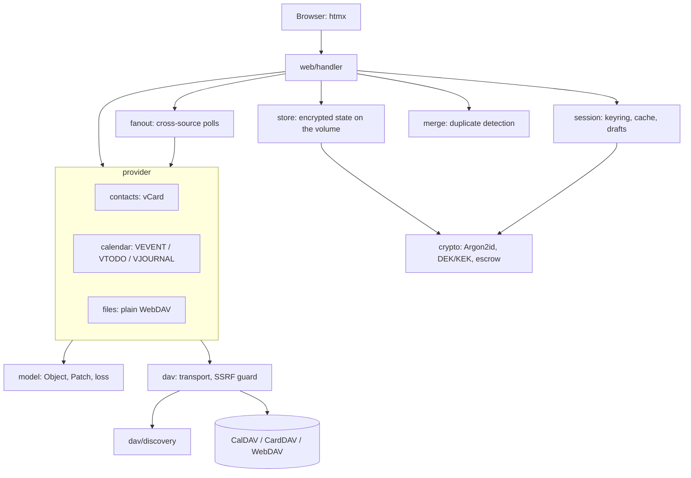

# Architecture

How Carrel is put together, and why each boundary is where it is. The requirements it answers are in [carrel-spec.md](carrel-spec.md); this document is about the shape of the code, and it exists so that a change can be made in the right place rather than in the first place that works.

For building, running and testing, see [development.md](development.md). For what is tested, [tests.md](tests.md).

---

## The one idea

**The DAV server owns the data. Carrel owns the session.**

Nothing about a user's contacts, calendars or notes is ever written to disk. What is on the volume is the list of who may log in, their encrypted DAV credentials, and their decisions about duplicates — that last one is metadata about their collections and is sealed accordingly. Everything else lives in the memory of one session and dies with it.

Every constraint that follows is downstream of that. There is no synchronisation to reconcile, no local schema to migrate, no stale copy to serve when a server is down, and no way for a stolen volume to give up somebody's address book. It also means a restart signs everyone out, because the key that opens their credentials was only ever in memory.

---

## Layers



Dependencies point one way. `dav` knows nothing about vCard or iCalendar; `model` knows nothing about HTTP; `provider` knows nothing about templates; `handler` is the only package that knows what a request is.

---

## `internal/crypto` — the key schedule

Two things are derived from a password, with separate salts so neither can be used to attack the other: a **verifier** that proves the password, and a **KEK** that unwraps the **DEK**.

The DEK is 32 random bytes generated once per account and never changed. It is stored wrapped under the KEK, so changing a password re-wraps it and everything encrypted under it stays readable — which is why a user changing their own password keeps their DAV accounts, and an administrator's destructive reset does not. Every use of AES-256-GCM carries a distinct additional-authenticated-data constant, so a wrapped DEK cannot be replayed as sealed state or the reverse.

Argon2id parameters are stored beside each record rather than compiled in, so costs can be raised later without locking anyone out. Three profiles: login verification, KEK derivation, and the escrow master password, which is the most expensive because it is the one secret on the instance that opens someone else's data.

The **server key** is generated on first run into the data directory with `O_EXCL` and mode 0600, and never overwritten — a short or unreadable key file is reported as corrupt rather than replaced, because replacing it would silently destroy the state it opens. It protects what must be readable before anyone logs in: settings, user records, the SMTP password.

**Escrow** (optional, off by default) is an X25519 key pair. The private key is sealed under the master password and never cached; a copy of a user's DEK is encrypted to the public key, so depositing needs no secret at all. That asymmetry is the point: enabling escrow cannot reach backwards into accounts created before it, because opening their DEK would need their password.

`Zero` exists and is called on every path that ends a session, because leaving key material to the garbage collector is a decision and this is the other one.

---

## `internal/store` — one encrypted file

The whole service state is one file, `state.enc`, sealed with the server key. Writes go to a temporary file and are renamed; a change becomes visible in memory only after it has reached the disk, so a failed write leaves neither the record nor the audit entry it would have produced.

An empty volume yields a store in bootstrap mode and writes nothing until the first change, which is what makes `docker run` on a fresh volume land on the setup screen instead of failing. The format carries a version and a migration hook; a file from a newer build is refused rather than guessed at.

The audit log is append-only, written in the same atomic commit as the change it describes, and bounded so a long-lived instance cannot grow the file without limit. It records who did what to whom, and never a password, a token or the contents of a record.

Each user carries a **secrets blob** sealed under their own DEK: their DAV accounts with the discovered collections, their per-screen source selections, and their duplicate decisions. The store can list how many accounts a user has without opening it — the administration panel needs the count and has no business with the contents.

---

## `internal/session` — the keyring and the cache

Sessions are in memory only. Each holds the user's DEK, a CSRF token, idle and absolute deadlines, and three things that outlive a single request but not the session:

- the **cache** of §12,
- **drafts**: a refused edit awaiting a conflict decision, an uploaded photo awaiting a crop, a previewed import awaiting confirmation,
- the **loss registry**, which remembers what a given server has been seen to drop.

The cache holds collection tags, path→ETag maps, object bodies and photo thumbnails, keyed so that a changed version is a miss rather than a stale hit: a body is stored under path *and* ETag together. Before reading a collection the server's `getctag` is compared; unchanged means the ETag map is reused without a request, changed means a fresh `PROPFIND`. A soft TTL covers servers that report no tag at all. Eviction is LRU across collections, with a stricter separate ceiling for thumbnails because images are large and cheap to rebuild.

What the cache deliberately does not do: survive a restart, serve data while a server is unreachable, or substitute for `If-Match`.

---

## `internal/dav` — the wire, and nothing above it

The transport is the DAV methods and no more. It does not know what a calendar is.

```go
type Transport interface {
    PropFind(ctx, path string, depth Depth, props []xml.Name) (*MultiStatus, error)
    Get(ctx, path string, rng *Range) (io.ReadCloser, string, error)
    Put(ctx, path string, body io.Reader, ifMatch string) (string, error)
    Delete(ctx, path, ifMatch string) error
    MkCol(ctx, path string) error
    Move(ctx, src, dst string, overwrite bool) error
}
```

`Get` returns a reader and not a slice. This is the single most consequential line in the package: the contacts and calendar providers read the stream out immediately because they have to parse it, and the files provider passes it to the browser. Had it returned `[]byte`, the file section would have meant rewriting the transport, and a large download would have meant its size in resident memory per reader.

`REPORT` and conditional `PUT` are separate interfaces — `Reporter` and `ConditionalPutter` — because they are not plain DAV and only the CalDAV and CardDAV providers need them. Keeping them out of `Transport` is what lets the files provider satisfy a smaller interface honestly.

### The SSRF guard

The user supplies a URL and the server follows it, which is a scanner of the host's network unless it is stopped. The guard resolves the name, checks the resulting address against loopback, private, link-local and multicast ranges, and then **dials the address it checked** rather than resolving again — otherwise a second DNS answer pointing inside is a trivial bypass. The check runs after every redirect, not just on the original URL, and the chain is bounded. An allowlist exists for a DAV server that genuinely is on a local network; it is empty by default and names hosts, not networks.

Timeouts on the connection and on the whole request, and a ceiling on the response, are part of the same object, so nothing reaches a DAV server without them.

### `internal/dav/discovery`

`.well-known/caldav`, then `.well-known/carddav`, then the URL as entered — the third being the reliable path for Baikal, where `.well-known` is a web server configuration people rarely have. Then `current-user-principal`, then the two home-sets, then `PROPFIND Depth: 1` on each.

A Multi-Status that does not name `current-user-principal` is not a failure: that property is CalDAV/CardDAV, and a plain WebDAV server does not advertise it. The entered URL is then the file collection, which is how a dedicated files account connects. A 401, or HTML where a Multi-Status should be, is still a failure.

Every step is recorded in a trace with what the server actually replied, and the trace is what the connection screen shows on failure. Discovery is the most common point of failure and "cannot connect" is not something a person can act on.

File collections are not advertised by any home-set. On a CalDAV/CardDAV server they are the plain collections under the root — a `DAV:collection` with no calendar, address book or principal marker — and the containers that hold the discovered homes are excluded, because a server answers its root with `calendars/` and `addressbooks/` and neither is a folder of files. On a files-only server the entered URL itself is the collection. There is no setting: collections were found or they were not, and the Files section follows.

---

## `internal/model` — the object that cannot be rebuilt from a form

This is where §8 is enforced, and the enforcement is structural rather than careful.

```go
type Object struct {
    Path string
    ETag string
    card vcard.Card    // unexported
    cal  *ical.Calendar
}
```

The payload is unexported. Reading goes out through a **display view** — `Contact`, `Event`, `Note`, `Todo` — which is deliberately lossy and one-way: the interface renders one and can never hand one back. Writing goes in through a **`Patch`**, which names the properties it touches and leaves every other one exactly as the server sent it.

There is therefore no code path that assembles a whole object from the fields a form happens to know about. That is how X- properties, categories, groups and attachments written by other clients disappear from a record in every other client, and it is not a mistake anyone makes on purpose — so the type system refuses it instead of a review catching it.

A patch is validated in full before any of it is applied, so a rejected patch changes nothing. `VERSION` and `UID` cannot be patched at all: the first is the format the object is written back in, the second is its identity. Deleting a property is `Remove` and not an empty value, because those are different things to every other client.

**Loss control.** After a successful `PUT` the stored object is read back and compared with what was sent, property by property and instance by instance, ignoring parameter order and the `REV`/`PRODID`/`DTSTAMP` a server is expected to stamp itself. What the server dropped or rewrote is reported to the person who saved — a notice, never a block, because the write already happened and the decision is theirs. Losses are aggregated per account: a server that drops X- properties drops them from everything, and saying so after every save only teaches people to dismiss the message.

**Adding a property** means: add it to the display view's struct, add its name to that view's `known*Props` set so it stops appearing among the foreign properties, read it in the view, and write it through a patch. `ATTACH` is the worked example — see `attach.go`.

---

## `internal/provider` — one shape, three implementations

Each provider takes a narrow `Client` interface satisfied by `*dav.Client`, an optional cache, and the loss registry. That interface is the seam the tests use: a fake DAV server in a `httptest.Server` is what most of the provider tests run against.

**Read path** (contacts, calendar), in order of preference: collection tag, then the path→ETag map, then bodies through `addressbook-multiget` / `calendar-multiget` in batches. An unchanged tag skips the deep `PROPFIND`; a collection reopened inside the TTL costs nothing at all. One record this build cannot parse costs that record and not the collection.

**Write path** carries a precondition without exception. A create is conditional on nothing being there (`If-None-Match: *`); an update is conditional on the version it was read at (`If-Match`); an update with no version is refused rather than sent as an unconditional overwrite. A refused precondition comes back as a `ConflictError` carrying both versions, which is what the conflict screen diffs. There is no automatic resolution in either direction.

**`files`** is the odd one out and deliberately so. It never buffers: `Open` hands back the server's stream and `Upload` takes a reader. It caches listings and not bodies, because a file is not reparsed on every view the way a vCard is and a file section that kept what it served would make the memory ceiling meaningless. A directory is a DAV collection, so it is cached as one — keyed by directory path, which gives per-folder TTL and invalidation without a second mechanism.

Its other job is refusing paths. A relative path from a URL is checked segment by segment (`..` refused rather than normalised away, so an attempt shows up as one) and the joined result is then required to still sit under the collection root. Either check would do; both mean a mistake has to be made twice to matter.

---

## `internal/fanout` — polling several servers at once

The unified view, the search and the duplicates screen all ask several collections the same question. One task owns one goroutine per source behind a parallelism gate, and reports each source as waiting, querying, done, empty, timed out, cancelled or unavailable — including whether its answer came from the cache.

A per-source timeout and an overall ceiling both mark whatever is outstanding, rather than leaving an indicator that never stops. A failed source gets a Retry that polls it alone. Cancelling keeps the partial results on screen with the interrupted source marked.

Tasks belong to the session that started them, are capped per session, swept when nobody asks about them, and cancelled when the session ends — so clicking through searches cannot accumulate live polls, and closing a tab mid-poll does not leave goroutines behind.

Progress reaches the browser over one event-source connection that closes itself when the poll ends, with an automatic fallback to polling when the stream will not open. That fallback is the normal case on a mobile network, not a contingency.

---

## `internal/merge` — duplicates without extra requests

Detection runs on records the fan-out has already loaded, so finding duplicates costs no requests of its own.

Each record is folded once into the handful of values it is compared on — UID, normalised name, addresses, the significant tail of each telephone number, birthday, an event's start — and only records sharing a bucket are scored against each other, so a book of thousands is not compared with itself card by card.

Scoring is points rather than a probability, because the threshold is a setting an administrator changes and a number is easier to reason about than a model nobody can inspect. One strong signal — a shared address, number or UID — reaches the default on its own; a name is a hint; a birthday only strengthens a match that already exists. A shared name and birthday together stay a near miss until somebody lowers the threshold deliberately, which is the conservative default the specification asks for: a false positive is a suggestion a person has to reject, and one of those is worse than a duplicate that goes unnoticed.

Pairs that score are joined into groups, so a card sharing an address with one record and a number with another is one person rather than two overlapping pairs.

---

## `internal/web/handler` — the only layer that knows about HTTP

### Middleware

Applied outermost first:

1. **`LoadSession`** — attaches the session and the client address to the context.
2. **`MaxBodyFunc`** — the body ceiling, chosen per request. This has to happen before anything reads the body, and it is the reason it is a function rather than a constant: the CSRF check reads a multipart form to find the token a plain HTML form carries as a field, so a ceiling imposed later would truncate the upload it was meant to authorise and answer 403 about a token that was fine.
3. **`SecurityHeaders`** — CSP with no `unsafe-inline` at all (htmx works through attributes), `nosniff`, `DENY`, a referrer policy, and HSTS only when the request demonstrably arrived over TLS.
4. **`Recover`** — a panic becomes a 500 and a log line; the stack stays on the server.

Then, per subtree: **`CSRF`** on everything that renders or takes a form, **`RequireAuth`** and **`RequirePasswordChange`** on `/app`, `/c`, `/d`, `/a`, and **`RequireAdmin`** on `/admin`. Guarded sections are mounted whole, so a route added inside one cannot miss its guard.

`/healthz` and the static assets bypass all of it: a probe that issued a CSRF cookie would be noise, and the probe deliberately discloses nothing about the version, the user count or any upstream.

### Prefixes

| Prefix | What answers there |
|---|---|
| `/` | Public: index, `/about`, setup, login, invite and confirmation links |
| `/app/` | Everything a signed-in person uses |
| `/admin/` | Administration: users at `/admin/`, then `/admin/invites`, `/admin/settings`, `/admin/dav`, `/admin/escrow`, `/admin/audit` |
| `/c/` | Contact photos |
| `/d/` | File downloads |
| `/a/` | Opening an attachment |

The last three are separate because they answer with bytes rather than a page. A browser asked to save a file should not be handed a URL that looks like a screen, and a photo needs its own cache and ETag behaviour.

### Rendering

Templates are parsed once at startup, each page against the shared frame, so a broken template fails the process rather than one request. A page is rendered into a buffer first: a template that fails halfway would otherwise leave a truncated body behind a 200. Every page is `no-store`.

`Render` writes the whole page; `RenderFragment` writes the `body` block alone for an htmx swap; `Fragment` returns the bytes, which the progress stream needs because one connection carries a succession of them.

Everything is `html/template` with contextual escaping. `template.HTML` is never used on anything a user typed — a note's body above all, which is arbitrary text rendered as a large block.

### Interface language

English, one language, strings written directly in the templates. There is no message catalogue and no placeholder for one: localisation infrastructure with no translations in it is an extra layer in every template that buys nothing. If an audience that needs it appears, extracting the strings is mechanical work, and doing it then means knowing the real volume.

---

## Assets

`go:embed` carries the templates, the stylesheet, the vendored htmx and its SSE extension, the PWA manifest and the icon. No Node, no npm, no bundler, no CDN — a page loads two scripts and one stylesheet, all from this origin, which is also what makes the CSP above possible.

`carrel.js` holds the handlers that cannot be attributes: print, copy, the progress fallback, and the paste-and-drop path for attachments. Nothing inline, anywhere.

---

## Where to put a change

| If you are… | Work in |
|---|---|
| adding a DAV method or a property to request | `internal/dav` |
| changing how a server is found | `internal/dav/discovery` |
| adding an iCalendar or vCard property | `internal/model`, then the display view and the patch |
| changing how records are read or written | `internal/provider/...` |
| adding a screen | `internal/web/handler` + `internal/web/template` |
| changing what is remembered between visits | `internal/account` (the sealed blob) |
| changing what is remembered within a session | `internal/session` |
| adding a setting | `internal/config`, and pass it through `main.go` |

Two rules that are not negotiable, because both are load-bearing for things a review will not catch:

- **Never reconstruct an object from form fields.** Read a display view, build a `Patch`, apply it. If a property has no field, that is exactly why it must survive.
- **Never write without a precondition.** A create is conditional on absence, an update on the version read. There is no third case.
