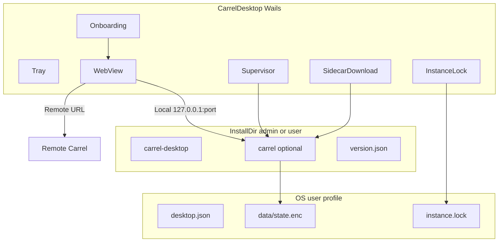

# Desktop wrapper (Wails) — план реализации

Временный рабочий документ. После реализации — **plan closeout** (§17): недоделки в [roadmap.md](../roadmap.md), полезное в постоянные docs, этот файл **удалить**.

Спека: [carrel-spec.md](../carrel-spec.md) §18. Roadmap: секция Desktop application.

---

## 1. Контекст и цели

PWA (манифест, `standalone`) даёт отдельное окно и иконку, но **не** управляет жизненным циклом сервера: бинарник `carrel` нужно запускать отдельно.

**Desktop обёртка (Wails)** закрывает:

- своё окно без адресной строки (как PWA);
- **Remote** — webview на URL уже работающего инстанса;
- **Local** — запуск sidecar `carrel`, динамический порт, останов при закрытии (или фон через tray);
- single instance per OS-user;
- установщики Windows + Linux.

**PWA и браузер** остаются для self-hosted сценария без desktop app.

**Не в v1:** macOS, DAV на localhost, offline mode, auto-update desktop.

---

## 2. Зафиксированные решения

| Тема | Решение |
|------|---------|
| Стек | **Wails v2** (не Tauri, не v3 в v1) |
| Платформы v1 | **Windows + Linux** (amd64; linux arm64 в релизах) |
| Режимы | **Remote** / **Local** при первом запуске (per OS-user) |
| Переключение режима | **Sign out** в Carrel → onboarding снова |
| Данные (`state.enc`) | Всегда в **профиле OS-user** |
| Sidecar бинарник | Рядом с desktop app (**install dir**); admin install = одна копия на машину |
| Sidecar доставка | Lazy при **Local**; опциональный чекбокс в **установщике** |
| Порт Local | **Динамический**; `CARREL_BIND=127.0.0.1` |
| Tray | Настройка пользователя; close → фон или SIGTERM sidecar; Quit → полный выход |
| Установка | Admin (per-machine) или user (per-user) |
| Коммиты | Одна фаза = один коммит **сразу после фазы** + CHANGELOG `[Unreleased]` |

---

## 3. Архитектура



---

## 4. Пути и установка

| ОС | Admin install | User install | Data (`CARREL_DATA_DIR`) | `desktop.json` | Lock |
|----|---------------|--------------|--------------------------|----------------|------|
| Windows | `Program Files\Carrel\` | `%LOCALAPPDATA%\Programs\Carrel\` | `%LOCALAPPDATA%\Carrel\data` | `%LOCALAPPDATA%\Carrel\desktop.json` | same dir `instance.lock` |
| Linux | `/opt/carrel/` | `~/.local/share/carrel-app/` | `~/.local/share/carrel/data` | `~/.config/carrel/desktop.json` | `~/.config/carrel/instance.lock` |

Sidecar в install dir: `carrel` / `carrel.exe` + `version.json`.

---

## 5. Изменения в core Carrel

- **`CARREL_BIND`** — listen address (пусто = все интерфейсы `:%port`; desktop: `127.0.0.1`).
- **`CARREL_PORT`** — уже есть; desktop задаёт динамический порт.

---

## 6. Структура репозитория

```
cmd/carrel-desktop/
  main.go
internal/desktop/
  paths.go
  config.go
  instance.go
  supervisor.go
  sidecar/
    download.go
    ensure.go
frontend/                 # onboarding only (vanilla HTML/JS)
```

`cmd/carrel` — `CGO_ENABLED=0`. Desktop — CGO для webview. Один `go.mod`.

---

## 7. Потоки

**First run:** нет `desktop.json` → onboarding (Remote/Local, tray) → Remote: webview URL | Local: ensure sidecar → supervisor → webview.

**Sign out:** login page → stop local sidecar → onboarding.

**Second launch:** lock alive → focus window; else fresh start.

**Supervisor (Local):** `pickFreePort()` → env `CARREL_DATA_DIR`, `CARREL_PORT`, `CARREL_BIND=127.0.0.1` → exec `{installDir}/carrel` → poll `/healthz` → write lock `{pid, port, mode: local}`.

**Sidecar download:** GitHub release `carrel_{version}_{goos}_{goarch}.tar.gz` / `.zip`; SHA256 из `checksums.txt`; write install dir.

---

## 8. Wails

- WebView: полный Carrel UI (шаблоны не переписывать).
- Tray: Open / Quit; `desktop.json.tray`.
- Close: tray on → hide; tray off → SIGTERM sidecar + quit.
- Onboarding: отдельный minimal frontend (не Carrel templates).

Linux dev: `libwebkit2gtk-4.1-dev`, `pkg-config` — см. [development.md](../development.md) после реализации.

---

## 9. Установщики

| Платформа | Формат | Server checkbox |
|-----------|--------|-----------------|
| Windows | NSIS/MSI via Wails | optional |
| Linux | `.deb` (+ AppImage позже) | postinst |

---

## 10. Релизы

- Desktop version = sidecar version для Local.
- CI: `windows-amd64`, `linux-amd64`, `linux-arm64` для `carrel` и `carrel-desktop`.
- Installer по умолчанию **без** sidecar; checkbox / lazy download.

---

## 11. Тестирование

**Unit:** paths, config, port, download (mock), lock, supervisor (fake binary).

**Manual:** см. [manual-acceptance.md](../manual-acceptance.md) P-desktop.

---

## 12. Фазы и коммиты

Порядок в проходе агента: закрыть чекбоксы фазы → `go test` → CHANGELOG → **коммит** (без отложения).

| Фаза | Deliverable | Коммит (subject) | Состояние |
|------|-------------|------------------|-----------|
| 0 | docs + `CARREL_BIND` | `docs: desktop plan; feat: CARREL_BIND` | ☑ |
| 1 | `internal/desktop` | `desktop: paths, config, instance lock` | ☑ |
| 2 | Wails Remote | `desktop: Wails Remote webview` | ☑ |
| 3 | Supervisor | `desktop: local supervisor` | ☑ |
| 4 | Sidecar download | `desktop: sidecar download` | ☑ |
| 5 | Onboarding + sign out | `desktop: onboarding and sign-out` | ☑ |
| 6 | Tray | `desktop: tray and window lifecycle` | ☑ |
| 7 | Installers | `desktop: installers` | ☐ |
| 8 | CI + acceptance docs | `desktop: CI and acceptance` | ☐ |
| closeout | roadmap, docs, delete plan | `docs: desktop closeout` | ☐ |

---

## 13. Out of scope v1

macOS, DAV localhost onboarding, auto-update, ручной путь к exe, multi-profile в одном OS-login, AppImage (если не сделали в фазе 7).

---

## 14. Прогресс

Фазы **0–6** закрыты в коде и CHANGELOG; чеклисты сняты, статус — в §12. Ниже только оставшееся.

### Фаза 7 — Установщики — модель: **Composer** + ручная проверка

- [ ] Windows per-machine/user + server checkbox
- [ ] Linux `.deb`
- [ ] Post-install download
- [ ] UAC documented
- [ ] Коммит + CHANGELOG [Unreleased]

### Фаза 8 — CI и приёмка — модель: **Composer**

- [ ] CI matrix
- [ ] Manual Win/Linux
- [ ] Коммит + CHANGELOG [Unreleased]

### Manual acceptance — человек

- [ ] P-desktop-1 Remote
- [ ] P-desktop-2 Local + lazy download
- [ ] P-desktop-3 tray on/off
- [ ] P-desktop-4 sign out → mode switch
- [ ] P-desktop-5 Win + Linux fan-out

### Plan closeout — модель: **Composer**

- [ ] Недоделки → roadmap
- [ ] development / architecture / README / manual / CHANGELOG
- [ ] §18 и roadmap без ссылки на этот план
- [ ] Удалить `docs/plans/desktop-wrapper.md`
- [ ] Битых ссылок нет
- [ ] Коммит + CHANGELOG [Unreleased]

---

## 15. Рекомендации по моделям

Модели агента — в заголовках фаз §14. Здесь стек и правила.

| Компонент | Рекомендация |
|-----------|--------------|
| Wails | v2 stable |
| Go | как в `go.mod` |
| Sidecar | `CGO_ENABLED=0` |
| Desktop | CGO on |
| Windows | WebView2 Evergreen |
| Linux | `libwebkit2gtk-4.1-dev` |
| Onboarding UI | Vanilla HTML/JS, без npm |

**Параллельность:** 0+1 вместе возможно; 2 не ждёт 3; Local = 1+3.

**Security review:** после фаз 3 и 4.

**Антипаттерны:** no in-process carrel; no `state.enc` in install dir; no CSP weaken; no npm для onboarding.

**Коммиты:** сразу после фазы; CHANGELOG `[Unreleased]`; closeout — отдельный коммит.

---

## 16. Закрытие этого плана

После фаз 0–8:

1. **Недоделки → [roadmap.md](../roadmap.md)** — конкретные пункты (macOS, auto-update, AppImage, …). §18: **готово** / **частично**, без ссылки сюда.
2. **Полезное → docs** — [development.md](../development.md), [architecture.md](../architecture.md), [README.md](../../README.md), [manual-acceptance.md](../manual-acceptance.md), [CHANGELOG.md](../../CHANGELOG.md). Без decision log и чекбоксов.
3. **Удалить** этот файл; пустой `docs/plans/` — убрать или одна строка в roadmap intro.
4. **`grep plans/desktop-wrapper`** в repo — пусто.
