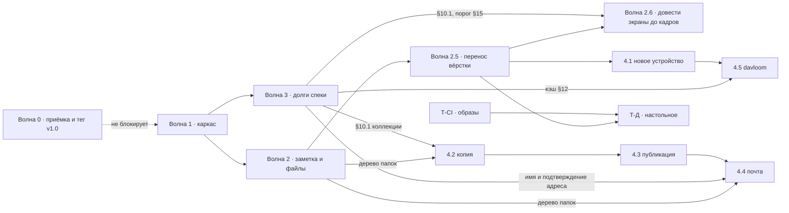

# Глобальный план реализации — план планов

Временный рабочий документ. Отвечает на вопрос **«в каком порядке доделывается всё оставшееся»** — и запланированные функции из [roadmap.md](../roadmap.md), и дизайн из [carrel-ui-mockups.html](../visual/carrel-ui-mockups.html) вместе со всем функционалом, которого он требует. После того как последняя волна закрыта — **plan closeout**: недоделки в roadmap, полезное в постоянные docs, этот файл удалить.

Источники, к которым план не добавляет ни одного решения, а только выстраивает их в порядок:

| | |
|---|---|
| Что не построено и почему именно так | [roadmap.md](../roadmap.md) |
| Требования и `§`-ссылки | [carrel-spec.md](../carrel-spec.md) |
| Как это выглядит и порядок работ по редизайну | [carrel-ui-mockups.html](../visual/carrel-ui-mockups.html), раздел 13 |
| Настольная обёртка, свои фазы | [desktop-wrapper.md](desktop-wrapper.md) |
| Библиотека компонентов, свои этапы | [component-library.md](component-library.md) |
| Что проверяет человек | [manual-acceptance.md](../manual-acceptance.md) |
| Как проверяется волна 2.6 | [wave-2.6-review.md](wave-2.6-review.md) |
| Соглашения кода, кому какая работа | [development.md](../development.md) |

---

## 1. Правила, из которых выведен весь порядок

**1. Ни одна функция не начинается с интерфейса.** Сказано в разделе 13 макетов дословно. Профиль Apple — это XML и одноразовая ссылка, резервная копия — архив и проверка чтением, davloom — подстановка префиксов в потоке. Внутри каждого шага порядок один и тот же: транспорт и модель → провайдер и служба → обработчики → шаблоны. Макет говорит, чем работа кончится, и не говорит, с чего начнётся.

**2. Каркас — раньше того, что на нём стоит.** Двенадцать существующих экранов и пять запланированных нарисованы на одних и тех же примитивах: рейл, строка списка, таблица, панель подробностей, диалог, форма. Если сначала сделать «новое устройство» и резервную копию на нынешней вёрстке, каркас придётся менять под четырнадцатью экранами вместо двух. Поэтому редизайн стоит перед функциями — и по той же причине он не ждёт, пока функции будут готовы.

**3. Правило равенства коллекций (§2.1 макетов) — приёмочный критерий, а не пожелание.** Прежде чем шаг считается закрытым, по каждому роду коллекций (события, задачи, заметки, контакты, файлы) должен быть ответ: **делаем**, **неприменимо** (и почему), **сознательно позже** (и где записано). Ответа «не подумали» быть не должно. Таблица в §2.1 макетов — образец формы ответа.

Следствие первых двух правил: **порядок редизайна из раздела 13 макетов и порядок функций из roadmap — это два разных порядка**, и они не конкурируют. Сначала волны **1–2** (поведение и структурный каркас), затем **2.5** (визуальный перенос вёрстки по макетам 7.1–7.13), потом волна **3** (долги спеки), волна **4** — запланированные функции.

**4. Визуальное соответствие макетам — отдельный критерий закрытия.** Волны 1–2 закрывались по коду, тестам и механике; перенос классов из раздела 6 макетов в шаблоны и `carrel.css` при этом не был доведён до конца. Поэтому v1.1 **не считается достигнутой**, пока не закрыта волна 2.5. Приёмка волны 2.5 — не «тесты зелёные», а **экран рядом с кадром макета** из таблицы 7.13; для форм и панелей — встроенная проверка `#check` в `carrel-ui-mockups.html` («Строки выровнены»).

---

## 2. Вехи

| Веха | Что в ней | Волны |
|---|---|---|
| **v1.0** | Функциональность v1 целиком (готова), минус то, что построено сверх спеки, плюс пройденная ручная приёмка | 0 |
| **v1.1** | Визуальное соответствие макетам для уже реализованного (7.1–7.13): перенос вёрстки, не новые возможности | 2.5 |
| **v1.1.1** | Экраны доведены до кадров и работают: библиотека компонентов, панель над списком, долги настроек и админки, значки | 2.6 |
| **v1.1‑struct** | *(закрыто)* Структурный редизайн и функции: каркас, панель подробностей, единый вид в разделах, заметка и файлы | 1–2 |
| **v1.2** | Долги спеки: коллекции (§10.1), кэш (§12), изменяющий тест DAV (§6), оболочка офлайн, учётная запись | 3 |
| **v1.3+** | Новое устройство, резервная копия, публикация, почта — по одной на выпуск | 4.1–4.4 |
| **v2.0** | davloom | 4.5 |
| параллельно | Настольное приложение, CI и образы | Т-Д, Т-CI |

**Рекомендация по v1.0: тегировать до редизайна, а не после.** Три довода. Приёмочные проверки P1 и P2 (круговорот заметки через jtx Board и Evolution) проверяют совместимость данных и от вёрстки не зависят вовсе — ждать редизайна незачем. Тег даёт базовую линию, относительно которой редизайн читается как диф, а не как «всё сразу». И регрессию, которую редизайн внесёт в чужой сервер, искать проще, когда есть точка, где всё работало.

Тег v1.0 при этом **не равен показу людям**: §25.6 расставляет порядок, в котором функции стоит кому-то показывать, а раздел 1 макетов честно говорит, что нынешний экран читается как отладочная страница. Публичный показ — **после волны 2.5**, когда экраны 7.1–7.13 совпадают с макетами по каркасу, типографике и цвету. Приёмка 20 августа (§7.7) показала, что этого достаточно, чтобы экран перестал читаться как отладочная страница: недостающее после 2.5 — это отсутствующие элементы управления (§7.8), а не разъехавшаяся вёрстка, и они видны как «здесь могло бы быть больше», а не как «сделано наспех». Волны 1–2 дали механику и каркас, но не визуальный эталон.

---

## 3. Карта зависимостей

Четыре зависимости, которые дороже прочих, если их пропустить:

- **Дерево выбора папки** появляется трижды — «Move…» в файлах (2.4), назначение резервной копии (4.2), выбор файла для письма (4.4). Макеты говорят прямо: третьего дерева не заводится. Значит, оно делается один раз в 2.4 как общий фрагмент.
- **§10.1 коллекции** нужны восстановлению из архива (4.2): восстановление кладёт записи в новую коллекцию, а завести её сегодня нечем.
- **Общий потолок кэша (§12)** становится обязательным ровно тогда, когда к экземпляру подключается несколько клиентов сразу, то есть с davloom.
- **Отображаемое имя и признак подтверждённого адреса** — два поля в записи пользователя, без которых письмо (4.4) не подписать и `Reply-To` не выставить.

---

## 4. Волна 0 — закрыть v1

| | Шаг | Что делается | Проверка |
|---|---|---|---|
| **0.1** | Депонирование: убрать запрет отзыва | `Settings.Escrow.ForbidOptOut`, флажок на `/admin/escrow`, ветка в профиле, `TestOptOutCanBeForbidden`, `TestForbiddenOptOutIsVisible`. Отзыв — всегда решение владельца ключа (§5.4). Существующее состояние с выставленным флагом читается как «не выставлен», поле не мигрируется, а игнорируется | `go test ./...`; отозвать копию у пользователя на экземпляре, где флаг был включён |
| **0.2** | Приёмка, не зависящая от вёрстки | **P1–P4** из [manual-acceptance.md](../manual-acceptance.md): круговорот заметки через jtx Board и Evolution, `docker compose` с пустого тома, логи без секретов | Человек. Результаты — в manual-acceptance |
| **0.3** | Приёмка через интерфейс | **P5** (вставка снимка экрана за пару секунд) и живой сквозной проход вложений: Baikal и отдельный WebDAV через браузер | Человек. Повторяется после волны **2.5** — эти два проходят через экраны, которые она меняет |
| **0.4** | Тег | `CHANGELOG.md`, версия и коммит через `-ldflags`, `/about` показывает их | `docker compose exec carrel /carrel healthcheck` |

**Приёмка блокирует тег, а не работу.** Волна 1 может идти параллельно: P1–P4 проверяют совместимость данных, контейнер и логи и от вёрстки не зависят вовсе. Обратное тоже верно и стоит сказать: P5 и живой проход вложений идут через экран заметки и загрузку файла, то есть ровно через то, что меняет волна **2.5**, — снятые до неё, они дают базовую линию, а не окончательный ответ, и повторяются после волны 2.5.

Единственный шаг волны 0, у которого есть настоящий порядок относительно волны 1, — **0.1: его стоит сделать до 1.10**, иначе флажок «не давать отзывать» сначала перенесут в новый шаблон настроек, а потом оттуда уберут.

Спеке нужна правка статусов: §5.4 уже поправлена, код догоняет её.

---

## 5. Волна 1 — каркас *(структура, закрыта)*

Шаги 1–8 и 11–14 из раздела 13 макетов, плюс то, что раздел 13 не перечислял, потому что оно не про вёрстку, а описано в разделах 6, 7.1–7.3, 7.7, 7.10, 11. Редизайн **не добавляет возможностей** там, где не сказано обратное, и не трогает ни одной формулировки в интерфейсе.

**Что волна 1 дала на самом деле:** поведение, маршруты, htmx-механику, частичный каркас (`.app-top`, `.app-rail`, токены, списки). **Визуальный перенос** из `.m-*` в шаблоны — волна **2.5**; до неё экраны не обязаны совпадать с макетами.

| | Шаг | Файлы | Проверка |
|---|---|---|---|
| **1.1** | Токены и сброс: переменные, шкала, `--alert` вместо пары `--error`/`--danger`, поверхности тёмной темы, фокус | `static/carrel.css` | Существующие экраны не ломаются; `go test ./...` зелёный — шаблоны не тронуты |
| **1.2** | Каркас: верхняя панель 52 px, рейл, снятие `max-width` с `main`, четыре зоны и их поведение по ширине окна | `template/base.html`, CSS | `shell_test.go`: навигация присутствует и помечает текущий раздел |
| **1.3** | Компоненты списка: строка, полоска коллекции 3 px, рубрикатор, значки, квадратные заглушки вместо круглых. **Три высоты строки** (28/26/22 px) как правило системы, а не разметки; кнопка при поле — внутри его блока | CSS, `contacts.html`, `agenda.html`, `tasks.html`, `notes.html` | Печать сохраняет вид (`print-only` не трогается). Визуальное выравнивание по `#check` — приёмка **2.5**, не 1.3 |
| **1.4** | Панель подробностей справа через htmx `hx-target`. Правило: нет выделения — нет панели; закрыта вручную — сама не возвращается; состояние помнится по разделу | `contact.html`, `event.html`, `task.html`, `note.html`, роутинг фрагментов | Прямая ссылка на карточку по-прежнему открывает целую страницу — панель только надстройка |
| **1.5** | Быстрая заметка **листом** с любого экрана и клавиши `N`, `/`, `Enter`, `Esc`, `Ctrl+Enter`; «New note» в шапке со стрелкой на всё остальное, что можно создать, в порядке рейла | `base.html`, `note_quick.html` как фрагмент, `carrel.js` | `/app/notes/quick` остаётся рабочей страницей: без JS кнопка — обычная ссылка. Клавиши не срабатывают в полях ввода |
| **1.6** | Формы: многоколоночная раскладка, ширина поля по содержимому, нижняя панель действий, выравнивание ячеек по верху | все шаблоны с формами | Формы отправляются теми же полями; тесты обработчиков не меняются |
| **1.7** | **Единый вид внутри разделов.** Строка «All …» первой в списке источников, трёхпозиционный флажок, опрос по отмеченным, колонка источника, флажки «Events / Tasks due / Notes» в календаре. `/app/unified` и «Everything» удаляются | `agenda.html`, `contacts.html`, `tasks.html`, `notes.html`, `base.html`; `unified.html` убирается, его `findresults` переиспользуется | `stage5_test.go`, `stage6_test.go`: механика fan-out остаётся, меняются точки входа. SSE и опрос не затронуты |
| **1.8** | Сквозное: поиск из шапки с любого экрана и **экран «человек целиком»** — переезжает из служебной «ленты» в контакты, во всю ширину, с колонкой «почему совпало» (точное `mailto:` против попадания строки в текст), вкладкой файлов из уже загруженных записей и кнопками «заметка о ней» / «встреча с ней» с подставленным участником | `search.html`, `person.html`, `duplicates.html`, `base.html` | Признак совпадения доносится от движка до строки; второго опроса ради вкладки файлов нет |
| **1.9** | Диалоги: импорт как мастер с явными шагами, слияние, конфликт | `*_import.html`, `duplicate_merge.html`, `conflict.html` | Шаги соответствуют состояниям, которые обработчик уже различает |
| **1.10** | Настройки и администрирование: свой рейл, порядок пунктов «кто вы → откуда данные → как забрать на устройства → куда сложить копию → что отдать наружу → как выглядит», меню в шапке вместо квадратика с инициалами, экран **Appearance** — тема и плотность строк в `localStorage` | `app.html` → `settings_*.html`, `admin*.html`, `base.html` | `admin_test.go`, `accounts_test.go`, `register_test.go`; поля в профиле на сервере ради темы не заводятся |
| **1.11** | **Выбор столбцов**: кнопка `Columns` в панели управления каждого списка и таблицы — контакты, задачи, заметки, файлы, пользователи, журнал. Флажок включает столбец, ручка меняет порядок, первый столбец выключить нельзя | CSS, шаблоны списков, хранение выбора | Открытый вопрос — где хранить: `localStorage` рядом с темой и плотностью или `internal/account/views.go` рядом с выбором источников. Решается перед шагом, а не внутри него |
| **1.12** | §23.8, первый пункт: блок **Source** в панели подробностей и в карточке аккаунта — когда коллекция читалась и когда менялась на сервере | `base.html`, карточки, `internal/session/cache.go` | Кэш это уже знает: `getctag` и ETag. Кода почти нет, ценность — та, ради которой §23.8 написан |
| **1.13** | §23.8, второй пункт: **исходный часовой пояс** события меткой рядом со временем и только когда он отличается от общего | `event.html`, `agenda.html`, `internal/model/event.go` | Данные уже в `DTSTART` с `TZID`; общий пояс v1 остаётся один |
| **1.14** | **Вложения у задачи**: тот же блок, что у события и заметки | `task.html` | `ATTACH` в модели есть; закрывает строку таблицы равенства |
| **1.15** | **Дубликаты задач и заметок** — только связывание. Ни «Merge on the server…», ни выбора значений полей: у них нечего дополнять | `duplicates.html`, `internal/merge` | Расходящиеся тексты человек выбирает сам и не получает склеенными |
| **1.16** | Печать: **листинг папки** и подвал с числом источников, попавших в снимок, у агенды и списков | `@media print` в CSS, `files.html` | Усечённый листинг, напечатанный молча, врёт убедительнее экранного |
| **1.17** | **Узкий экран (§13)**: выдвижной рейл вместо стопки флажков, цели 44 px, нижняя панель разделов, две строки в записи, меню строки вместо панели свойств | CSS, `base.html` | Ручная проверка на телефоне; закрывает пробел §13 из roadmap |
| **1.18** | **Кадрирование фотографии** перетаскиванием: слой вместо четырёх числовых полей; числа остаются запасным путём с клавиатуры и единственным на узком экране, где §13 просит центральный кроп | `contact_crop.html`, `carrel.js`, `internal/photo` | Без JS остаются числа и работающая форма |
| **1.19** | Шрифты Literata и Public Sans в бинарник через `go:embed` | `internal/web/embed.go`, CSS | CDN не появляется; размер образа вырос предсказуемо |

**Чего волна 1 не делает.** Не приносит JS-фреймворк: панель подробностей, выдвижной рейл, лист и мастер импорта — htmx и `
`. `carrel.js` вырастает со ста шестидесяти строк примерно втрое (клавиши, кроп, позже очередь загрузок), и каждая добавка деградирует: без JS кнопка заметки — ссылка, загрузка — обычная форма. Не заводит вторую палитру. Не трогает тексты интерфейса.

---

## 6. Волна 2 — заметка и файлы *(функции, закрыта)*

Две тяжёлые части редизайна: единственная запись, которую **пишут**, и единственный раздел, который должен стать **менеджером**. Обе добавляют возможности, поэтому стоят отдельной волной, а не строкой в предыдущей. **Вёрстка** этих экранов по макетам 7.4–7.5 — волна **2.5**.

### Заметка

| Шаг | Что делается | Проверка |
|---|---|---|
| **2.1** | Полный экран заметки: чтение с колонкой связей и вложений, свой адрес для ссылки, соседние заметки в рейле, переключатель **Full width / Reading width** (умолчание — полная), режим **Focus** и выход по `Esc`, кнопки разметки, предупреждение о несохранённом | Сохранение остаётся явным: автосохранения на чужой сервер нет. Конфликт по ETag открывает тот же экран, что и раньше |
| **2.2** | **Разбор Markdown в просмотре** — `goldmark` в `go.mod` и `THIRD_PARTY.md`, сырой HTML выключен: чужая заметка приходит с чужого сервера. Поддерживается то, что пишут руками и кладёт jtx Board: заголовки, списки, задачи-флажки, выделение, ссылки, код, цитаты, таблицы. Хранится по-прежнему текст, правка отдаёт ровно набранные символы, неизвестный синтаксис остаётся видимым текстом. Кнопка **Source** показывает исходник | Новая зависимость — **решение, которое согласуется до коммита** (development.md). Тест: круговорот «правка без изменений» не меняет ни байта |
| **2.3** | «Related to» перестаёт быть полем для UID: поиск по мере набора по тем же источникам, выбранное — значок с крестиком, ручной ввод UID последним пунктом списка | Сегодня там `placeholder="UIDs, comma-separated"`, то есть просьба, которую никто не выполнит |

### Файлы

| Шаг | Что делается | Состояние провайдера |
|---|---|---|
| **2.4** | Выделение, групповые операции циклом по выбранным с отчётом по каждому, панель свойств по выделению (закрывается и помнит это), хлебные крошки как навигация, иконка типа в строке, **Filter this folder** по уже загруженному листингу, корень **All collections** — `/app/files` без account/col (список хранилищ; с account/col — как сейчас) | Только интерфейс поверх того, что провайдер уже умеет |
| **2.5** | **Переименование и перемещение** — `MOVE` на том же сервере; на другой — скачать и загрузить. Один метод провайдера `Move` и **общее дерево выбора папки** (общий фрагмент для 4.2 и 4.4) | В транспорте `Move` есть, провайдер его не использует |
| **2.6** | **Перезапись по требованию** как ответ на столкновение имён в очереди загрузок: `Keep both` берёт следующее свободное имя, `Replace` перезаписывает осознанно. Очередь загрузок в углу, не блокирует работу, прогресс через `XMLHttpRequest` | `PUT` без `If-None-Match`. Запрет по умолчанию остаётся правильным, но становится выбором человека в момент столкновения, а не отказом без вариантов |
| **2.7** | **Плитки и миниатюры**: тот же список сеткой — то же выделение, та же панель операций. Превью — серверный `GET …/thumb` (как `photo?size=thumb`): клиент **никогда** не качает оригинал ради плитки или панели свойств. Carrel с DAV берёт файл только для декода; **порог превью 16 MiB** — больше не пытается, в плитке значок типа (не лимит загрузки и не лимит скачивания). Декод до ~256 px по длинной стороне (плитка 132 px, 4:3); lazy load по видимости; кэш сессии §12 | Не `GET` оригинала в браузер |
| **2.8** | **Копирование** — всегда `GET` + `PUT`, исходник остаётся (`COPY` не используется). **Перемещение** на том же сервере — `MOVE` без трафика; на другой — скачать и загрузить. Предупреждение **до** начала, когда файл идёт через Carrel, а не одним `MOVE` | `COPY` не используется |
| **2.9** | **Поиск по именам файлов** в сквозном поиске, с честной строкой о том, что содержимое не индексируется и не будет | `PROPFIND` уже возвращает имена |
| **2.10** | Ярлыки рейла **Shortcuts**: **Attachments** — папка из настроек вложений (не выбрана — страница выбора). **Published** — пункт в рейле и страница-заглушка до 4.3 | Ярлыка «недавние» нет намеренно: WebDAV не умеет спрашивать, что изменилось |

---

## 7. Волна 2.5 — перенос вёрстки

То, что раздел 13 макетов называет редизайном буквально: **только вёрстка, разметка шаблонов и `carrel.css`**, без новых возможностей и без смены строк интерфейса. Волны 1–2 построили механику поверх параллельных классов (`.app-*` рядом со старыми `.card` / `.button` / `.sidebar`); эта волна **переносит** примитивы из раздела 6 макетов (`.m-shell`, `.m-rail`, `.m-head`, `.m-bar`, `.m-row`, `.m-btn` и т.д.) в продакшен-код — копированием разметки и CSS, а не перерисовкой с нуля.

Охват — **таблица полноты 7.13** в макетах: все шаблоны и маршруты, у которых уже есть кадр в разделах 7.1–7.13. Разделы 7.14–7.19 и экран 7.11.1 сюда **не входят** — у них свои волны 3–4.

| | Шаг | Что делается | Проверка |
|---|---|---|---|
| **2.5.1** | **Единый рейл.** Разделы (`.m-nav`) и источники (`.m-rail-sec`) — одна левая колонка, как в макете; убрать отдельный `sidebar card` и двухколоночный `app-layout` там, где источники и разделы сейчас расходятся | `base.html`, `sectionrail`, шаблоны разделов | На контактах, календаре, задачах, заметках, файлах — один рейл, как в 7.1–7.5 |
| **2.5.2** | **Шапка.** SVG-логотип вместо текста «Carrel»; иконки в поиске, кнопках и меню пользователя; метка времени обновления вместо голого «Refresh», где это нарисовано в макете | `base.html`, `static/` (иконки в `go:embed`) | Кадр «Каркас» (раздел 4 макетов) совпадает с живым `/app/calendar` |
| **2.5.3** | **Контент без обёртки `.card`.** Основная зона — `.m-main`: `.m-head` / `.m-sub` / `.m-acts`, панель `.m-bar` (фильтр, сортировка, Columns, счётчик) | `contacts.html`, `agenda.html`, `tasks.html`, `notes.html`, `files.html`, `search.html`, … | Нет второй рамки внутри рабочей области; отступы и типографика как в макете |
| **2.5.4** | **Кнопки и иконки.** `.button` → `.app-btn` (или финальные классы из перенесённого набора); SVG в нижней панели узкого экрана вместо эмодзи; единый набор иконок разделов в рейле | все шаблоны с действиями, `carrel.css` | Grep: в app-экранах не осталось `class="button"` |
| **2.5.5** | **Экраны 7.12–7.13.** Вход, регистрация, смена пароля, about, диалоги импорта/слияния/конфликта, админка и настройки — по кадрам макета, не только списки разделов | `login.html`, `setup.html`, `settings_*.html`, `admin*.html`, `*_import.html`, … | Каждая строка таблицы 7.13 отмечена вручную: «совпадает» |
| **2.5.6** | **CSS и зачистка.** Классы из макетов в `carrel.css`; удалить неиспользуемые `.card`/`.sidebar` из app-экранов; `#check` в `carrel-ui-mockups.html` — «Строки выровнены» | `carrel.css`, шаблоны | `go test ./...` зелёный; обработчики и поля форм не менялись |

**Чего волна 2.5 не делает.** Не добавляет возможностей из 7.14–7.19. Не трогает §10.1, service worker и проверку установки — это волна 3. Не требует пиксель-в-пиксель с данными в макете (имена и события там русские и вымышленные); сравнивается **раскладка, иерархия, компоненты и отступы**.

**Приёмка волны.** Волна **не закрыта**, пока хотя бы один экран из таблицы 7.13 визуально расходится с кадром макета при том же размере окна. Закрытие фиксируется в `CHANGELOG.md`, таблице 7.13 макетов и §13 спеки; тег **v1.1** — после 2.5 и повторной приёмки 0.3 (P5, вложения).

---

### 7.7 Результат визуальной приёмки *(20 августа 2026)*

Приёмка по §4 проведена: макеты подняты на соседнем порту рядом с работающим экземпляром, и для каждого примитива сличены **вычисленные стили и геометрия**, а не впечатление. Так строже, чем глазом, и воспроизводимо: расхождение либо есть в числах, либо его нет.

**Каркас перенесён.** Совпали значение в значение: палитра целиком — 11 токенов светлой темы и 11 тёмной; `--rail` / `--side` / `--top` / `--pad` / `--row-*`; шапка (52 px, отступы, gap, логотип Literata 17); рейл (264 px, паддинги 12/16, gap 16, ссылки 29 px / 13.5 px, активная 600 + `--card`); рубрика и строка источника; шапка страницы (`15 20 11 20`, h1 Literata 22, подзаголовок 11.5); кнопки (26 px / 12.5 / `0 10` / r3); сетки строк объединённых экранов (`.list-row--contact-find` и `.list-row--find` — колонка в колонку с `.m-row--contact` и `.m-row--find`); все 19 перенесённых иконок — идентичны по путям.

**Найдено и исправлено — четыре места, и все одной природы:** класс из волны 2.5 присутствовал, но его перебивало правило, стоящее позже или специфичнее.

| Что | Кто перебивал | Как выглядело |
|---|---|---|
| Рубрикатор групп на всех объединённых экранах | `.find-group h2` — правило доредизайна | Заголовок Literata 22 px с линейкой вместо капители Public Sans 10 px; строка группы 51 px против 37 |
| Все поля ввода | `font: inherit` + отсутствие `color` | 13 px браузерным чёрным вместо 12.5 px цвета `--ink` |
| Метки и рубрики панели подробностей | собственные значения, не сверенные с кадром | 13 px и 11 px вместо 11.5 и 10, другой серый |
| Кнопка входа | `.form-foot button` | 28 px против собственных объявленных 30 |

**Второй проход — экраны, до которых первый не дошёл.** Первый проход сверял списочные экраны (7.1–7.4) и объявил волну закрытой преждевременно: настройки, админку и файловый менеджер он проверил только по каркасу — где начинается панель и какой ширины рейл. Поэлементно они сверены отдельно, и там перенос **не был сделан вовсе**. Признак, по которому это видно сразу: весь редизайн задан в пикселях (13, 12.5, 11.5, 11, 10), а в `carrel.css` оставалось **42 размера в `rem`** — доредизайнная шкала, и вся она сидела ровно в этих трёх местах.

| Что | Было | Кадр макета |
|---|---|---|
| Таблицы админки (`table.data`) и файлового менеджера (`.files-table`) | 14–14.4 px, `th` браузерным полужирным без капители, ячейки с отступом 8 px | 13 px; `th` 10/600, `ls .12em`, uppercase, dusty, `9 12`; `td` 12.5, `7 12`; первая ячейка — к полю страницы |
| `.mono` | **правила не существовало** — девять мест в шести шаблонах просили моноширинный и получали Public Sans в размере родителя | `code, .mono` → `--f-mono`, 11.5 px |
| `.hint` | 14 px — **крупнее основного текста**, то есть пояснение читалось как главное | 11.5 px |
| Заголовки блоков внутри панелей (`.subsection h2/h3/h4`, имя аккаунта в подключениях) | Literata 17.6 / 16 / 15.2 — вторые заголовки внутри панели, у которой уже есть свой | Везде `.m-rubric` 10/600 uppercase: у панели один заголовок, остальное — метки |
| Хлебные крошки файлов | 14.4 px цветом текста | 12 px dusty, текущая папка — 600 и ink |
| Панель выделения в файлах | плавающая коробка на бумаге, `8 12` | полоса во всю панель цветом `--card`, `0 20 9 20`, кнопки на бумаге |
| Свойства файла, дерево «Move…», список передач, ярлыки | 13.6–16.8 px | 11.5–12.5, заголовок диалога — Literata 22 |

Исправлено; после переноса в `rem` осталось 23 размера, и все они — на элементах, которых нет в кадрах 7.1–7.13, либо перекрыты правилами в пикселях.

**Вывод для тега.** Теперь волна 2.5 в границах, которые она сама себе поставила («только вёрстка, разметка шаблонов и `carrel.css`»), закрыта. Оставшееся к вёрстке не относится — см. ниже.

**Урок для приёмки, который стоит записать.** «Проверил каркас» и «проверил экран» — разные вещи, и первое выдаёт себя за второе. Ширина рейла и положение панели совпадают на всех экранах сразу, потому что их задаёт `base.html`; типографика задаётся правилами конкретного экрана, и именно она остаётся непеpенесённой. **Приёмка по таблице 7.13 идёт по строкам таблицы, а не по разделам интерфейса** — иначе экраны, у которых нет своего кадра в 7.1–7.5, тихо выпадают.

---

### 7.8 Противоречие, которое приёмка вскрыла

Приёмка нашла ещё семь расхождений с кадрами 7.1–7.5, и ни одно из них не чинится в CSS: на экранах **нет компонентов**, которые макет рисует. Панель `.m-bar` над списком с полем фильтра, сортировкой и счётчиком; числа у разделов в рейле и у коллекций; подвал рейла; Import/Export на объединённых экранах.

Здесь план противоречит сам себе, и это стоит признать прямо, а не обходить:

- **§7 говорит:** волна 2.5 — «без новых возможностей».
- **§4 говорит:** волна не закрыта, пока хотя бы один экран расходится с кадром, и сравниваются «раскладка, иерархия, **компоненты** и отступы».

Отсутствующий фильтр — это расхождение по компонентам и одновременно новая возможность. По букве плана волна 2.5 не может быть ни закрыта, ни доделана. Разрешается разделением, а не толкованием.

**Вторая находка того же разбора:** этих компонентов нет **ни в спеке, ни в roadmap** — они существуют только в макете. То есть макет тихо ввёл требования, которых не проходил ни один документ. Правило 1 («ни одна функция не начинается с интерфейса») нарушено бы, если сделать их «потому что нарисовано». Каждому нужен ответ по правилу 3.

---

### 7.9 Полная сверка всех экранов с функционалом *(20 августа 2026)*

Третий проход, по строкам таблицы 7.13, а не по разделам интерфейса. Метод сменился: сверять экран с кадром поэлементно — дорого и дырявo, два прохода это уже показали. Макет — **закрытая система величин**, и она вынимается из него целиком: шкала кеглей `9.5 · 10 · 10.5 · 11 · 11.5 · 12 · 12.5 · 13 · 13.5 · 16 · 17 · 19 · 20 · 22 · 24 · 26 · 27`, два семейства, трекинг `.03 · .04 · .1 · .12 · .18em`, высоты контролов `22 · 26 · 28 · 29 · 38 · 52`. Дальше проверяется не «похоже ли», а **попадает ли каждое объявление в систему** — и это покрывает все экраны разом, включая те, у которых нет своего кадра.

**Типографика — сошлась везде.** Аудит `carrel.css` нашёл 25 объявлений вне шкалы; после переноса не осталось ни одного, кроме трёх, задающих размер значка, а не текста. Живая проверка 31 маршрута — контакты, календарь, задачи, заметки (объединённые, поколлекционные и формы), файлы, поиск, дубликаты, четыре экрана настроек, шесть экранов админки, три мастера импорта, `/about`, вход — **ноль отклонений**.

Крупнейшее, что нашёл этот проход: `body` был **15 px / 1.6**, а оболочка перекрывала его на 13 / 1.45. То есть весь экран **до входа** — вход, первый администратор, регистрация, приглашение, подтверждение адреса, «восстановление невозможно», `/about` — жил в другом кегле и другом интерлиньяже, чем всё остальное. Теперь мера одна на приложение. Заодно тело заметки переведено на шкалу: заголовок `27/400` вместо `26.4/600`, текст — **гротеск 13.5/1.65 вместо антиквы 14.5/1.7**, как в `.m-prose`; правка и чтение одного размера, чтобы заметка не прыгала при смене режима.

**Компоненты — расходятся, и вот полный список.** Ниже только то, чего на экране нет; всё остальное сверено и совпало.

| Экран | Кадр | Чего нет |
|---|---|---|
| Контакты, объединённый | 7.1 | панель над списком целиком: фильтр по загруженному, сортировка `A–Z / Recently changed`, `Columns`, `Compact rows`, счётчик; `Import`, `Export`, `⋯` в шапке; подвал рейла |
| Агенда, объединённая | 7.2 | сегмент `Week / Month / Range` (есть форма From/To); `Import`, `Export`, `⋯`; подвал рейла |
| Задачи, объединённые | 7.3 | панель целиком: `Open n / Done n / All n`, `By due / By priority / Recently changed`, `Columns` (на поколлекционном экране это есть) |
| Заметки, объединённые | 7.4 | панель: фильтр по слову, `Newest / Oldest / Title`, `Columns`, счётчик; `Import Markdown`, `Export` в шапке |
| Файлы | 7.5 | значки типов и действий (`i-grid`, `i-img`, `i-doc`, `i-pencil`, `i-move`, `i-trash`, `i-panel`, `i-link`); `New folder` кнопкой в шапке |
| Поиск | 7.6 | — совпал |
| Дубликаты | 7.7 | порог совпадений в подвале рейла (§15 требует настраиваемости — **шаг 3.7**) |
| Конфликт | 7.8 | — совпал |
| Импорт, три мастера и три отчёта | 7.9 | — совпали |
| Подключения | 7.10 | **`Test` / `Test again`** — повторная проверка сохранённого аккаунта; **`Edit`** — правка подключения без пересоздания; `Show password` (волна 4.1); `New collection` / `New folder` (волна 3.1) |
| Учётная запись | 7.10.2 | **блок `SESSIONS`** целиком: список сеансов, «завершить», «завершить все прочие»; **`Delete account`** |
| Внешний вид | 7.10.3 | блок `DATES AND TIMES` |
| Админка · пользователи | 7.11 | фильтр `All / Administrators / Disabled` |
| Админка · журнал | 7.11 | **`Export CSV`**; сегмент `All / Security / Failures` |
| Админка · настройки, валидатор, депонирование | 7.11, 7.13 | — совпали |
| Вход, первый администратор, регистрация, приглашение, смена пароля, `/about` | 7.12, 7.13 | — совпали (после общей меры) |
| Панели подробностей ×4 | 7.1–7.4 | — совпали |

**Три вывода, которые стоит держать вместе:**

1. Вёрстка догнала макет везде. Остались **отсутствующие возможности**, а не разъехавшиеся размеры.
2. Часть из них — не выдумка макета, а невыполненные обещания других документов: порог дубликатов (§15), повторная проверка подключения (§6 обещает диагностику «какой шаг сломался» — она есть при добавлении и недоступна потом), сеансы в учётной записи (§24 говорит о завершении сеансов, и админка это умеет, а человек про свои — нет).
3. Всё это ложится в **одну и ту же дюжину мест разметки**, и класть их в тридцать копий шапки — значит повторить историю волны 2.5 ещё раз. Поэтому библиотека компонентов идёт **первой**, а не «когда-нибудь потом».

---

## 7-бис. Волна 2.6 — довести экраны до кадров

Отдельная волна, а не хвост 2.5: это **возможности**, и порядок внутри каждой тот же, что везде по правилу 1 — модель → служба → обработчик → шаблон. Волна отвечает на два требования сразу: экран должен совпасть с кадром **и работать**, то есть каждый добавленный контрол обязан что-то делать на живых данных, а не изображать.

**Веха v1.1.1.** Ни на что не блокирует: волны 3 и 4 идут параллельно.

---

### 2.6.A Библиотека компонентов *(первым, всё остальное кладётся в неё)*

Причина, по которой это первое, установлена измерением, а не вкусом: шапка страницы написана руками **30 раз в 19 шаблонах**, поле формы — **153 раза в 24**, кнопка — 95 раз. Общих определений в шаблонах 16, и все они про обвязку (иконки, рейлы, механика веерного опроса); ни одного про содержимое. В `carrel.css` 394 класса, из них 108 общих примитивов и **286 привязанных к экрану** — три к одному.

Прямое следствие уже случилось: шапку можно написать двумя способами — `.page-title` / `.page-sub` и голый `<h1>` / `.source-label`, — а правило `.page-title, .page-head h1 { … }` покрывает оба. Десять шаблонов (**все настройки и вся админка**) пишут по-старому, и это не было видно, потому что запасное правило по тегу всё чинило на глаз. Волна 2.5 прошла мимо них именно так.

| | Шаг | Что делается | Чем закрывается |
|---|---|---|---|
| **2.6.A1** | `{{template "pagehead"}}` — заголовок, подпись, полоска коллекции, набор действий, `⋯` | Одно определение вместо 30 написанных руками мест. **Мест, а не экранов:** в каждом списочном шаблоне шапка стоит трижды — объединённый вид, поколлекционный, пустое состояние, — и все три остаются, просто становятся вызовами. Десять шаблонов со старой шапкой переводятся | Тест: ни один шаблон не содержит `page-head` с `<h1>` без класса |
| **2.6.A2** | `{{template "pagebar"}}` — фильтр, сегменты, `Columns`, правый счётчик | Панель появляется там, где её нет, одним изменением, а не пятью | Тест: `page-bar` встречается только внутри компонента |
| **2.6.A3** | `{{template "datatable"}}` — заголовок капителью, ячейки, отступ первой колонки | Админка и файлы перестают быть двумя таблицами | Grep: нет собственных `<table>` мимо компонента |
| **2.6.A4** | Убрать запасные правила по тегу: `.page-head h1`, `.source-label`, `.subsection h2/h3/h4` | Непереведённый шаблон **виден сразу**, а не через полгода | `go test ./...` зелёный; экраны сверены заново |

Поведение не меняется — ни одного нового поля формы, ни одного нового маршрута. Это волна 2.5 по характеру работы и 2.6 по времени: раньше её сделать было не на чем, потому что не было известно, какие компоненты нужны.

---

### 2.6.B Панель над списком и то, что в ней работает

Контейнер `.page-bar` уже совпадает с `.m-bar` до пикселя и стоит на поколлекционных экранах. Не хватает содержимого — и оно должно **действовать по загруженным записям, без второго веера** (§16 запрещает лишний запрос).

| | Шаг | Работает так | Равенство коллекций (правило 3) |
|---|---|---|---|
| **2.6.B1** | **Фильтр по загруженному.** Поле в панели, сужает то, что уже пришло | Целиком в браузере: строки скрываются по подстроке, счётчик пересчитывается. Ни одного запроса. Без JS поле не показывается — фильтровать нечем.  **Панель обязана стоять вне `#find-panel`.** Этот узел целиком заменяется на каждом обновлении потока (`sse-swap="results"`), а кадр рисует панель вплотную над списком — то есть на вид её место именно внутри. Внутри она будет стирать набранное при каждой пришедшей порции. Счётчик внутри — обновлять скриптом, а не перерисовкой | Контакты, задачи, заметки, события, файлы — **делаем** |
| **2.6.B2** | **Сортировка.** Контакты `A–Z / по изменению`, заметки `Newest / Oldest / Title`, задачи `By due / By priority / Recently changed` | Порядок — ответственность сервера (§16: записи встают на позицию по приходу). Выбор едет параметром, запоминается в профиле, применяется при слиянии | Контакты, задачи, заметки — **делаем**; события — **неприменимо**, агенда по времени по определению; файлы — **делаем** (свои колонки) |
| **2.6.B3** | **`Open n / Done n / All n` на задачах** | Числа берутся из уже слитого набора, не из отдельного запроса | Задачи — **делаем**; прочие — **неприменимо** |
| **2.6.B4** | **`Compact rows` в панели** | Механика есть (`carrel:density`), переносится точка входа | Все — **делаем** |
| **2.6.B5** | **Счётчик справа** | Число загруженных, не число в коллекции — то есть то, что уже известно | Все — **делаем** |
| **2.6.B6** | **Сегмент `Week / Month / Range` на агенде** | Три пресета поверх нынешней формы From/To; `Range` открывает её | Календарь — **делаем** |

**Счётчики у разделов и коллекций в рейле — сюда не входят.** Число рядом с «Contacts» требует спросить каждую коллекцию, включая неотмеченные, а §16 называет веер самым дорогим местом. Вынесено в roadmap как открытый вопрос к §12 (кэш, шаг 3.2), где срок жизни кэша всё равно пересматривается: число стоит показывать ровно тогда, когда оно уже известно.

---

### 2.6.C Долги на экранах настроек и админки

Не украшения: каждый пункт — обещание, данное другим документом или соседним экраном.

| | Шаг | Почему это долг, а не добавка |
|---|---|---|
| **2.6.C1** | **`Test` / `Test again` у сохранённого подключения** | §6 обещает, что отказ называет сломавшийся шаг и ответ сервера. При добавлении аккаунта это есть; после сохранения — недоступно, а именно тогда сервер и ломается. Обработчик discovery уже есть, нужен вход с идентификатором аккаунта и тот же след |
| **2.6.C2** | **`Edit` у подключения** | Сменился адрес или пароль — сегодня аккаунт надо удалить и завести заново, потеряв выбор источников и решения о дубликатах, которые привязаны к `account_id` |
| **2.6.C3** | **Блок `SESSIONS` в учётной записи** | Админка умеет «Kill sessions» для чужого, человек про свои — не видит ничего. Список сеансов и «завершить все прочие»; данные в `internal/session` уже есть |
| **2.6.C4** | **`Delete account`** | Кадр 7.10.2 показывает; удаление пользователя есть в админке, себя — нет. Подтверждение набором логина, как у удаления коллекции (§10.1) |
| **2.6.C5** | **`Export CSV` в журнале аудита** | Кадр 7.11 показывает кнопкой; журнал существует, выгрузки нет. Потоком, без буфера |
| **2.6.C6** | **Фильтры: `All / Administrators / Disabled` в пользователях, `All / Security / Failures` в журнале** | Тот же сегмент, что в 2.6.B, на готовых данных |
| **2.6.C7** | **Блок `DATES AND TIMES` во внешнем виде** | Кадр 7.10.3. Формат даты и первый день недели; хранится там же, где тема и плотность |

---

### 2.6.D Значки и меню второго ряда

| | Шаг | |
|---|---|---|
| **2.6.D1** | **`⋯` и `i-dots`** | Есть на каждом кадре. Состав меню — то, что вытеснено из шапки: `Import`, `Export`, печать, удаление |
| **2.6.D2** | **`Import` / `Export` на объединённых экранах** | Поколлекционно оба есть; на «All …» нужен выбор коллекции-назначения. **Делаем** для контактов, событий, заметок; **неприменимо** для задач (импорта задач не обещано) и файлов |
| **2.6.D3** | **Значки файлового экрана** — `i-grid`, `i-img`, `i-doc`, `i-pencil`, `i-move`, `i-trash`, `i-panel`, `i-link`, `i-server` | Кнопки существуют текстом; чистый перенос из спрайта макета |
| **2.6.D4** | **`New folder` кнопкой в шапке файлов** | Форма есть внизу страницы; кадр ставит её в действия |

---

### 2.6.E Что делает сборку неправильного экрана невозможной

Вопрос поставлен точно, и честный ответ на шаги A–D — **нет, не делает**. Компонент, которым удобно пользоваться, — это соглашение; ничто не мешает написать шапку руками рядом с ним. Стоит различать три уровня, потому что стоят они по-разному и дают разное.

| Уровень | Что даёт | Чем ловится ошибка |
|---|---|---|
| **Соглашение** | правильный способ удобнее неправильного | ничем; надеемся на внимательность |
| **Гейт по списку ошибок** | ловит то, что кто-то перечислил | грепом по шаблонам; **новая ошибка проходит насквозь** |
| **Гейт по списку экранов** | ловит **всё** на **каждом** экране | рендером всех маршрутов и проверкой инвариантов |

Разница между вторым и третьим — ровно та, что вскрылась при сверке с макетами. Перечислять ошибки — значит проверять то, что вспомнил; перечислять экраны — значит проверять всё, потому что **список экранов закрыт и известен машине**. Второй подход пропустил десять экранов, третий не пропустил ни одного.

**Механизм уже стоит** (`routes_conformance_test.go`): список страничных маршрутов **выводится разбором `routes.go`**, а не поддерживается руками, и админские разделы добираются из их же перечисления в обработчике. Сегодня это 32 маршрута. Экран, добавленный завтра, попадает под проверку в тот же день, никем не вписанный. Проверено обратным ходом: возвращённый inline-стиль на экране, которого не было ни в одном списке, роняет и шаблонный тест, и маршрутный.

| | Шаг | Что становится невозможным |
|---|---|---|
| **2.6.E1** | **Аллоу-лист имён примитивов.** `page-head`, `page-bar`, `list-row`, имя таблицы разрешены **только внутри файлов компонентов** | Написать шапку руками. Проверяется не «нет ли плохого паттерна», а «встречается ли имя вне разрешённого места» — это перечисление разрешённого, а не запрещённого |
| **2.6.E2** | **Типизированный вход компонента.** `pagehead` принимает `PageHead`, а не свободную точку | Позвать компонент с чем попало: несоответствие типа роняет рендер, а рендерит все маршруты 2.6.E4 |
| **2.6.E3** | **Структурные инварианты на каждом отрендеренном экране**: ровно одна шапка; она — первый потомок рабочей области; таблица только с классом компонента; нет `<h1>` без класса | Собрать экран из правильных кусков в неправильном порядке |
| **2.6.E4** | **Аудит системы величин тестом**, а не разовым прогоном: объявление вне шкалы кеглей, чужое семейство, трекинг вне набора — красный тест | Завести новый класс со своим кеглем. Разметку закрыть можно, CSS иначе не закрывается ничем |

**Чего не закроет и это, и об этом лучше сказать сразу.** Тест может утверждать, что шапка одна и стоит первой; он не может знать, те ли действия в ней нужны этому экрану. Семантика — «здесь должен быть Export, а не Import» — остаётся человеку и таблице 7.13. Граница проходит там же, где всегда: машина держит форму, человек отвечает за смысл. Но форма — это ровно то, что разъехалось в волне 2.5, и её машина держать умеет.

---

### 2.6.F Исполнителю

Волна 2.5 разъехалась не потому, что её плохо делали, а потому, что её план был написан для того, кто и так всё знает: «переносить классы копированием» — и классы перенесли в шаблоны, у которых есть кадр, а десять остальных не заметили. Этот раздел существует, чтобы то же самое не повторилось. Он не про вежливость к исполнителю, он про то, что план без него **неисполним не глядя**.

**Общие правила шага.** Один шаг — один коммит. Перед коммитом: `go build ./...`, `go vet ./...`, молчащий `gofmt -l .`, зелёный `go test ./...`. Ни один шаг не считается сделанным по «выглядит правильно»: у каждого ниже есть команда и ожидаемое число.

**Где что лежит.** Шаблоны — `internal/web/template/*.html`, 52 страничных `{{define "body"}}` плюс общая обвязка в `base.html`. Стили — один файл `internal/web/static/carrel.css`. Обработчики — `internal/web/handler`. Маршруты — `internal/web/handler/routes.go`.

**Ловушка, которую видно только изнутри: где объявлять компонент.** Страница парсится как `base.html` + один файл страницы (`render.go`, `ParseFS(fsys, baseTemplate, name)`). `{{define}}`, положенный в файл страницы, **не виден остальным 51**, и это не ошибка сборки — это «шаблон не найден» в рантайме на другом экране. Все компоненты волны объявляются в `base.html`, рядом с `sectionrail` и `findresults`.

**Ловушки, на которых уже спотыкались.** Каждая стоила времени и ни одна не видна из кода при беглом чтении:

| Ловушка | Как проявляется | Что делать |
|---|---|---|
| Правило перебивает класс | Класс на месте, значение не то. Так были потеряны рубрикатор групп, кегль полей, высота кнопки входа — четыре из четырёх найденных расхождений | Не «дописать !important», а найти перебивающее правило: в браузере обойти `document.styleSheets[0]`, собрать все, чьи селекторы `el.matches()`, и посмотреть последнее |
| Запасное правило по тегу | Экран выглядит правильно, хотя разметка старая. Так прошли мимо десяти экранов | 2.6.A4 их убирает. Пока не убраны — не доверять глазу |
| Контейнерные запросы в макете | Кадр узкий (main ≈ 535 px), и в нём срабатывает `@container (max-width:620px)`: отступы строк 12 вместо 20, колонок меньше. Выглядит как расхождение, расхождением не является | Сверять правила, а не вычисленные значения узкого кадра; либо сузить окно приложения до ширины кадра |
| Переход не проигрывается | Класс поставлен, `transform` не изменился — кажется, что шторка не открывается | Артефакт скрытой панели браузера. `el.getAnimations().forEach(a => a.finish())` и мерить снова |
| `
` в командной оболочке | Экранирование схлопывается по пути в файл, и в Go получается незакрытый rune-литерал | Строить символ через `chr(92)` или писать файл целиком, а не подстановкой |

**Проверка каждого шага — командой, а не взглядом.**

| Шаг | Команда | Ожидается |
|---|---|---|
| 2.6.A1 | `grep -c 'class="page-head"' internal/web/template/*.html \| grep -v ':0'` | только файл компонента |
| 2.6.A2–A3 | то же для `page-bar`, `<table` | только файлы компонентов |
| 2.6.A4 | `go test ./internal/web/handler/` | зелёно; затем аудит шкалы — ноль отклонений на 32 маршрутах |
| 2.6.B* | ручная проверка на живом сервере с данными: фильтр сужает, сортировка меняет порядок | и то и другое **во время** идущего опроса, а не после |
| 2.6.C* | см. ниже — эти шаги не сдаются без второго прохода по дифу | |
| 2.6.E* | вернуть дефект и убедиться, что гейт покраснел | тест, который ни разу не падал, ничего не доказывает |

**Шаги, которые нельзя брать без надзора.** `development.md` уже говорит: крипто, исходящие соединения, чужие свойства и разрушительные операции — отдельными сессиями и с повторным проходом по дифу. В этой волне под правило попадают:

- **2.6.C1 `Test` у сохранённого подключения.** Достаёт расшифрованный пароль через `sess.DEK()`, ходит наружу. Обязано: идти через `s.Guard` (SSRF, §24.2), переиспользовать существующий лимитер, **не логировать пароль ни на каком уровне**, включая `debug`. Образец — `Discover` в `accounts.go`; писать заново не надо, надо дать второй вход с идентификатором аккаунта.
- **2.6.C2 `Edit` подключения.** Смена адреса или пароля не должна менять `account_id`: к нему привязаны выбор источников и решения о дубликатах.
- **2.6.C3 сеансы**, **2.6.C4 `Delete account`** — разрушительное и над чужими сеансами. Подтверждение набором логина, как у удаления коллекции.

**Когда остановиться и спросить, а не решить самому.** Макет ввёл требования, не прошедшие ни через спеку, ни через roadmap, — это установлено (§7.8). Значит, «нарисовано» не равно «решено». Спрашивать, если:

- шаг требует нового хранимого поля, которого нет ни в спеке, ни в модели;
- кадр показывает контрол, а поведение его нигде не описано, и вариантов больше одного;
- по правилу 3 (равенство коллекций) для какого-то рода ответ выходит «наверное, тоже делаем» — «наверное» и есть повод спросить;
- шаг задевает крипто, исходящее соединение или удаление.

Ответ «не подумали» правилом 3 запрещён; ответ «спросил» — нет.

---

**Проверяет работу другая модель, и ей написан свой документ** — [wave-2.6-review.md](wave-2.6-review.md). Разделение намеренное: исполнителю нужны пути и ловушки, проверяющему — определение «правильно» и способ его установить, не полагаясь ни на слово исполнителя, ни на собственное впечатление. Волна 2.5 сдавалась как закрытая дважды и оба раза неверно: один раз по зелёным тестам, которые вёрстку не проверяли, второй — по взгляду на экран, который выглядел правильно из-за запасного правила по тегу.

**Приёмка волны.** Три условия, и все три проверяемы:

1. `go test ./...` зелёный, включая тесты на разметку из 2.6.A и гейты из 2.6.E. Отдельно проверяется, что гейт **кусается**: возвращённая ошибка роняет прогон. Тест, который не падал ни разу, ничего не доказывает.
2. Аудит системы величин — ноль объявлений вне шкалы, ноль экранов с отклонениями. Прогон воспроизводимый: макеты на соседнем порту, сверка вычисленных стилей.
3. **Каждый добавленный контрол проверен на живых данных.** Фильтр сужает список, сортировка меняет порядок, `Test` показывает след ответа сервера, `Export CSV` отдаёт файл, который открывается. Кнопка, которая совпала с кадром и ничего не делает, — не закрытый шаг, а новый долг.

**Проверка проведена 20.08.2026, и волна ею не закрыта.** Условия 1 и 2 выполнены, условие 3 — нет: `Compact rows` совпал с кадром и не делает ничего, а панели, ради которой писан весь раздел B, на объединённых видах не оказалось вовсе. Что найдено и как чинится — §2.6.G ниже; до его закрытия веха v1.1.1 не достигнута.

---

### 2.6.G Что нашла проверка и как это чинится

Проверка по [wave-2.6-review.md](wave-2.6-review.md) проведена 20.08.2026 на живом экземпляре с данными (Baikal: 29 карточек в `book 1`, 142 записи в `cal 2`; SFTPGo). Что сошлось, стоит назвать, потому что дальше речь пойдёт только о несошедшемся: `go build`, `go vet`, молчащий `gofmt`, зелёный `go test ./... -count=1`; гейты кусаются — семь внесённых дефектов, семь падений; типографика совпала с кадрами **посимвольно на 15 маршрутах** (заголовок, подпись, рубрика, панель, кнопка, строка списка); раздел C проверен вживую целиком, включая отказные пути — чужой сеанс, последний администратор, неверный регистр логина, неверный пароль подключения, SSRF на трёх частных адресах; пароль не попадает ни в вывод, ни в лог (во всём коде ноль вызовов `Debug(`, и сеанс на `CARREL_LOG_LEVEL=debug` дал одну строку — стартовую).

Расхождений пятнадцать, и они делятся на четыре группы. **Порядок между группами не произволен: сначала гейты.** Два гейта из четырёх слабее собственных формулировок, и одно из расхождений живёт ровно в их слепой зоне — панель объединённого вида. Чинить содержимое раньше, чем гейт научится его ловить, значит чинить вслепую и готовиться делать это второй раз; это и есть механизм, которым волна 2.5 сдавалась дважды.

#### G-гейты — сначала, иначе остальное чинится вслепую

| | Шаг | Что делается | Чем закрывается |
|---|---|---|---|
| **2.6.G1** | **«Ровно одна шапка» проверяется как «не больше одной».** `component_structure_test.go:52` написан как `if n > 1`, поэтому экран, потерявший шапку целиком, проходит гейт. Проверено обратным ходом: вызов `pagehead` убран из отрисовываемой ветки `notes.html` — `go test` зелёный | `n != 1` вместо `n > 1`. Экраны без шапки перечисляются явно, как уже перечислены `authCardScreens`, — список разрешённого, а не молчание | Убрать шапку с любого маршрута — тест обязан покраснеть |
| **2.6.G2** | **Гейт рендерит только пустой экземпляр.** `newApp(t, nil)` не имеет DAV-аккаунтов, поэтому у списочных шаблонов отрисовывается лишь ветка «источников нет». Ветка объединённого вида (`$d.Mode`) не проверяется никогда — дубль шапки, вставленный в неё, прошёл незамеченным. То же ограничение у `TestEveryPageObeysTheMarkupRules` | Подставной DAV-аккаунт с парой коллекций в фикстуре, и прогон каждого маршрута **дважды**: пустым и наполненным. Это не «ещё один тест», а закрытие списка состояний — сегодня список экранов закрыт, а список их веток нет | Дубль шапки в ветке `$d.Mode` роняет прогон |
| **2.6.G3** | **Аллоу-лист 2.6.E1 перечисляет одно имя примитива из трёх.** `carrel.css:4798` определяет `.page-bar, .list-toolbar` одним правилом — это один примитив под двумя именами, а админка добавляет третье, `.bar-sort`. В аллоу-листе только `page-head`, `page-bar`, `<table>`. Следствие измеримо: `.page-bar` имеет `margin 0`, `.list-toolbar` — `margin 0 0 10px`, кадр даёт 0 | Свести к одному имени: админские полосы переводятся на `pagebar`, `.list-toolbar` и `.bar-sort` уходят из шаблонов, их правила — из CSS. Аллоу-лист чинится тем, что чинить в нём становится нечего | `grep -rc list-toolbar internal/web/template/` и то же для `bar-sort` — ноль в обоих |
| **2.6.G4** | **Гейта на трекинг нет,** хотя 2.6.E4 называет его третьим из трёх («объявление вне шкалы кеглей, чужое семейство, трекинг вне набора»). Кегль и семейство закрыты, трекинг — нет | Набор макета закрыт и снят: `0`, `.03`, `.04`, `.06`, `.1`, `.12`, `.14`, `.16`, `.18em`. Тест рядом с `TestStylesheetKeepsTheTypeScale`, той же формы | Дописать `letter-spacing: 0.07em` — тест обязан покраснеть. Фактических нарушений сегодня нет: все семь значений приложения входят в набор |

#### G-форма — числа, которые не совпали с кадром

| | Шаг | Что делается | Чем закрывается |
|---|---|---|---|
| **2.6.G5** | **16 px под каждой шапкой на каждом экране.** В `carrel.css` два правила `.page-head`: `3895` (из волны 1.10, коммит `78827bd`) и `4745` (перенос по кадру). Позднее перебивает `gap` и `padding`, но **не сбрасывает `margin-bottom: 1rem`** из первого. Кадры 9, 12, 44 дают зазор шапка→панель ровно 0; приложение — 16 на всех 15 проверенных маршрутах. Это тот же класс остатка, который убирал 2.6.A4, только правилом, а не фолбэком по тегу | Правило на `3895` удаляется целиком: `display/align/justify` дублируют правило на `4745`, `gap: 1rem` им перебит, `margin-bottom` — единственное, что оно вносит, и вносит ошибочно. Заодно снимается дословный дубль `.page-title .src-bar` (`4765` и `4771`) | Зазор шапка→панель равен нулю; экраны настроек и админки сверены заново — правило было написано под них |
| **2.6.G6** | **Панель аудита развёрнута в пять ярусов.** Кадр 48 рисует одну полосу «All actions · дата · All/Security/Failures»; в приложении это сегмент голым `` внутри `.subsection`, затем подпись «Filter by action», затем список во всю ширину, затем **первичная зелёная кнопка `Filter`, которой в кадре нет вовсе**, и только потом `Export CSV` с `Columns` в `.list-toolbar`. Фильтра по дате нет. То же расслоение на `/admin/`. Записанное сначала «по трём контейнерам» оказалось мягче того, что видно на снимке | Одна полоса на экран, как на кадре. Делается тем же движением, что G3, и вместе с ним | Один `.page-bar` на маршрут, порядок содержимого — как в кадре |

#### G-содержимое — контролы, которые совпали с кадром и не работают

Третье условие приёмки волны сказано прямо: «Кнопка, которая совпала с кадром и ничего не делает, — не закрытый шаг, а новый долг». Здесь три таких долга и два расхождения с обещанным.

| | Шаг | Что делается | Чем закрывается |
|---|---|---|---|
| **2.6.G7** | **`Compact rows` не меняет высоту строк ни в одном списке.** Механика отрабатывает полностью: `data-density="compact"` ставится на `:root`, `--row-lg/md/sm` становятся 24/22/20, кнопка загорается, `localStorage` пишется. И ничего не происходит: контакты 38→38, задачи 61→61, заметки 38→38. Причина — `.list-row { min-height: 38px }` литералом (`carrel.css:425`, и ещё четыре таких же на `2688`, `2753`, `2836`, `3508`), а `--row-lg` управляет шириной колонки аватара, а не высотой строки. 2.6.B4 переносил точку входа, считая механику готовой; механики нет | Высота строки берётся из `var(--row-lg)` во всех пяти местах. **Оба числа названы кадром 43 дословно** — «List row height: 38 or 32 px. On a phone always 52», — так что назначать тут нечего: комфортная 38, плотная 32, на телефоне всегда 52. Нынешние 24/22/20 в `:root[data-density="compact"]` не совпадают ни с одним из них и всё равно ни на что не влияют | Переключение меняет высоту на всех пяти списках; `Appearance` и панель дают одно и то же |
| **2.6.G8** | **У объединённых видов панели нет вообще.** Кадры §4 — это объединённые экраны, и панель на них нарисована: 9 «Filter · A–Z/Recently changed · Columns · Compact rows · 312», 14 «Open 12/Done 48/All 60 · By due/By priority/Recently changed · Columns · 3 overdue», 15 «Filter by word · Newest/Oldest/Title · Columns · 86», 12 «Week/Month/Range · диапазон · Show · Events/Tasks due/Notes · Compact rows». В приложении панель есть только на поколлекционных экранах; на `/app/calendar` осталась старая форма From/To без пресетов и без `Compact rows`. Абзац 2.6.B1 про «панель обязана стоять вне `#find-panel`» написан именно про эти экраны — то есть шаг сделан ровно наоборот прочитанному | Панель переносится на объединённые виды: контакты, задачи, заметки, агенда. Вне `#find-panel`, счётчик обновляется скриптом (2.6.B1), сортировка применяется при слиянии (2.6.B2), `Week/Month/Range` — на агенде (2.6.B6). Счётчик 2.6.B5 приходит вместе с панелью: сегодня его на объединённых видах тоже нет | Гейт G2 к этому моменту уже рендерит ветку `$d.Mode`. Живая проверка: фильтр сужает список **во время идущего опроса**, и набранное переживает пришедшую порцию |
| **2.6.G9** | **Фильтр не переживёт опрос, когда панель на него встанет.** `applyFilter` (`carrel.js`) висит только на событии `input` и ни к одному `htmx:afterSwap` не подключён. Сегодня это не проявляется — фильтр и `#find-panel` в шаблонах живут в разных ветках и на одном экране не встречаются, — но G8 их сводит, и пришедшая порция строк вернёт список к полному при заполненном поле. Это хуже, чем стёртое поле: экран начнёт врать | `applyFilter` вызывается заново на `htmx:afterSwap` и на приходе порции по SSE, по всем полям в области. Делается **до** G8, а не после | Порция приходит при заполненном поле — список остаётся суженным, счётчик пересчитан |
| **2.6.G10** | **`All` без числа на задачах.** Кадр 14 даёт «All 60», 2.6.B3 требует «`Open n / Done n / All n`». `Open (2)` и `Done (18)` числа несут, `All` — нет, хотя набор уже слит и число известно | Число проставляется из того же слитого набора | `Open n + Done n = All n` на живых данных; проверено — 2 + 18 = 20 |
| **2.6.G11** | **Выбор сортировки не переживает переход.** 2.6.B2 говорит «едет параметром, **запоминается в профиле**, применяется при слиянии». Параметр едет и применяется, профиля нет: после `?sort=changed` умолчание снова `A–Z`. CHANGELOG это признаёт, но признание — не закрытие шага | Выбор хранится там же, где `week_start` (`store.User`), и является умолчанием при заходе без параметра. Первый день недели уже показал, что серверное поле для такого — рабочая форма | Зайти с `?sort=changed`, уйти, вернуться без параметра — порядок прежний |

#### G-снимки — то, что нашлось только на картинке

Первый проход проверки сравнивал **вычисленные стили**: он держит кегль, семейство, трекинг, цвет и отступы, и на пятнадцати маршрутах не нашёл ни одного расхождения. Он не видит того, что видно глазом: список без правил, рамку не на месте, строку, разъехавшуюся на две. Съёмка двадцати четырёх пар «кадр ↔ экран» нашла это за один проход — и заодно исправила один шаг выше, потому что кадр 43 называет число, которое шаг предлагал назначить.

Снимается мимо панели браузера, которая в среде проверки не отрисовывает кадры: Edge в headless по CDP, окно 1280×900, DPR 1, приложение из `dist/carrel.exe` на живых данных, кадры вырезаются из `carrel-ui-mockups.html` по границам элемента `.mock`. Для объединённых видов съёмка ждёт, пока веер отчитается обо всех источниках, иначе снимок ловит страницу на середине опроса.

| | Шаг | Что делается | Чем закрывается |
|---|---|---|---|
| **2.6.G12** | **Блок `SESSIONS` нарисован маркированным списком браузера.** У классов `.session-list` и `.session-row`, заведённых в 2.6.C3, **нет ни одного правила** в `carrel.css` — ноль вхождений. Список выпадает со стандартными дисками и отступом, каких нет больше нигде в приложении. Кадр 42 рисует таблицу «WHERE / STARTED / LAST SEEN» с кнопкой `End` в строке и счётчиком «SESSIONS 2 active» в рубрике. Это ровно тот разряд ошибки, ради которого 2.6.A4 убирал запасные правила по тегу, — только здесь непереведённой оказалась не разметка, а стили к ней | Блок переводится на `datatable` (2.6.A3): колонки, кнопка в строке, счётчик в рубрике. **И заводится гейт:** класс, встречающийся в шаблоне и ни разу в стилях, роняет прогон. Сегодня таких 25; большинство — вторые классы на уже оформленных узлах, поэтому гейт идёт с перечислением разрешённых, как в 2.6.E1 | Убрать правило любого используемого класса — прогон краснеет. На картинке блок сеансов — таблица |
| **2.6.G13** | **`.form-foot` рисует висящие штрихи.** Правило (`carrel.css:835`) даёт `border-top: 0.5px` и `flex: 1 1 100%` каждому подвалу формы. На «Подключениях» кнопки `Test`, `Edit` и `Disconnect` — три отдельные крошечные формы, и над ними висят три коротких обрубка линии. На «Учётной записи» то же над `Send confirmation link` и `End` | Линия — свойство формы во всю ширину панели, а не любой формы из одной кнопки. Правило разделяется: подвал с линией остаётся у полноразмерных форм, кнопочные формы получают свой класс без неё | На снимках «Подключений» и «Учётной записи» ни одного обрубка |
| **2.6.G14** | **Шапки настроек и админки пусты там, где кадр их наполняет.** Кадр 44 даёт подпись «6 accounts · 2 administrators · 4 covered by escrow» и действия «+ Add user», «Reset a password…»; кадр 48 — «1 240 records» и «Export CSV»; кадр 31 — «+ Connect account». В приложении подписей нет, действий в шапке нет, а сами формы лежат внизу страницы во всю ширину: сброс пароля под таблицей пользователей, подключение аккаунта под карточками | Подписи и действия переезжают в `pagehead`, который для этого и сделан. Формы, которые кадр показывает диалогом, остаются на месте до тех пор, пока диалог не заведён, — но из шапки на них ведёт действие | На каждом из трёх экранов подпись и набор действий совпадают с кадром |
| **2.6.G15** | **Примитивы разъезжаются внутри своих контейнеров.** Строка задачи занимает две строки — флажок уезжает под заголовок вместо места слева от него (61 px против 38 в кадре). Сегмент «Monday / Sunday» на «Внешнем виде» растянут во всю ширину рабочей области. «Comfortable / Compact» на списочных экранах нарисован рамкой, выступающей над линией полосы, а счётчик выпадает под полосу. Заголовки колонок в файлах нарисованы кнопками в рамках, тогда как кадр даёт капитель без рамок | Каждое — своя сетка или своя ширина, и все четыре чинятся в одном проходе по `carrel.css` вместе с G5. Сортируемый заголовок колонки — это кнопка по разметке и капитель по виду; рамка снимается | Снимки списков, «Внешнего вида» и файлов сверены с кадрами заново |

**Что этот проход добавил к порядку работ.** Ничего не переставляет: G12–G15 — это форма, то есть та же группа, что G5–G6, и делаются они там же. Но он меняет вес всей затеи со снимками: пятнадцать маршрутов, сверенных по числам, дали ноль расхождений, а те же пятнадцать, снятые и положенные рядом с кадром, дали одиннадцать. **Сверка чисел и сверка картинок ловят разные разряды ошибок, и вторая не заменяется первой.** Съёмка занимает одну команду и три минуты — значит, в приёмку она и попадает, а не в «когда-нибудь посмотрим глазами».

#### Отложено сознательно, с причиной

Правило 3 требует ответа по каждому роду, и «не подумали» им запрещено. Два элемента кадров в волну не берутся:

- **`⋯` на карточке подключения (кадр 31).** Меню висит на строке коллекции и состоит из действий над коллекцией — завести, переименовать, удалить. Это §10.1, то есть **волна 3**; заводить пустое меню раньше действий незачем. Записано здесь, чтобы при закрытии волны 3 это не искали заново.
- **`Show password` на карточке подключения (кадр 31).** Показ хранимого пароля от чужого сервера — решение про крипто и про то, что видно на экране через плечо, а не перенос вёрстки. Ни спека, ни roadmap его не описывают; по правилу «когда остановиться и спросить» — **вопрос человеку**, а не решение исполнителя.

#### Замечания, которые шагами не становятся

Записаны, потому что установлены проверкой, но ни одно не меняет поведения и ни одно не относится к волне 2.6:

- `Export CSV` описан в CHANGELOG как «streamed straight from the store», а 2.6.C5 — как «потоком, без буфера». Фактически `s.Store.Audit(...)` возвращает готовый слайс: журнал целиком в памяти, и уже он пишется по строке. Ограничения в 200 строк действительно нет, то есть обещание по существу выполнено, а по формулировке — нет. **Либо** формулировка правится, **либо** чтение делается потоковым; выбор не срочный.
- Лимитера на `Test` нет, как нет его и на `Discover`: 2.6.F требовал «переиспользовать существующий», а существующего DAV-лимитера в проекте не заводилось (`LoginLimit`, `InviteLimit`, `RecoveryLimit` — всё). Каждое нажатие `Test` — исходящий запрос без ограничения. Не регресс волны, но и не то, что было написано.
- У записи `password_change` в аудите пустое поле IP; у всех остальных — адрес.
- На `CARREL_LOG_LEVEL=debug` сервер не пишет ничего: ни запросов, ни отказов аутентификации. Пароль утечь не может именно поэтому, но и отлаживать этим уровнем нечего.

#### Приёмка G

Те же три условия, что у волны, плюс одно, которого волне не хватило:

1. `go test ./...` зелёный, и **каждый из четырёх гейтов G1–G4 проверен обратным ходом** — внесённый дефект роняет прогон.
2. Сверка с кадрами повторяется по парам из §4 [wave-2.6-review.md](wave-2.6-review.md); зазор шапка→панель равен нулю, `.page-bar` один на экран.
3. Каждый контрол из G7–G11 нажат на живых данных, и записано, что произошло.
4. **Проверка ведётся на наполненном экземпляре и на пустом.** Обе несостоявшиеся сдачи волны 2.5 и оба слабых гейта этой волны — один и тот же промах: проверялось состояние, до которого расхождение не доживает.
5. **Каждая пара из §4 снята и положена рядом с кадром.** Не «сверена по числам» — снята. Числа дали ноль расхождений там, где картинки дали пятнадцать; проход, который делается одной командой за три минуты, не выносится за пределы приёмки.

**G1–G15 сделаны.** Условие 1 — да: все четыре гейта (G1, G2, G4, плюс новый гейт класса без стиля из G12) проверены обратным ходом, каждый покраснел на внесённом дефекте и был возвращён обратно. Условие 3 и частично условие 4 — да: G7–G11 нажаты на живом экземпляре с наполненной фикстурой (один DAV-аккаунт, `s.Fanout` не задан, чтобы объединённый вид отрисовался синхронно без сети), и по дороге это поймало реальный дефект, которого сама проверка не называла: `htmx:afterSwap` не срабатывает для SSE-обновления `#find-panel` в этом приложении на практике — счётчик и `Open/Done/All` оставались нулевыми, пока строки уже были на экране. Заменено на `MutationObserver` самой панели, живьём подтверждено, что считает верно. Условие 2 — частично: зазор шапка→панель и один `.page-bar` на экран проверены вживую там, где это делалось (`.theme-segment`, `.inline-form`, шапки настроек/админки, таблица сеансов, заголовки колонок файлов) — с тем же результатом, что и предыдущий проход: первая теория (`align-self`) оказалась верной лишь частично, вторая (явная высота) — верной. **Условие 5 не выполнено**: пары из §4 не переснимались рядом с кадрами макета тем же способом, что делала проверка (Edge headless по CDP, вырезка `.mock`) — эта сессия смотрела на вычисленные стили и живой DOM, а не клала снимок рядом со снимком. Это честный пробел, а не «наверное, и так сойдёт».

---
## 8. Волна 3 — долги спеки

То, на что опираются функции четвёртой волны, и то, что спека уже требует, а код не делает. Ни один пункт здесь не начинается с шаблона.

### 3.1 Коллекции: завести, переименовать, удалить (§10.1)

Дыра, которую видно, только если специально искать: Carrel умеет писать события и карточки и не умеет завести коллекцию, куда их класть.

1. **Транспорт (§7).** Два метода: `MkColProps(ctx, method, path, props)` — `MKCALENDAR` и расширенный `MKCOL` отличаются именем метода и корневым элементом тела, поэтому это один метод; `PropPatch(ctx, path, set, remove)`. `Delete` работает по адресу коллекции без изменений.
2. **Провайдеры.** Вывод адреса из имени: транслитерация, нижний регистр, пробелы в дефисы, прочее отбрасывается; пусто — `collection`; столкновение — числовой суффикс; `..`, `/` и точка в начале отвергаются (§24.4). Адрес показан, а не спрятан, и **неизменяем после создания**. Набор компонентов задаётся при создании — это единственный момент, когда вопрос можно задать, и от ответа зависит раздел, в котором коллекция появится. Цвет пишется на сервер (`calendar-color`); у адресных книг такого свойства нет и цвет выводится из адреса.
3. **Отказ сервера — диагностика, а не «не получилось».** Право на создание живёт на home-set (`DAV:bind`), а discovery забирает привилегии у самих коллекций, поэтому кнопку заранее не прячут: `403` с `DAV:need-privileges` превращается во внятное «этой учётной записью можно читать, но не создавать», с методом, адресом, кодом и телом ответа.
4. **Удаление** — единственная операция Carrel, уничтожающая чужие данные пачкой. Перед ним показывается, что на коллекцию ссылается (публичные ссылки, задания копирования, устройства прокси), экспорт предлагается **до**, подтверждение — набором имени коллекции, и сказано, что восстановление из архива вернёт записи в новую коллекцию, а не в эту.
5. **Интерфейс, последним.** Две двери, один диалог: кнопка внизу списка источников в рейле (New calendar / New address book / New list / New notebook) и `New collection` в шапке аккаунта плюс `⋯` у строки коллекции в подключениях. Переименование и удаление — только во втором месте. `Remove` у аккаунта становится `Disconnect`, потому что рядом появляется кнопка, удаляющая данные на чужом сервере.

Строки, которые ссылаются на коллекцию, до волны 4 пусты — но список пишется сразу, иначе его допишут не тогда, когда добавят публикацию, а тогда, когда кто-то потеряет ссылку.

### 3.2 Кэш: потолок процесса и порядок вытеснения (§12)

- **Общий потолок на все сессии** с вытеснением LRU через пользователей. Сегодня десять сессий получают десятикратную сессионную норму; на одиночном экземпляре это невидимо, на общем — разница между медленным инстансом и убитым ядром.
- **Учёт байт тел объектов** и правильный порядок: первыми вытесняются тела, карты ETag держатся дольше — они мелкие и дают наибольший выигрыш. Сегодня коллекция вытесняется целиком вместе с картой, и следующий заход платит глубоким `PROPFIND`, которого не должно было быть.

Работа с параллелизмом: `-race` не опция, а условие приёмки (`internal/session`, `internal/fanout`).

### 3.3 Полный тест DAV-сервера (§6)

Второй, **необязательный и изменяющий** этап после успешного discovery на `/admin/dav`. Создаёт короткоживущие объекты в найденных коллекциях, выполняет ровно те операции, которые Carrel делает сам — `calendar-query` с той глубиной, что шлёт Carrel, `multiget`, условный создающий `PUT`, конфликт по ETag как 412, операции CardDAV и WebDAV, — читает обратно, сверяет и удаляет за собой. Не абстрактная сверка с RFC и не замена CalDAV Test Suite. Отдельного экрана не нужно: тот же след, вторая кнопка, предупреждение, явное согласие администратора и запись в аудит. Discovery остаётся read-only и умолчанием.

### 3.4 Проверка установки (7.11.1 макетов)

Экран, которого нет ни в roadmap, ни в спеке, — **его требует дизайн, и он отвечает на самую частую жалобу**. Carrel почти всегда стоит за чужим обратным прокси, и почти все «у меня не работает» — это прокси: срезанные заголовки, буферизация потока, короткий таймаут, потолок размера тела. Каждая строка — не «ошибка», а что получилось и что делать; буферизация SSE и потолок тела стоят первыми, потому что изнутри контейнера не видны. Проверка, которую снаружи измерить нельзя, честно помечается серым и говорит, что удалось увидеть, вместо «ок» на непроверенный вопрос. Тот же экран нужен настольному приложению в локальном режиме, где первой строкой стоит доступность снаружи. Спеку дополнить: это §18.1.

### 3.5 Учётная запись: имя и подтверждённый адрес (§23.5)

Двух полей в записи пользователя нет. **Отображаемое имя** попадает из одного поля в два места — заголовок `From` и подпись в подвале письма. **Признак подтверждения адреса**: три из четырёх способов появления адреса подтверждают его по построению, четвёртый — приглашение **ссылкой** — позволяет ввести любой адрес и сохраняет его непроверенным. Пока худшим случаем было недоставленное уведомление, это никого не стоило; с `Reply-To` это адрес, на который уедет ответ получателя. Активация по ссылке считается неподтверждённой, подтверждается тем же письмом со ссылкой, что и смена адреса. Заодно: `noreply` становится **запрещённым логином** в проверке логина всегда, а не при включении персональных адресов. Миграции существующих томов нет: других инстансов нет, флаг ставится при создании учётки; хук `migrate()` остаётся пустым до смены формата файла.

### 3.7 Порог совпадений — настройка, а не константа сборки (§15)

Найдено визуальной приёмкой волны 2.5: макет ставит порог в подвал рейла на экране дубликатов, и это не добавка макета. §15 говорит дословно, что порог — «настройка, которую меняют», и что число понятнее модели, которую нельзя рассмотреть. Сегодня он живёт в `config.json` и в переменной окружения, то есть меняется тем, у кого есть доступ к файловой системе, а не тем, кто смотрит на группы и видит, что их слишком много или слишком мало. Экран показывает число («matching at 60 points and above») и не даёт его тронуть — худший из вариантов: обещание настраиваемости без настройки.

Работа мелкая и целиком в рамках правила 1: значение уже читается из конфигурации, нужно только положить его в профиль пользователя рядом с прочими предпочтениями и дать контрол. Хранение — там же, где решения о дубликатах (§15, «хранение решений»), тем же DEK.

### 3.6 Оболочка офлайн (service worker, §13)

Минимальный service worker на оболочку и статику. **Содержимое коллекций — никогда**: это была бы та самая локальная персистентность, которой в Carrel нет. Состояние «нет сети» нарисовано в разделе 8 макетов. Сегодня установленное приложение без сети показывает браузерную ошибку.

---

## 9. Волна 4 — запланированные функции

Порядок — из roadmap: ценность первой, а не инженерное удобство. Одна функция — один выпуск.

### 4.1 Новое устройство (§23.1) · **S**

Самая дешёвая функция дорожной карты: после discovery Carrel уже знает всё, на что уходит время при ручной настройке — рабочий адрес, принципал, home-sets, точные пути и имена коллекций, учётные данные.

- **Apple** — `.mobileconfig`, XML-plist с payload'ами CalDAV и CardDAV, один профиль на все подключённые аккаунты сразу. По объёму это генерация XML.
- **Android** — `davx5://user@host/path/` в QR. Пароль так не передаётся (документация DAVx5 это запрещает), но два поля, в которых чаще всего ошибаются, закрыты. `caldavs://` и `carddavs://` — для прочих совместимых.
- **Thunderbird** — экрана с кнопками копирования достаточно, механизма импорта у него нет.
- **Файловый клиент** — адрес строкой в списке; в профиль Apple WebDAV не кладут.

Безопасность — не довесок, а причина, по которой функция не так мала, как выглядит: профиль содержит пароли в открытом виде и оказывается в «Загрузках» и в мессенджерах. Поэтому — повторный ввод пароля Carrel, одноразовая ссылка с коротким сроком и обратным отсчётом на экране, ничего не пишется на диск сервера, явное предупреждение до кнопки, запись в аудит. Здесь же делается **лист «показать пароль»** с общей механикой (вопрос раз в сеанс, автоскрытие, журнал) — тот же лист потом стоит в подключениях (7.10).

### 4.2 Резервная копия и восстановление (§23.3) · **L**

Carrel читает с одного сервера и пишет на другой, поэтому §2 остаётся в силе. Архив — сырые `.ics` и `.vcf` **как есть**, в папках `account/collection`, файлы файлами, плюс манифест с датой, версией, коллекциями и ETag'ами. Копия, которую распаковывает только её собственная программа, — плохая копия.

**Копия — это список заданий, а не переключатель в настройках:** у каждого свои источники, место, триггер и срок хранения. Первое задание заводится мастером за три поля.

Триггеры — в порядке возрастания компромисса и в порядке реализации:

1. **По требованию.** Человек вошёл, ключ развёрнут, архив уходит куда выбрали. Уступки модели безопасности нет вовсе.
2. **При входе.** Если последняя копия старше N дней — предложить или снять её в уже открытой сессии. Секрет нигде не хранится.
3. **Внешний триггер.** `POST /api/backup/run` с паролем приложения, областью которого является ровно одно задание и его запуск. Асинхронно, с лимитом, аудитом и отказом на второй запуск при идущем первом. Плюс `GET /api/backup/{id}/download` потоком, не касаясь диска сервера. Наружу отдаётся **готовая строка**, а не пароль: у задания на WebDAV — строка в `crontab`, у задания с «Download» — короткий скрипт из трёх шагов, у чистого «Download» — снова одна строка, но другая. Формы ответов подчинены этому: идентификатор голой строкой, статус одним словом, чтобы `sh` на чужой машине обошёлся без `jq`.

Не обсуждается ни при каком триггере: файл датируется, а не перезаписывается, и хранится N штук; записанное **читается обратно и сверяется**; отказ на одной коллекции помечается в манифесте и не останавливает остальные; **восстановление — часть функции**, потому что копия без проверенного восстановления — это чувство, а не защита.

**Восстановление** живёт в шапке страницы «Backup» рядом с «New job» и весит столько же: в тот день, когда оно понадобится, искать будут его. Два входа — из истории задания и **из файла** на чистом экземпляре, где заданий нет; второй и есть тот, ради которого копию делали. Пароль архива спрашивается первым, до выбора коллекций: без него не читается даже манифест. Колонка «Restore into» — обычный список коллекций с полосками и предподставленным совпадением по пути; несколько строк назначаются разом; «Skip this one» — такой же выбор цели, как остальные. Обещание формулируется выполнимо: восстановление — это импорт, а не откат.

Шифрование отдельным паролем — **включено по умолчанию, выключается осознанно**, и там же сказано, чем это оборачивается вместе с паролем триггера.

### 4.3 Публикация по ссылке и внешние подписки (§23.4) · **L**

Один механизм в две стороны, с одинаковыми ограничениями: только чтение, ничего не хранится, страница собирается живым чтением источника на каждый запрос.

**Наружу** — секретная ссылка на один объект или одну коллекцию, пять видов публичной страницы с общей хромой (логотип, метка read-only, скачивание, срок в подвале): адресная книга (список; телефоны и почта — два отдельных флажка, оба выключены, и скачивание `.vcf` им подчиняется), календарь (агенда за диапазон, `webcal://` рядом с «Download .ics»), заметка (рендер или сырой `.ics`), файл (картинка встроенно, PDF в браузер, текст и Markdown телом на странице с экранированием, прочее — имя и размер), папка (листинг со значками типа, вложенные — флажком, по умолчанию выключено; тот же токен монтируется как WebDAV только для чтения, и «How to mount» показывает три строки для трёх систем).

**Внутрь** — подписка на чужую ленту `.ics` или `.vcf`. Живёт среди подключений (7.10), а не среди выданных ссылок: для человека это источник. Проверка адреса — тот же след, что у discovery: что ответил сервер, сколько весит, за сколько пришло, что внутри, просили ли пароль. Имя берётся из `X-WR-CALNAME`, раздел определяется содержимым: `VEVENT` в календарь, `VTODO` в задачи, `VJOURNAL` в заметки, одной строкой «Подписки» в рейле каждого раздела. Цвет выдумывается из адреса, полоска штрихованная, метка `ro`. Ошибка живёт в строке подписки, а не вместо событий.

**Общее:** токен не меньше 32 случайных байт, хранится дайджестом; отзыв в одно нажатие; настраиваемый срок; список действующих ссылок с последним заходом и числом заходов (единственный способ понять, что ссылка ушла дальше, чем предполагалось); `Cache-Control: private`, `X-Robots-Tag: noindex`, свой лимит запросов. Одна ссылка — один объект, одна коллекция или одна лента; аккаунт целиком — никогда. Для внешних источников — таймаут, потолок размера, правила SSRF (§24.2) и деградация §17.

Здесь же в рейле файлов появляется ярлык **Published** (2.10) и в удалении коллекции (3.1) заполняется первая строка «на это ссылается».

### 4.4 Отправка почтой (§23.5) · **M**

Два шага на одном механизме, и второй без первого не строится. Оба переиспользуют SMTP-клиент, который работает с §5.3; не хватало разрешения отправить им что-то, кроме токена.

1. **Ссылка письмом** — кнопка рядом со ссылкой, которую §23.4 уже выдаёт. Письмо несёт ссылку и ничего больше; отзыв и срок остаются там, где их поставил §23.4, и отправка не создаёт состояния.
2. **Обычное письмо с вложениями** — контакт, книга, событие, диапазон календаря, заметка, задача, файл вложением; папка — всегда ссылкой; всё, что выше потолка, становится ссылкой §23.4, **и интерфейс говорит это до отправки**. Колонка «attached / as a link» — главное в окне письма.

Выбор вложения — **экран Carrel, а не системный диалог**: вкладывают запись из коллекции, о которой ОС ничего не знает. Тот же рейл источников, тот же список, тот же поиск; для файлов колонка «файлом/ссылкой» стоит у каждой строки **до** выбора. Формат заметки — единственный настоящий вопрос: Markdown читает человек, но чужие `X-`свойства в него не попадают; `.ics` несёт всё, но требует клиента, понимающего VJOURNAL. Умолчание — Markdown: письмо идёт человеку, а не его календарю. Вложение ссылкой — это выдача публичной ссылки, и сказать об этом надо там, где нажимают «Attach», а не в подсказке ниже.

**From — двухпозиционная настройка администратора**, а не догадка: персональный `<login>@<domain>` или служебный `noreply@<domain>` (умолчание). Конверт остаётся адресом релея, так что SPF проходит в обоих случаях; DKIM Carrel не подписывает и DNS не трогает, а кнопка тестового письма из §5.3 отвечает на вопрос опытом. `Reply-To` — адрес профиля **только подтверждённый** (3.5); без него письмо кончается строкой «не отвечайте», потому что входящую почту Carrel не разбирает вовсе. Получатель дополняется из подключённых книг тем же веерным поиском §16, суженным до карточек с адресом: подсказка — это адрес, а не человек, поэтому две почты дают две строки, а книга, не ответившая вовремя, названа — иначе отсутствие человека читается как «нет такого контакта», когда правда в том, что сервер лежал.

Остальное — поверхность злоупотребления, и потому у функции есть выключатель: **выключено по умолчанию**, потолки на размер вложения, размер письма, число получателей и писем в сутки, `CR`/`LF` вырезаются из темы, имени и адресов, аудит пишет кто и сколько отправил и какого рода вложение — не адреса, не тему, не содержимое. Одно ограничение структурное: SMTP хочет письмо целиком, base64 раздувает его на треть, и это единственное место, где тело файла держится в памяти целиком. Ответ на это — потолок, а не временный файл.

### 4.5 davloom — режим прокси (§23.2) · **XL**

Killer feature и самый большой кусок работы. Один аккаунт в DAVx5 или Thunderbird вместо пяти.

Поставляется **режимом запуска той же сборки**: `carrel serve`, `carrel proxy` или оба. Рекомендуемое развёртывание — два процесса из одного образа: прокси разбирает недоверенные тела от машин и не должен делить адресное пространство с развёрнутыми ключами, а падение прокси не должно выкидывать всех из веб-интерфейса.

Большая часть трафика проксируется вслепую — `REPORT`, `sync-collection`, `calendar-query`, `PROPPATCH`, `GET`, `PUT`, `DELETE` — с подменой заголовка авторизации. Вслепую не идут два:

- **hrefs в телах.** Multistatus несёт пути апстрима; отданный как есть, он уводит следующий запрос клиента мимо прокси. Решается зеркальной схемой путей и потоковой подстановкой префикса в обе стороны, без разбора XML и без буферизации тела.
- **корень.** `/` не принадлежит ни одному апстриму. `.well-known`, `current-user-principal`, принципал и home-sets — синтетические уровни, и они же склеивают несколько серверов в один аккаунт. `PROPFIND Depth: 1` на синтетическом home-set — веерный опрос с таймаутами и деградацией §16–17, которые уже есть. Синтетических уровней ровно три; ниже — тупое проксирование. Ветка `files/` идёт бесплатно: провайдер написан, учётные данные есть, синтетики не нужно — только префикс.

Аутентификация — пароли приложений **по устройствам**, у каждого своя обёртка ключа: отзыв устройства — удаление обёртки, смена пароля Carrel устройств не роняет. Интерфейс обязан сказать это вслух. Ничего расшифрованного между запросами в памяти не остаётся; короткий кэш KEK существует ради всплеска, который DAVx5 делает при нескольких правках подряд, а не ради плановой синхронизации раз в несколько часов.

Интерфейс: область выдачи у каждого устройства (полоски и счёт, правится без перевыдачи пароля), время последнего запроса в строке, подробный журнал под `⋯`, **только чтение в двух местах** — общий потолок сверху и права устройства в строке, не выше потолка, с погашенным переключателем и подсказкой вместо отказа после нажатия. Страница-заглушка по адресу прокси в браузере: что это, куда вводить адрес, `Serves: CalDAV · CardDAV · WebDAV`, ссылка на исходники — §13 AGPL требует предложить их тем, кто пользуется программой по сети, и это единственная пользовательская поверхность модуля. `PROPFIND` по тому же адресу по-прежнему требует аутентификации и отвечает клиенту, а не человеку.

Настоящий риск — не код: реализация по RFC и реализация, которую переваривают DAVx5, Thunderbird и Apple Calendar, различаются заметно, и этот хвост часто дороже функции. **Начинать только чтением против одного DAVx5.**

---

## 10. Параллельные треки

**Т-Д. Настольное приложение (Wails, §18).** Свои восемь фаз в [desktop-wrapper.md](desktop-wrapper.md); порядок относительно волн не фиксирован. Разумно начинать **после волны 2.5**: обёртка ничего не рисует сама (нативного в ней — рамка, меню, трей, уведомления и три диалога), и оборачивать вёрстку, которая ещё не совпадает с макетами, незачем. Ранний прототип после волны 1 допустим; показ людям — после 2.5. Ей нужны от основного плана: экран проверки установки (3.4) в локальном режиме и метки `local` там, где результат зависит от доступности снаружи.

**Т-CI. Образы и сборка (§18).** Сегодня нет ни CI, ни публикации `linux/amd64` и `linux/arm64`, ни `ghcr.io` — и это осознанно откладывалось с первого этапа. Предпосылка для установщиков настольного приложения и для любого выпуска, который кто-то поставит не из исходников. Секреты не дублируются в Gitea: сборка в GitHub Actions для зеркала.

---

## 11. Что план сознательно не содержит

Из roadmap, без изменений и без обсуждения заново:

- **Не принято** (§23.7): разбор экспортов сервисов и изменяющая ссылка. Записаны, не запланированы.
- **Не будет:** сетка месяца и перетаскивание, правка отдельных вхождений повторов, iTIP, локальная персистентность содержимого, база данных, Node и сборщик, локализация, восстановление пароля, файловый менеджер как продукт, уборка папки вложений, мобильное приложение, корзина, хостинг как услуга, внутренний планировщик с сохранённым паролем, защита от оператора хоста.
- Из «последствий ранних решений»: экспорт нескольких коллекций сразу поглощается резервной копией (4.2); встроенные вложения (base64) по-прежнему показываются и не открываются; размер и тип вложения берутся из параметров, а не измеряются; листинги папок не пагинируются.

---

## 12. Риски

| Риск | Где | Что делать |
|---|---|---|
| Хвост совместимости клиентов | 4.5 davloom | Начать read-only против одного DAVx5; расширять по одному клиенту, а не по RFC |
| Редизайн ломает механику веерного опроса | 1.7 | `stage5_test.go`/`stage6_test.go` не переписываются под новую вёрстку: меняются точки входа, механика остаётся |
| Разъезд строк и высот при переносе классов | 2.5, 1.3, 1.6 | Встроенная проверка `#check` в макетах; переносить классы копированием, а не перерисовкой |
| Экран без своего кадра выпадает из приёмки | 2.5, 2.6 | Идти **по строкам таблицы 7.13**, не по разделам интерфейса; проверять не «похоже ли», а попадание в систему величин макета — это ловит и то, у чего кадра нет |
| Запасное правило по тегу прячет непереведённый шаблон | 2.6.A4 | Правило требует класс. Убрать `.page-head h1`, `.source-label`, `.subsection h2/h3/h4` — иначе следующая волна снова пройдёт мимо десяти экранов |
| Контрол совпал с кадром и ничего не делает | 2.6 | Приёмка волны — на живых данных, а не на пустом экземпляре: фильтр сужает, сортировка меняет порядок, `Test` показывает след ответа сервера |
| План написан для того, кто и так всё знает | 2.5 (случилось), 2.6 | Именно так волна 2.5 прошла мимо десяти экранов: «переносить копированием» перенесли туда, где есть кадр. §2.6.F: пути, ловушки, команда проверки и условия «остановись и спроси» — до первого шага, а не в ретроспективе |
| Волны 1–2 закрыты без визуала | 2.5 | Не считать v1.1 достигнутой; приёмка — кадр макета рядом с экраном, таблица 7.13 |
| Новая зависимость (`goldmark`) как прецедент | 2.2 | Согласовать отдельно, добавить в `THIRD_PARTY.md` тем же коммитом; сырой HTML выключен |
| Профиль Apple с паролями утекает | 4.1 | Одноразовая короткоживущая ссылка, повторный ввод пароля, ничего на диск, аудит, предупреждение до кнопки |
| Тихо сломавшаяся копия | 4.2 | Читать записанное обратно и сверять; неполная копия помечается красным в задании и в истории |
| Ссылки, о которых владелец не знает | 4.3, 4.4 | Вложение выше потолка публикует ссылку — сказать об этом на кнопке «Attach», а не в подсказке |
| Память процесса на общем экземпляре | 3.2, 4.5 | Общий потолок и учёт байт **до** davloom, а не после первой смерти по OOM |
| Документы разъезжаются | все | Волна не закрыта, пока не обновлены статусы в спеке, строки в roadmap, `CHANGELOG.md` и таблица полноты 7.13 макетов |

---

## 13. Отслеживание

Отметка ставится, когда шаг закрыт целиком — код, тесты, документы. Для волны **2.5** дополнительно — визуальная приёмка по §4 выше.

| Волна | Шаги | Состояние |
|---|---|---|
| 0 — закрыть v1 | 0.1–0.4 | 0.1 ☑ · 0.2–0.3 человек · 0.4 после P1/P2/P5 |
| 1 — каркас (структура) | 1.1–1.19 | 1.1–1.19 ☑ · вёрстка → 2.5 · перенесено: меню строки на узком экране (§13 спеки, roadmap) |
| 2 — заметка и файлы (функции) | 2.1–2.10 | 2.1–2.10 ☑ · вёрстка → 2.5 |
| **2.5 — перенос вёрстки** | **2.5.1–2.5.6** | **☑ · приёмка проведена 20.08.2026 (§7.7): каркас совпал, четыре перебитых правила исправлены** |
| **2.6 — довести экраны до кадров** | **2.6.A1–A4, B1–B6, C1–C7, D1–D4, E1–E4, G1–G15** | **A–D ☑ · E1–E4 ☑ (весь E закрыт) · проверка 20.08.2026 (§2.6.G) нашла 15 расхождений сверх исходной приёмки; G1–G15 ☑, гейты и живые контролы проверены на живом экземпляре — условие 5 приёмки G (переснять пары §4 рядом с кадром тем же способом, что делала проверка) не выполнено, честно записано в §2.6.G** |
| 3 — долги спеки | 3.1–3.7 | **3.1 ☑ · 3.2 ☑ · 3.3 ☑ · 3.4 ☑ · 3.5 ☑ · 3.6 ☑ · 3.7 ☑** |
| 4 — функции | 4.1–4.5 | ☐ |
| Т-Д — настольное | фазы 1–8 | ☐ |
| Т-CI — образы | — | ☐ |

**Ритм работы** — из development.md, без изменений: коммиты только по просьбе; один шаг — один коммит с обновлённым `CHANGELOG.md`; перед коммитом `go build ./...`, `go vet ./...`, молчащий `gofmt -l .`, зелёный `go test ./...`. Крипто, исходящие соединения, сохранение чужих свойств и разрушительные операции — отдельными сессиями и с повторным проходом по дифу; шаблоны, CSS и печать — быстрыми итерациями.

## 14. Закрытие плана

План закрывается, когда закрыты волны 0–4 (включая **2.5**) и оба трека. Тогда: недоделки, которые всплыли и не были сделаны, переносятся в [roadmap.md](../roadmap.md); то, что стоит помнить о практике, — в [development.md](../development.md); статусы `[не сделано]` в спеке приводятся в соответствие; [desktop-wrapper.md](desktop-wrapper.md) и этот файл удаляются.
