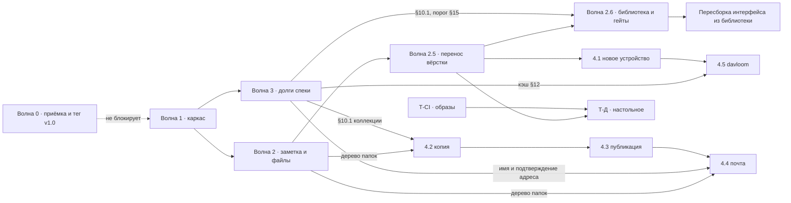

# Глобальный план реализации — план планов

Временный рабочий документ. Отвечает на вопрос **«в каком порядке доделывается всё оставшееся»** — и запланированные функции из [roadmap.md](../roadmap.md), и дизайн из [carrel-ui-mockups.html](../visual/carrel-ui-mockups.html) вместе со всем функционалом, которого он требует. После того как последняя волна закрыта — **plan closeout**: недоделки в roadmap, полезное в постоянные docs, этот файл удалить.

Источники, к которым план не добавляет ни одного решения, а только выстраивает их в порядок:

| | |
|---|---|
| Что не построено и почему именно так | [roadmap.md](../roadmap.md) |
| Требования и `§`-ссылки | [carrel-spec.md](../carrel-spec.md) |
| Как это выглядит и порядок работ по редизайну | [carrel-ui-mockups.html](../visual/carrel-ui-mockups.html), раздел 13 |
| Настольная обёртка, свои фазы | [desktop-wrapper.md](desktop-wrapper.md) |
| Библиотека компонентов, свои этапы | [component-library.md](component-library.md) |
| Что проверяет человек | [manual-acceptance.md](../manual-acceptance.md) |
| Пересборка интерфейса из библиотеки, свои этапы | [interface-rebuild.md](interface-rebuild.md) |
| Соглашения кода, кому какая работа | [development.md](../development.md) |

---

## 1. Правила, из которых выведен весь порядок

**1. Сценарий диктует интерфейс, интерфейс диктует функцию.** Экран — это место, из которого функцию вызывают; функция, у которой такого места нет, сделана низачем. Поэтому кадр макета — **источник требования**, а не иллюстрация к готовому: нарисованный контрол, за которым ничего нет, означает не самоуправство макета, а то, что требование пропустили мы. Три исхода для такого случая — в [interface-rebuild.md](interface-rebuild.md) §6, и «оставить как есть» среди них нет.

*Прежняя редакция этого правила гласила обратное — «ни одна функция не начинается с интерфейса». Она и привела туда, где план стоял в августе 2026: возможности сделаны, экрана нет, три приёмки подряд не могут ответить, готово ли. Правило снято сознательно.*

**Очередь реализации при этом обычная, снизу вверх:** транспорт и модель → провайдер и служба → обработчики → шаблоны. Профиль Apple — это XML и одноразовая ссылка, резервная копия — архив и проверка чтением, davloom — подстановка префиксов в потоке; шаблон не может показать то, чего обработчику неоткуда взять. Это **порядок работы, а не порядок происхождения требований**, и путать их — та самая ошибка, что стоила волны 2.5.

**2. Каркас — раньше того, что на нём стоит.** Двенадцать существующих экранов и пять запланированных нарисованы на одних и тех же примитивах: рейл, строка списка, таблица, панель подробностей, диалог, форма. Если сначала сделать «новое устройство» и резервную копию на нынешней вёрстке, каркас придётся менять под четырнадцатью экранами вместо двух. Поэтому редизайн стоит перед функциями — и по той же причине он не ждёт, пока функции будут готовы.

**3. Правило равенства коллекций (§2.1 макетов) — приёмочный критерий, а не пожелание.** Прежде чем шаг считается закрытым, по каждому роду коллекций (события, задачи, заметки, контакты, файлы) должен быть ответ: **делаем**, **неприменимо** (и почему), **сознательно позже** (и где записано). Ответа «не подумали» быть не должно. Таблица в §2.1 макетов — образец формы ответа.

Следствие первых двух правил: **порядок редизайна из раздела 13 макетов и порядок функций из roadmap — это два разных порядка**, и они не конкурируют. Сначала волны **1–2** (поведение и структурный каркас), затем **2.5** (визуальный перенос вёрстки по макетам 7.1–7.13), потом волна **3** (долги спеки), волна **4** — запланированные функции.

**4. Визуальное соответствие макетам — отдельный критерий закрытия.** Волны 1–2 закрывались по коду, тестам и механике; перенос классов из раздела 6 макетов в шаблоны и `carrel.css` при этом не был доведён до конца. Поэтому v1.1 **не считается достигнутой**, пока не закрыта волна 2.5. Приёмка волны 2.5 — не «тесты зелёные», а **экран рядом с кадром макета** из таблицы 7.13; для форм и панелей — встроенная проверка `#check` в `carrel-ui-mockups.html` («Строки выровнены»).

---

## 2. Вехи

| Веха | Что в ней | Волны |
|---|---|---|
| **v1.0** | Функциональность v1 целиком (готова), минус то, что построено сверх спеки, плюс пройденная ручная приёмка | 0 |
| **v1.1** | Визуальное соответствие макетам для уже реализованного (7.1–7.13): перенос вёрстки, не новые возможности | 2.5 |
| **v1.1.1** | Экраны собраны из библиотеки и работают: каждый нарисованный контрол что-то делает на живых данных | 2.6 + пересборка |
| **v1.1‑struct** | *(закрыто)* Структурный редизайн и функции: каркас, панель подробностей, единый вид в разделах, заметка и файлы | 1–2 |
| **v1.2** | Долги спеки: коллекции (§10.1), кэш (§12), изменяющий тест DAV (§6), оболочка офлайн, учётная запись | 3 |
| **v1.3+** | Новое устройство, резервная копия, публикация, почта — по одной на выпуск | 4.1–4.4 |
| **v2.0** | davloom | 4.5 |
| параллельно | Настольное приложение, CI и образы | Т-Д, Т-CI |

**Рекомендация по v1.0: тегировать до редизайна, а не после.** Три довода. Приёмочные проверки P1 и P2 (круговорот заметки через jtx Board и Evolution) проверяют совместимость данных и от вёрстки не зависят вовсе — ждать редизайна незачем. Тег даёт базовую линию, относительно которой редизайн читается как диф, а не как «всё сразу». И регрессию, которую редизайн внесёт в чужой сервер, искать проще, когда есть точка, где всё работало.

Тег v1.0 при этом **не равен показу людям**: §25.6 расставляет порядок, в котором функции стоит кому-то показывать, а раздел 1 макетов честно говорит, что нынешний экран читается как отладочная страница. Публичный показ — **после волны 2.5**, когда экраны 7.1–7.13 совпадают с макетами по каркасу, типографике и цвету. Приёмка 20 августа (§7.9) показала, что этого достаточно, чтобы экран перестал читаться как отладочная страница: недостающее после 2.5 — это отсутствующие элементы управления, а не разъехавшаяся вёрстка. Волны 1–2 дали механику и каркас, но не визуальный эталон.

---

## 3. Карта зависимостей

Четыре зависимости, которые дороже прочих, если их пропустить:

- **Дерево выбора папки** появляется трижды — «Move…» в файлах (2.4), назначение резервной копии (4.2), выбор файла для письма (4.4). Макеты говорят прямо: третьего дерева не заводится. Значит, оно делается один раз в 2.4 как общий фрагмент.
- **§10.1 коллекции** нужны восстановлению из архива (4.2): восстановление кладёт записи в новую коллекцию, а завести её сегодня нечем.
- **Общий потолок кэша (§12)** становится обязательным ровно тогда, когда к экземпляру подключается несколько клиентов сразу, то есть с davloom.
- **Отображаемое имя и признак подтверждённого адреса** — два поля в записи пользователя, без которых письмо (4.4) не подписать и `Reply-To` не выставить.

---

## 4. Волна 0 — закрыть v1

| | Шаг | Что делается | Проверка |
|---|---|---|---|
| **0.1** | Депонирование: убрать запрет отзыва | `Settings.Escrow.ForbidOptOut`, флажок на `/admin/escrow`, ветка в профиле, `TestOptOutCanBeForbidden`, `TestForbiddenOptOutIsVisible`. Отзыв — всегда решение владельца ключа (§5.4). Существующее состояние с выставленным флагом читается как «не выставлен», поле не мигрируется, а игнорируется | `go test ./...`; отозвать копию у пользователя на экземпляре, где флаг был включён |
| **0.2** | Приёмка, не зависящая от вёрстки | **P1–P4** из [manual-acceptance.md](../manual-acceptance.md): круговорот заметки через jtx Board и Evolution, `docker compose` с пустого тома, логи без секретов | Человек. Результаты — в manual-acceptance |
| **0.3** | Приёмка через интерфейс | **P5** (вставка снимка экрана за пару секунд) и живой сквозной проход вложений: Baikal и отдельный WebDAV через браузер | Человек. Повторяется после волны **2.5** — эти два проходят через экраны, которые она меняет |
| **0.4** | Тег | `CHANGELOG.md`, версия и коммит через `-ldflags`, `/about` показывает их | `docker compose exec carrel /carrel healthcheck` |

**Приёмка блокирует тег, а не работу.** Волна 1 может идти параллельно: P1–P4 проверяют совместимость данных, контейнер и логи и от вёрстки не зависят вовсе. Обратное тоже верно и стоит сказать: P5 и живой проход вложений идут через экран заметки и загрузку файла, то есть ровно через то, что меняет волна **2.5**, — снятые до неё, они дают базовую линию, а не окончательный ответ, и повторяются после волны 2.5.

Единственный шаг волны 0, у которого есть настоящий порядок относительно волны 1, — **0.1: его стоит сделать до 1.10**, иначе флажок «не давать отзывать» сначала перенесут в новый шаблон настроек, а потом оттуда уберут.

Спеке нужна правка статусов: §5.4 уже поправлена, код догоняет её.

---

## 5. Волна 1 — каркас *(закрыта)*

Шаги 1.1–1.19: токены и сброс, каркас страницы, компоненты списка, панель подробностей, быстрая заметка листом и клавиши, формы, единый вид внутри разделов, сквозной поиск и «человек целиком», диалоги, настройки и админка со своим рейлом, выбор столбцов, блок **Source** и исходный часовой пояс (§23.8), вложения у задачи, связывание дубликатов задач и заметок, печать, узкий экран, кадрирование фотографии перетаскиванием, шрифты в бинарник. Что именно сделано — в `CHANGELOG.md`.

**Что волна дала и чего не дала:** поведение, маршруты, htmx-механику и структурный каркас — но не визуальный эталон. Перенос `.m-*` из макетов был оставлен волне 2.5, и это разделение потом стоило трёх приёмок.

---

## 6. Волна 2 — заметка и файлы *(закрыта)*

Две тяжёлые части: единственная запись, которую **пишут**, и единственный раздел, который должен стать **менеджером**. Шаги 2.1–2.10: полный экран заметки с режимом сосредоточения, разбор Markdown (`goldmark`, сырой HTML выключен), «Related to» с поиском по мере набора; в файлах — выделение и групповые операции, `MOVE` с общим деревом выбора папки, перезапись по требованию при столкновении имён, плитки с серверными миниатюрами, копирование через `GET`+`PUT`, поиск по именам, ярлыки рейла.

**Что отсюда живёт дальше:** дерево выбора папки — общий фрагмент, и третьего дерева не заводится (§3).

---

## 7. Волна 2.5 — перенос вёрстки *(закрыта, и стоила трёх приёмок)*

Волна переносила примитивы раздела 6 макетов в шаблоны и `carrel.css` копированием, а не перерисовкой. Что перенесено — в `CHANGELOG.md`; здесь остаётся то, что стоит помнить, потому что оно повторится.

**Две приёмки из трёх были ложными.** Первая объявила волну закрытой по зелёным тестам, которые вёрстку не проверяли. Вторая — по взгляду на экраны: они выглядели правильно из-за запасного правила по тегу, которое чинило заголовок и прятало, что перенос не дошёл до десяти шаблонов — всех настроек и всей админки.

**Урок дороже самой волны.** «Проверил каркас» и «проверил экран» — разные вещи, и первое выдаёт себя за второе: ширину рейла и положение панели задаёт `base.html`, и они совпадают на всех экранах разом, а типографику задаёт правило конкретного экрана. Приёмка идёт **по строкам таблицы 7.13 макетов**, а не по разделам интерфейса, — иначе экраны без своего кадра тихо выпадают.

**Метод, которым волна была наконец сверена.** Макет — закрытая система величин: шкала кеглей `9.5 · 10 · 10.5 · 11 · 11.5 · 12 · 12.5 · 13 · 13.5 · 16 · 17 · 19 · 20 · 22 · 24 · 26 · 27`, два семейства, трекинг `.03 · .04 · .1 · .12 · .18em`, высоты контролов `22 · 26 · 28 · 29 · 38 · 52`. Проверяется не «похоже ли», а попадает ли каждое объявление в систему; это покрывает разом и экраны, у которых своего кадра нет. Выросшие из метода гейты живут в `internal/web/handler/typescale_test.go`.

### 7.9 Чем волна кончилась *(20 августа 2026)*

Три вывода, ради которых раздел и оставлен:

1. **Вёрстка догнала макет везде.** Остались отсутствующие возможности, а не разъехавшиеся размеры.
2. **Часть из них — не выдумка макета, а невыполненные обещания других документов:** порог дубликатов (§15), повторная проверка подключения (§6), сеансы в учётной записи (§24). Как это читается теперь — правило 1 в §1.
3. **Всё это ложится в одну и ту же дюжину мест разметки**, и класть их в тридцать копий шапки — значит повторить историю волны 2.5. Поэтому библиотека компонентов пошла **первой**.

Список того, чего на экранах не хватало, здесь больше не ведётся: он устарел дважды и теперь **выводится машиной** перед каждым этапом — [interface-rebuild.md](interface-rebuild.md) §6.

---

## 7-бис. Волна 2.6 — довести экраны до кадров *(закрыта; шаги B–D переехали)*

Волна дала три вещи, которые работают дальше.

**Библиотека компонентов** (2.6.A) — своя дорожка в [component-library.md](component-library.md).

**Гейты по списку экранов** (2.6.E). Различать стоит три уровня, потому что стоят они по-разному: *соглашение* («правильный способ удобнее неправильного») не ловит ничего; *гейт по списку ошибок* ловит то, что кто-то перечислил, и новая ошибка проходит насквозь; *гейт по списку экранов* ловит **всё** на **каждом** экране, потому что список экранов закрыт и известен машине — `routes_conformance_test.go` выводит его разбором `routes.go`. Второй подход пропустил десять экранов, третий не пропустил ни одного. Граница, которую стоит помнить: тест держит форму, смысл остаётся за человеком.

**Проверка 2.6.G**, нашедшая пятнадцать расхождений сверх исходной приёмки, — все закрыты.

**Шаги B–D — панель над списком, долги настроек и админки, значки и меню второго ряда — растворены** в [interface-rebuild.md](interface-rebuild.md): делать контрол отдельно от экрана, который его показывает, оказалось тем же разделением, что стоило волны 2.5.

**Открытые замечания, которые шагами так и не стали.** Записаны, потому что установлены проверкой, и ни одно не закрыто:

- `Export CSV` описан как потоковый, а `s.Store.Audit(...)` возвращает готовый слайс: журнал целиком в памяти. По существу обещание выполнено — ограничения в 200 строк нет, — по формулировке нет. Либо правится формулировка, либо чтение.
- **Лимитера на `Test` и `Discover` нет.** Каждое нажатие — исходящий запрос без ограничения.
- У записи `password_change` в аудите пустое поле IP; у всех остальных — адрес.
- На `CARREL_LOG_LEVEL=debug` сервер не пишет ничего: пароль поэтому утечь не может, но и отлаживать этим уровнем нечего.

---

## 8. Волна 3 — долги спеки *(закрыта целиком)*

Семь шагов, все закрыты и описаны в `CHANGELOG.md`: коллекции — завести, переименовать, удалить (§10.1); кэш с общим потолком процесса и вытеснением тел раньше карт ETag (§12); полный изменяющий тест DAV-сервера (§6); проверка установки (§18.1, кадр 7.11.1); отображаемое имя и подтверждённый адрес учётной записи (§23.5); оболочка офлайн (§13); порог совпадений как настройка профиля, а не константа сборки (§15).

Волна важна дальше двумя следствиями: восстановление из архива (4.2) кладёт записи в коллекцию, которую теперь есть чем завести, а общий потолок кэша — предпосылка davloom (4.5).

---

## 9. Волна 4 — запланированные функции

Порядок — из roadmap: ценность первой, а не инженерное удобство. Одна функция — один выпуск.

### 4.1 Новое устройство (§23.1) · **S**

Самая дешёвая функция дорожной карты: после discovery Carrel уже знает всё, на что уходит время при ручной настройке — рабочий адрес, принципал, home-sets, точные пути и имена коллекций, учётные данные.

- **Apple** — `.mobileconfig`, XML-plist с payload'ами CalDAV и CardDAV, один профиль на все подключённые аккаунты сразу. По объёму это генерация XML.
- **Android** — `davx5://user@host/path/` в QR. Пароль так не передаётся (документация DAVx5 это запрещает), но два поля, в которых чаще всего ошибаются, закрыты. `caldavs://` и `carddavs://` — для прочих совместимых.
- **Thunderbird** — экрана с кнопками копирования достаточно, механизма импорта у него нет.
- **Файловый клиент** — адрес строкой в списке; в профиль Apple WebDAV не кладут.

Безопасность — не довесок, а причина, по которой функция не так мала, как выглядит: профиль содержит пароли в открытом виде и оказывается в «Загрузках» и в мессенджерах. Поэтому — повторный ввод пароля Carrel, одноразовая ссылка с коротким сроком и обратным отсчётом на экране, ничего не пишется на диск сервера, явное предупреждение до кнопки, запись в аудит. Здесь же делается **лист «показать пароль»** с общей механикой (вопрос раз в сеанс, автоскрытие, журнал) — тот же лист потом стоит в подключениях (7.10).

### 4.2 Резервная копия и восстановление (§23.3) · **L**

Carrel читает с одного сервера и пишет на другой, поэтому §2 остаётся в силе. Архив — сырые `.ics` и `.vcf` **как есть**, в папках `account/collection`, файлы файлами, плюс манифест с датой, версией, коллекциями и ETag'ами. Копия, которую распаковывает только её собственная программа, — плохая копия.

**Копия — это список заданий, а не переключатель в настройках:** у каждого свои источники, место, триггер и срок хранения. Первое задание заводится мастером за три поля.

Триггеры — в порядке возрастания компромисса и в порядке реализации:

1. **По требованию.** Человек вошёл, ключ развёрнут, архив уходит куда выбрали. Уступки модели безопасности нет вовсе.
2. **При входе.** Если последняя копия старше N дней — предложить или снять её в уже открытой сессии. Секрет нигде не хранится.
3. **Внешний триггер.** `POST /api/backup/run` с паролем приложения, областью которого является ровно одно задание и его запуск. Асинхронно, с лимитом, аудитом и отказом на второй запуск при идущем первом. Плюс `GET /api/backup/{id}/download` потоком, не касаясь диска сервера. Наружу отдаётся **готовая строка**, а не пароль: у задания на WebDAV — строка в `crontab`, у задания с «Download» — короткий скрипт из трёх шагов, у чистого «Download» — снова одна строка, но другая. Формы ответов подчинены этому: идентификатор голой строкой, статус одним словом, чтобы `sh` на чужой машине обошёлся без `jq`.

Не обсуждается ни при каком триггере: файл датируется, а не перезаписывается, и хранится N штук; записанное **читается обратно и сверяется**; отказ на одной коллекции помечается в манифесте и не останавливает остальные; **восстановление — часть функции**, потому что копия без проверенного восстановления — это чувство, а не защита.

**Восстановление** живёт в шапке страницы «Backup» рядом с «New job» и весит столько же: в тот день, когда оно понадобится, искать будут его. Два входа — из истории задания и **из файла** на чистом экземпляре, где заданий нет; второй и есть тот, ради которого копию делали. Пароль архива спрашивается первым, до выбора коллекций: без него не читается даже манифест. Колонка «Restore into» — обычный список коллекций с полосками и предподставленным совпадением по пути; несколько строк назначаются разом; «Skip this one» — такой же выбор цели, как остальные. Обещание формулируется выполнимо: восстановление — это импорт, а не откат.

Шифрование отдельным паролем — **включено по умолчанию, выключается осознанно**, и там же сказано, чем это оборачивается вместе с паролем триггера.

### 4.3 Публикация по ссылке и внешние подписки (§23.4) · **L**

Один механизм в две стороны, с одинаковыми ограничениями: только чтение, ничего не хранится, страница собирается живым чтением источника на каждый запрос.

**Наружу** — секретная ссылка на один объект или одну коллекцию, пять видов публичной страницы с общей хромой (логотип, метка read-only, скачивание, срок в подвале): адресная книга (список; телефоны и почта — два отдельных флажка, оба выключены, и скачивание `.vcf` им подчиняется), календарь (агенда за диапазон, `webcal://` рядом с «Download .ics»), заметка (рендер или сырой `.ics`), файл (картинка встроенно, PDF в браузер, текст и Markdown телом на странице с экранированием, прочее — имя и размер), папка (листинг со значками типа, вложенные — флажком, по умолчанию выключено; тот же токен монтируется как WebDAV только для чтения, и «How to mount» показывает три строки для трёх систем).

**Внутрь** — подписка на чужую ленту `.ics` или `.vcf`. Живёт среди подключений (7.10), а не среди выданных ссылок: для человека это источник. Проверка адреса — тот же след, что у discovery: что ответил сервер, сколько весит, за сколько пришло, что внутри, просили ли пароль. Имя берётся из `X-WR-CALNAME`, раздел определяется содержимым: `VEVENT` в календарь, `VTODO` в задачи, `VJOURNAL` в заметки, одной строкой «Подписки» в рейле каждого раздела. Цвет выдумывается из адреса, полоска штрихованная, метка `ro`. Ошибка живёт в строке подписки, а не вместо событий.

**Общее:** токен не меньше 32 случайных байт, хранится дайджестом; отзыв в одно нажатие; настраиваемый срок; список действующих ссылок с последним заходом и числом заходов (единственный способ понять, что ссылка ушла дальше, чем предполагалось); `Cache-Control: private`, `X-Robots-Tag: noindex`, свой лимит запросов. Одна ссылка — один объект, одна коллекция или одна лента; аккаунт целиком — никогда. Для внешних источников — таймаут, потолок размера, правила SSRF (§24.2) и деградация §17.

Здесь же в рейле файлов появляется ярлык **Published** (2.10) и в удалении коллекции (3.1) заполняется первая строка «на это ссылается».

### 4.4 Отправка почтой (§23.5) · **M**

Два шага на одном механизме, и второй без первого не строится. Оба переиспользуют SMTP-клиент, который работает с §5.3; не хватало разрешения отправить им что-то, кроме токена.

1. **Ссылка письмом** — кнопка рядом со ссылкой, которую §23.4 уже выдаёт. Письмо несёт ссылку и ничего больше; отзыв и срок остаются там, где их поставил §23.4, и отправка не создаёт состояния.
2. **Обычное письмо с вложениями** — контакт, книга, событие, диапазон календаря, заметка, задача, файл вложением; папка — всегда ссылкой; всё, что выше потолка, становится ссылкой §23.4, **и интерфейс говорит это до отправки**. Колонка «attached / as a link» — главное в окне письма.

Выбор вложения — **экран Carrel, а не системный диалог**: вкладывают запись из коллекции, о которой ОС ничего не знает. Тот же рейл источников, тот же список, тот же поиск; для файлов колонка «файлом/ссылкой» стоит у каждой строки **до** выбора. Формат заметки — единственный настоящий вопрос: Markdown читает человек, но чужие `X-`свойства в него не попадают; `.ics` несёт всё, но требует клиента, понимающего VJOURNAL. Умолчание — Markdown: письмо идёт человеку, а не его календарю. Вложение ссылкой — это выдача публичной ссылки, и сказать об этом надо там, где нажимают «Attach», а не в подсказке ниже.

**From — двухпозиционная настройка администратора**, а не догадка: персональный `<login>@<domain>` или служебный `noreply@<domain>` (умолчание). Конверт остаётся адресом релея, так что SPF проходит в обоих случаях; DKIM Carrel не подписывает и DNS не трогает, а кнопка тестового письма из §5.3 отвечает на вопрос опытом. `Reply-To` — адрес профиля **только подтверждённый** (3.5); без него письмо кончается строкой «не отвечайте», потому что входящую почту Carrel не разбирает вовсе. Получатель дополняется из подключённых книг тем же веерным поиском §16, суженным до карточек с адресом: подсказка — это адрес, а не человек, поэтому две почты дают две строки, а книга, не ответившая вовремя, названа — иначе отсутствие человека читается как «нет такого контакта», когда правда в том, что сервер лежал.

Остальное — поверхность злоупотребления, и потому у функции есть выключатель: **выключено по умолчанию**, потолки на размер вложения, размер письма, число получателей и писем в сутки, `CR`/`LF` вырезаются из темы, имени и адресов, аудит пишет кто и сколько отправил и какого рода вложение — не адреса, не тему, не содержимое. Одно ограничение структурное: SMTP хочет письмо целиком, base64 раздувает его на треть, и это единственное место, где тело файла держится в памяти целиком. Ответ на это — потолок, а не временный файл.

### 4.5 davloom — режим прокси (§23.2) · **XL**

Killer feature и самый большой кусок работы. Один аккаунт в DAVx5 или Thunderbird вместо пяти.

Поставляется **режимом запуска той же сборки**: `carrel serve`, `carrel proxy` или оба. Рекомендуемое развёртывание — два процесса из одного образа: прокси разбирает недоверенные тела от машин и не должен делить адресное пространство с развёрнутыми ключами, а падение прокси не должно выкидывать всех из веб-интерфейса.

Большая часть трафика проксируется вслепую — `REPORT`, `sync-collection`, `calendar-query`, `PROPPATCH`, `GET`, `PUT`, `DELETE` — с подменой заголовка авторизации. Вслепую не идут два:

- **hrefs в телах.** Multistatus несёт пути апстрима; отданный как есть, он уводит следующий запрос клиента мимо прокси. Решается зеркальной схемой путей и потоковой подстановкой префикса в обе стороны, без разбора XML и без буферизации тела.
- **корень.** `/` не принадлежит ни одному апстриму. `.well-known`, `current-user-principal`, принципал и home-sets — синтетические уровни, и они же склеивают несколько серверов в один аккаунт. `PROPFIND Depth: 1` на синтетическом home-set — веерный опрос с таймаутами и деградацией §16–17, которые уже есть. Синтетических уровней ровно три; ниже — тупое проксирование. Ветка `files/` идёт бесплатно: провайдер написан, учётные данные есть, синтетики не нужно — только префикс.

Аутентификация — пароли приложений **по устройствам**, у каждого своя обёртка ключа: отзыв устройства — удаление обёртки, смена пароля Carrel устройств не роняет. Интерфейс обязан сказать это вслух. Ничего расшифрованного между запросами в памяти не остаётся; короткий кэш KEK существует ради всплеска, который DAVx5 делает при нескольких правках подряд, а не ради плановой синхронизации раз в несколько часов.

Интерфейс: область выдачи у каждого устройства (полоски и счёт, правится без перевыдачи пароля), время последнего запроса в строке, подробный журнал под `⋯`, **только чтение в двух местах** — общий потолок сверху и права устройства в строке, не выше потолка, с погашенным переключателем и подсказкой вместо отказа после нажатия. Страница-заглушка по адресу прокси в браузере: что это, куда вводить адрес, `Serves: CalDAV · CardDAV · WebDAV`, ссылка на исходники — §13 AGPL требует предложить их тем, кто пользуется программой по сети, и это единственная пользовательская поверхность модуля. `PROPFIND` по тому же адресу по-прежнему требует аутентификации и отвечает клиенту, а не человеку.

Настоящий риск — не код: реализация по RFC и реализация, которую переваривают DAVx5, Thunderbird и Apple Calendar, различаются заметно, и этот хвост часто дороже функции. **Начинать только чтением против одного DAVx5.**

---

## 10. Параллельные треки

**Т-Д. Настольное приложение (Wails, §18).** Свои восемь фаз в [desktop-wrapper.md](desktop-wrapper.md); порядок относительно волн не фиксирован. Разумно начинать **после волны 2.5**: обёртка ничего не рисует сама (нативного в ней — рамка, меню, трей, уведомления и три диалога), и оборачивать вёрстку, которая ещё не совпадает с макетами, незачем. Ранний прототип после волны 1 допустим; показ людям — после 2.5. Ей нужны от основного плана: экран проверки установки (3.4) в локальном режиме и метки `local` там, где результат зависит от доступности снаружи.

**Т-CI. Образы и сборка (§18).** Сегодня нет ни CI, ни публикации `linux/amd64` и `linux/arm64`, ни `ghcr.io` — и это осознанно откладывалось с первого этапа. Предпосылка для установщиков настольного приложения и для любого выпуска, который кто-то поставит не из исходников. Секреты не дублируются в Gitea: сборка в GitHub Actions для зеркала.

---

## 11. Что план сознательно не содержит

Из roadmap, без изменений и без обсуждения заново:

- **Не принято** (§23.7): разбор экспортов сервисов и изменяющая ссылка. Записаны, не запланированы.
- **Не будет:** сетка месяца и перетаскивание, правка отдельных вхождений повторов, iTIP, локальная персистентность содержимого, база данных, Node и сборщик, локализация, восстановление пароля, файловый менеджер как продукт, уборка папки вложений, мобильное приложение, корзина, хостинг как услуга, внутренний планировщик с сохранённым паролем, защита от оператора хоста.
- Из «последствий ранних решений»: экспорт нескольких коллекций сразу поглощается резервной копией (4.2); встроенные вложения (base64) по-прежнему показываются и не открываются; размер и тип вложения берутся из параметров, а не измеряются; листинги папок не пагинируются.

---

## 12. Риски

| Риск | Где | Что делать |
|---|---|---|
| Хвост совместимости клиентов | 4.5 davloom | Начать read-only против одного DAVx5; расширять по одному клиенту, а не по RFC |
| Контрол совпал с кадром и ничего не делает | пересборка | Приёмка — на живых данных, а не на пустом экземпляре; таблица контролов и способ проверки — [interface-rebuild.md](interface-rebuild.md) §8 |
| План написан для того, кто и так всё знает | 2.5 (случилось), пересборка | Именно так волна 2.5 прошла мимо десяти экранов. Лечится не вежливостью к исполнителю, а вложением в библиотеку и её документацию: [interface-rebuild.md](interface-rebuild.md) §12–13 |
| Профиль Apple с паролями утекает | 4.1 | Одноразовая короткоживущая ссылка, повторный ввод пароля, ничего на диск, аудит, предупреждение до кнопки |
| Тихо сломавшаяся копия | 4.2 | Читать записанное обратно и сверять; неполная копия помечается красным в задании и в истории |
| Ссылки, о которых владелец не знает | 4.3, 4.4 | Вложение выше потолка публикует ссылку — сказать об этом на кнопке «Attach», а не в подсказке |
| Память процесса на общем экземпляре | 3.2, 4.5 | Общий потолок и учёт байт **до** davloom, а не после первой смерти по OOM |
| Документы разъезжаются | все | Волна не закрыта, пока не обновлены статусы в спеке, строки в roadmap, `CHANGELOG.md` и таблица полноты 7.13 макетов |

---

## 13. Отслеживание

Отметка ставится, когда шаг закрыт целиком — код, тесты, документы. Для всего, что касается экранов, «закрыт» значит ещё и приёмку на живых данных, а не только зелёные тесты (правило 4 в §1).

| Волна | Шаги | Состояние |
|---|---|---|
| 0 — закрыть v1 | 0.1–0.4 | 0.1 ☑ · 0.2–0.3 человек · 0.4 после P1/P2/P5 |
| 1 — каркас (структура) | 1.1–1.19 | 1.1–1.19 ☑ · вёрстка → 2.5 · перенесено: меню строки на узком экране (§13 спеки, roadmap) |
| 2 — заметка и файлы (функции) | 2.1–2.10 | 2.1–2.10 ☑ · вёрстка → 2.5 |
| 2.5 — перенос вёрстки | 2.5.1–2.5.6 | ☑ |
| 2.6 — довести экраны до кадров | A–G | ☑ · шаги B–D переехали в пересборку |
| 3 — долги спеки | 3.1–3.7 | ☑ |
| **Пересборка интерфейса** | **О1–О3, П, С1–С7** | ☐ — [interface-rebuild.md](interface-rebuild.md) |
| 4 — функции | 4.1–4.5 | ☐ · лист «показать пароль» из 4.1 делается в пересборке |
| Т-Д — настольное | фазы 1–8 | ☐ |
| Т-CI — образы | — | ☐ |

**Ритм работы** — из development.md, без изменений: коммиты только по просьбе; один шаг — один коммит с обновлённым `CHANGELOG.md`; перед коммитом `go build ./...`, `go vet ./...`, молчащий `gofmt -l .`, зелёный `go test ./...`. Крипто, исходящие соединения, сохранение чужих свойств и разрушительные операции — отдельными сессиями и с повторным проходом по дифу; шаблоны, CSS и печать — быстрыми итерациями.

## 14. Закрытие плана

План закрывается, когда закрыты волны 0–4 (включая **2.5**) и оба трека. Тогда: недоделки, которые всплыли и не были сделаны, переносятся в [roadmap.md](../roadmap.md); то, что стоит помнить о практике, — в [development.md](../development.md); статусы `[не сделано]` в спеке приводятся в соответствие; [desktop-wrapper.md](desktop-wrapper.md), [component-library.md](component-library.md), [interface-rebuild.md](interface-rebuild.md) и этот файл удаляются.
