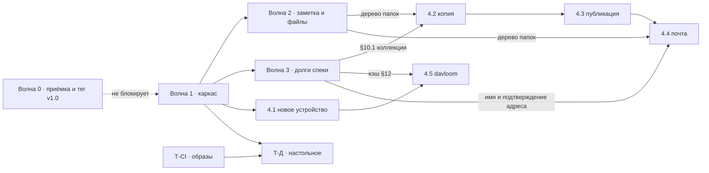

# Глобальный план реализации — план планов

Временный рабочий документ. Отвечает на вопрос **«в каком порядке доделывается всё оставшееся»** — и запланированные функции из [roadmap.md](../roadmap.md), и дизайн из [carrel-ui-mockups.html](../visual/carrel-ui-mockups.html) вместе со всем функционалом, которого он требует. После того как последняя волна закрыта — **plan closeout**: недоделки в roadmap, полезное в постоянные docs, этот файл удалить.

Источники, к которым план не добавляет ни одного решения, а только выстраивает их в порядок:

| | |
|---|---|
| Что не построено и почему именно так | [roadmap.md](../roadmap.md) |
| Требования и `§`-ссылки | [carrel-spec.md](../carrel-spec.md) |
| Как это выглядит и порядок работ по редизайну | [carrel-ui-mockups.html](../visual/carrel-ui-mockups.html), раздел 13 |
| Настольная обёртка, свои фазы | [desktop-wrapper.md](desktop-wrapper.md) |
| Что проверяет человек | [manual-acceptance.md](../manual-acceptance.md) |
| Соглашения кода, кому какая работа | [development.md](../development.md) |

---

## 1. Три правила, из которых выведен весь порядок

**1. Ни одна функция не начинается с интерфейса.** Сказано в разделе 13 макетов дословно. Профиль Apple — это XML и одноразовая ссылка, резервная копия — архив и проверка чтением, davloom — подстановка префиксов в потоке. Внутри каждого шага порядок один и тот же: транспорт и модель → провайдер и служба → обработчики → шаблоны. Макет говорит, чем работа кончится, и не говорит, с чего начнётся.

**2. Каркас — раньше того, что на нём стоит.** Двенадцать существующих экранов и пять запланированных нарисованы на одних и тех же примитивах: рейл, строка списка, таблица, панель подробностей, диалог, форма. Если сначала сделать «новое устройство» и резервную копию на нынешней вёрстке, каркас придётся менять под четырнадцатью экранами вместо двух. Поэтому редизайн стоит перед функциями — и по той же причине он не ждёт, пока функции будут готовы.

**3. Правило равенства коллекций (§2.1 макетов) — приёмочный критерий, а не пожелание.** Прежде чем шаг считается закрытым, по каждому роду коллекций (события, задачи, заметки, контакты, файлы) должен быть ответ: **делаем**, **неприменимо** (и почему), **сознательно позже** (и где записано). Ответа «не подумали» быть не должно. Таблица в §2.1 макетов — образец формы ответа.

Следствие первых двух правил: **порядок редизайна из раздела 13 макетов и порядок функций из roadmap — это два разных порядка**, и они не конкурируют. Первый идёт волнами 1–2, второй — волной 4, между ними волна 3 закрывает то, на что и тот и другой опираются.

---

## 2. Вехи

| Веха | Что в ней | Волны |
|---|---|---|
| **v1.0** | Функциональность v1 целиком (готова), минус то, что построено сверх спеки, плюс пройденная ручная приёмка | 0 |
| **v1.1** | Интерфейс из макетов: каркас, панель подробностей, единый вид в разделах, заметка и файлы | 1–2 |
| **v1.2** | Долги спеки: коллекции (§10.1), кэш (§12), изменяющий тест DAV (§6), оболочка офлайн, учётная запись | 3 |
| **v1.3+** | Новое устройство, резервная копия, публикация, почта — по одной на выпуск | 4.1–4.4 |
| **v2.0** | davloom | 4.5 |
| параллельно | Настольное приложение, CI и образы | Т-Д, Т-CI |

**Рекомендация по v1.0: тегировать до редизайна, а не после.** Три довода. Приёмочные проверки P1 и P2 (круговорот заметки через jtx Board и Evolution) проверяют совместимость данных и от вёрстки не зависят вовсе — ждать редизайна незачем. Тег даёт базовую линию, относительно которой редизайн читается как диф, а не как «всё сразу». И регрессию, которую редизайн внесёт в чужой сервер, искать проще, когда есть точка, где всё работало.

Тег v1.0 при этом **не равен показу людям**: §25.6 расставляет порядок, в котором функции стоит кому-то показывать, а раздел 1 макетов честно говорит, что нынешний экран читается как отладочная страница. Публичный показ — с v1.1.

---

## 3. Карта зависимостей

Четыре зависимости, которые дороже прочих, если их пропустить:

- **Дерево выбора папки** появляется трижды — «Move…» в файлах (2.4), назначение резервной копии (4.2), выбор файла для письма (4.4). Макеты говорят прямо: третьего дерева не заводится. Значит, оно делается один раз в 2.4 как общий фрагмент.
- **§10.1 коллекции** нужны восстановлению из архива (4.2): восстановление кладёт записи в новую коллекцию, а завести её сегодня нечем.
- **Общий потолок кэша (§12)** становится обязательным ровно тогда, когда к экземпляру подключается несколько клиентов сразу, то есть с davloom.
- **Отображаемое имя и признак подтверждённого адреса** — два поля в записи пользователя, без которых письмо (4.4) не подписать и `Reply-To` не выставить.

---

## 4. Волна 0 — закрыть v1

| | Шаг | Что делается | Проверка |
|---|---|---|---|
| **0.1** | Депонирование: убрать запрет отзыва | `Settings.Escrow.ForbidOptOut`, флажок на `/admin/escrow`, ветка в профиле, `TestOptOutCanBeForbidden`, `TestForbiddenOptOutIsVisible`. Отзыв — всегда решение владельца ключа (§5.4). Существующее состояние с выставленным флагом читается как «не выставлен», поле не мигрируется, а игнорируется | `go test ./...`; отозвать копию у пользователя на экземпляре, где флаг был включён |
| **0.2** | Приёмка, не зависящая от вёрстки | **P1–P4** из [manual-acceptance.md](../manual-acceptance.md): круговорот заметки через jtx Board и Evolution, `docker compose` с пустого тома, логи без секретов | Человек. Результаты — в manual-acceptance |
| **0.3** | Приёмка через интерфейс | **P5** (вставка снимка экрана за пару секунд) и живой сквозной проход вложений: Baikal и отдельный WebDAV через браузер | Человек. Повторяется после волны 2 — эти два проходят через экраны, которые она меняет |
| **0.4** | Тег | `CHANGELOG.md`, версия и коммит через `-ldflags`, `/about` показывает их | `docker compose exec carrel /carrel healthcheck` |

**Приёмка блокирует тег, а не работу.** Волна 1 может идти параллельно: P1–P4 проверяют совместимость данных, контейнер и логи и от вёрстки не зависят вовсе. Обратное тоже верно и стоит сказать: P5 и живой проход вложений идут через экран заметки и загрузку файла, то есть ровно через то, что меняют волны 1–2, — снятые сейчас, они дают базовую линию, а не окончательный ответ, и повторяются после волны 2.

Единственный шаг волны 0, у которого есть настоящий порядок относительно волны 1, — **0.1: его стоит сделать до 1.10**, иначе флажок «не давать отзывать» сначала перенесут в новый шаблон настроек, а потом оттуда уберут.

Спеке нужна правка статусов: §5.4 уже поправлена, код догоняет её.

---

## 5. Волна 1 — каркас

Шаги 1–8 и 11–14 из раздела 13 макетов, плюс то, что раздел 13 не перечислял, потому что оно не про вёрстку, а описано в разделах 6, 7.1–7.3, 7.7, 7.10, 11. Редизайн **не добавляет возможностей** там, где не сказано обратное, и не трогает ни одной формулировки в интерфейсе.

| | Шаг | Файлы | Проверка |
|---|---|---|---|
| **1.1** | Токены и сброс: переменные, шкала, `--alert` вместо пары `--error`/`--danger`, поверхности тёмной темы, фокус | `static/carrel.css` | Существующие экраны не ломаются; `go test ./...` зелёный — шаблоны не тронуты |
| **1.2** | Каркас: верхняя панель 52 px, рейл, снятие `max-width` с `main`, четыре зоны и их поведение по ширине окна | `template/base.html`, CSS | `shell_test.go`: навигация присутствует и помечает текущий раздел |
| **1.3** | Компоненты списка: строка, полоска коллекции 3 px, рубрикатор, значки, квадратные заглушки вместо круглых. **Три высоты строки** (28/26/22 px) как правило системы, а не разметки; кнопка при поле — внутри его блока | CSS, `contacts.html`, `agenda.html`, `tasks.html`, `notes.html` | Печать сохраняет вид (`print-only` не трогается); встроенная проверка макетов `#check` — «строки выровнены» |
| **1.4** | Панель подробностей справа через htmx `hx-target`. Правило: нет выделения — нет панели; закрыта вручную — сама не возвращается; состояние помнится по разделу | `contact.html`, `event.html`, `task.html`, `note.html`, роутинг фрагментов | Прямая ссылка на карточку по-прежнему открывает целую страницу — панель только надстройка |
| **1.5** | Быстрая заметка **листом** с любого экрана и клавиши `N`, `/`, `Enter`, `Esc`, `Ctrl+Enter`; «New note» в шапке со стрелкой на всё остальное, что можно создать, в порядке рейла | `base.html`, `note_quick.html` как фрагмент, `carrel.js` | `/app/notes/quick` остаётся рабочей страницей: без JS кнопка — обычная ссылка. Клавиши не срабатывают в полях ввода |
| **1.6** | Формы: многоколоночная раскладка, ширина поля по содержимому, нижняя панель действий, выравнивание ячеек по верху | все шаблоны с формами | Формы отправляются теми же полями; тесты обработчиков не меняются |
| **1.7** | **Единый вид внутри разделов.** Строка «All …» первой в списке источников, трёхпозиционный флажок, опрос по отмеченным, колонка источника, флажки «Events / Tasks due / Notes» в календаре. `/app/unified` и «Everything» удаляются | `agenda.html`, `contacts.html`, `tasks.html`, `notes.html`, `base.html`; `unified.html` убирается, его `findresults` переиспользуется | `stage5_test.go`, `stage6_test.go`: механика fan-out остаётся, меняются точки входа. SSE и опрос не затронуты |
| **1.8** | Сквозное: поиск из шапки с любого экрана и **экран «человек целиком»** — переезжает из служебной «ленты» в контакты, во всю ширину, с колонкой «почему совпало» (точное `mailto:` против попадания строки в текст), вкладкой файлов из уже загруженных записей и кнопками «заметка о ней» / «встреча с ней» с подставленным участником | `search.html`, `timeline.html`, `duplicates.html`, `base.html` | Признак совпадения доносится от движка до строки; второго опроса ради вкладки файлов нет |
| **1.9** | Диалоги: импорт как мастер с явными шагами, слияние, конфликт | `*_import.html`, `duplicate_merge.html`, `conflict.html` | Шаги соответствуют состояниям, которые обработчик уже различает |
| **1.10** | Настройки и администрирование: свой рейл, порядок пунктов «кто вы → откуда данные → как забрать на устройства → куда сложить копию → что отдать наружу → как выглядит», меню в шапке вместо квадратика с инициалами, экран **Appearance** — тема и плотность строк в `localStorage` | `app.html` → `settings_*.html`, `admin*.html`, `base.html` | `admin_test.go`, `accounts_test.go`, `register_test.go`; поля в профиле на сервере ради темы не заводятся |
| **1.11** | **Выбор столбцов**: кнопка `Columns` в панели управления каждого списка и таблицы — контакты, задачи, заметки, файлы, пользователи, журнал. Флажок включает столбец, ручка меняет порядок, первый столбец выключить нельзя | CSS, шаблоны списков, хранение выбора | Открытый вопрос — где хранить: `localStorage` рядом с темой и плотностью или `internal/account/views.go` рядом с выбором источников. Решается перед шагом, а не внутри него |
| **1.12** | §23.8, первый пункт: блок **Source** в панели подробностей и в карточке аккаунта — когда коллекция читалась и когда менялась на сервере | `base.html`, карточки, `internal/session/cache.go` | Кэш это уже знает: `getctag` и ETag. Кода почти нет, ценность — та, ради которой §23.8 написан |
| **1.13** | §23.8, второй пункт: **исходный часовой пояс** события меткой рядом со временем и только когда он отличается от общего | `event.html`, `agenda.html`, `internal/model/event.go` | Данные уже в `DTSTART` с `TZID`; общий пояс v1 остаётся один |
| **1.14** | **Вложения у задачи**: тот же блок, что у события и заметки | `task.html` | `ATTACH` в модели есть; закрывает строку таблицы равенства |
| **1.15** | **Дубликаты задач и заметок** — только связывание. Ни «Merge on the server…», ни выбора значений полей: у них нечего дополнять | `duplicates.html`, `internal/merge` | Расходящиеся тексты человек выбирает сам и не получает склеенными |
| **1.16** | Печать: **листинг папки** и подвал с числом источников, попавших в снимок, у агенды и списков | `@media print` в CSS, `files.html` | Усечённый листинг, напечатанный молча, врёт убедительнее экранного |
| **1.17** | **Узкий экран (§13)**: выдвижной рейл вместо стопки флажков, цели 44 px, нижняя панель разделов, две строки в записи, меню строки вместо панели свойств | CSS, `base.html` | Ручная проверка на телефоне; закрывает пробел §13 из roadmap |
| **1.18** | **Кадрирование фотографии** перетаскиванием: слой вместо четырёх числовых полей; числа остаются запасным путём с клавиатуры и единственным на узком экране, где §13 просит центральный кроп | `contact_crop.html`, `carrel.js`, `internal/photo` | Без JS остаются числа и работающая форма |
| **1.19** | Шрифты Literata и Public Sans в бинарник через `go:embed` | `internal/web/embed.go`, CSS | CDN не появляется; размер образа вырос предсказуемо |

**Чего волна 1 не делает.** Не приносит JS-фреймворк: панель подробностей, выдвижной рейл, лист и мастер импорта — htmx и `
`. `carrel.js` вырастает со ста шестидесяти строк примерно втрое (клавиши, кроп, позже очередь загрузок), и каждая добавка деградирует: без JS кнопка заметки — ссылка, загрузка — обычная форма. Не заводит вторую палитру. Не трогает тексты интерфейса.

---

## 6. Волна 2 — заметка и файлы

Две тяжёлые части редизайна: единственная запись, которую **пишут**, и единственный раздел, который должен стать **менеджером**. Обе добавляют возможности, поэтому стоят отдельной волной, а не строкой в предыдущей.

### Заметка

| Шаг | Что делается | Проверка |
|---|---|---|
| **2.1** | Полный экран заметки: чтение с колонкой связей и вложений, свой адрес для ссылки, соседние заметки в рейле, переключатель **Full width / Reading width** (умолчание — полная), режим **Focus** и выход по `Esc`, кнопки разметки, предупреждение о несохранённом | Сохранение остаётся явным: автосохранения на чужой сервер нет. Конфликт по ETag открывает тот же экран, что и раньше |
| **2.2** | **Разбор Markdown в просмотре** — `goldmark` в `go.mod` и `THIRD_PARTY.md`, сырой HTML выключен: чужая заметка приходит с чужого сервера. Поддерживается то, что пишут руками и кладёт jtx Board: заголовки, списки, задачи-флажки, выделение, ссылки, код, цитаты, таблицы. Хранится по-прежнему текст, правка отдаёт ровно набранные символы, неизвестный синтаксис остаётся видимым текстом. Кнопка **Source** показывает исходник | Новая зависимость — **решение, которое согласуется до коммита** (development.md). Тест: круговорот «правка без изменений» не меняет ни байта |
| **2.3** | «Related to» перестаёт быть полем для UID: поиск по мере набора по тем же источникам, выбранное — значок с крестиком, ручной ввод UID последним пунктом списка | Сегодня там `placeholder="UIDs, comma-separated"`, то есть просьба, которую никто не выполнит |

### Файлы

| Шаг | Что делается | Состояние провайдера |
|---|---|---|
| **2.4** | Выделение, групповые операции циклом по выбранным с отчётом по каждому, панель свойств по выделению (закрывается и помнит это), хлебные крошки как навигация, иконка типа в строке, корень **All collections** как единый вид раздела | Только интерфейс поверх того, что провайдер уже умеет |
| **2.5** | **Переименование и перемещение** — `MOVE`. Один метод провайдера и **общее дерево выбора папки**, которое потом переиспользуют 4.2 и 4.4 | В транспорте `Move` есть, провайдер его не использует |
| **2.6** | **Перезапись по требованию** как ответ на столкновение имён в очереди загрузок: `Keep both` берёт следующее свободное имя, `Replace` перезаписывает осознанно. Очередь загрузок в углу, не блокирует работу, прогресс через `XMLHttpRequest` | `PUT` без `If-None-Match`. Запрет по умолчанию остаётся правильным, но становится выбором человека в момент столкновения, а не отказом без вариантов |
| **2.7** | **Плитки и миниатюры**: тот же список сеткой — то же выделение, та же панель операций. Миниатюра только у картинок меньше порога, подгрузка по появлению на экране, всё прочее — значок типа на картоне | `GET` с порогом по размеру; сервер отдаёт оригинал, поэтому порог и ленивость обязательны |
| **2.8** | **Копирование между хранилищами**: внутри сервера — `MOVE`, наружу — скачать и загрузить, и Carrel говорит это **до** начала, а не после | `COPY` не используется |
| **2.9** | **Поиск по именам файлов** в сквозном поиске, с честной строкой о том, что содержимое не индексируется и не будет | `PROPFIND` уже возвращает имена |
| **2.10** | Ярлыки рейла: **Attachments** — папка из настроек вложений, где бы она ни была (не выбрана — ведёт на страницу выбора). **Published** — появляется вместе с 4.3 и до неё в рейле не стоит | Ярлыка «недавние» нет намеренно: WebDAV не умеет спрашивать, что изменилось |

---

## 7. Волна 3 — долги спеки

То, на что опираются функции четвёртой волны, и то, что спека уже требует, а код не делает. Ни один пункт здесь не начинается с шаблона.

### 3.1 Коллекции: завести, переименовать, удалить (§10.1)

Дыра, которую видно, только если специально искать: Carrel умеет писать события и карточки и не умеет завести коллекцию, куда их класть.

1. **Транспорт (§7).** Два метода: `MkColProps(ctx, method, path, props)` — `MKCALENDAR` и расширенный `MKCOL` отличаются именем метода и корневым элементом тела, поэтому это один метод; `PropPatch(ctx, path, set, remove)`. `Delete` работает по адресу коллекции без изменений.
2. **Провайдеры.** Вывод адреса из имени: транслитерация, нижний регистр, пробелы в дефисы, прочее отбрасывается; пусто — `collection`; столкновение — числовой суффикс; `..`, `/` и точка в начале отвергаются (§24.4). Адрес показан, а не спрятан, и **неизменяем после создания**. Набор компонентов задаётся при создании — это единственный момент, когда вопрос можно задать, и от ответа зависит раздел, в котором коллекция появится. Цвет пишется на сервер (`calendar-color`); у адресных книг такого свойства нет и цвет выводится из адреса.
3. **Отказ сервера — диагностика, а не «не получилось».** Право на создание живёт на home-set (`DAV:bind`), а discovery забирает привилегии у самих коллекций, поэтому кнопку заранее не прячут: `403` с `DAV:need-privileges` превращается во внятное «этой учётной записью можно читать, но не создавать», с методом, адресом, кодом и телом ответа.
4. **Удаление** — единственная операция Carrel, уничтожающая чужие данные пачкой. Перед ним показывается, что на коллекцию ссылается (публичные ссылки, задания копирования, устройства прокси), экспорт предлагается **до**, подтверждение — набором имени коллекции, и сказано, что восстановление из архива вернёт записи в новую коллекцию, а не в эту.
5. **Интерфейс, последним.** Две двери, один диалог: кнопка внизу списка источников в рейле (New calendar / New address book / New list / New notebook) и `New collection` в шапке аккаунта плюс `⋯` у строки коллекции в подключениях. Переименование и удаление — только во втором месте. `Remove` у аккаунта становится `Disconnect`, потому что рядом появляется кнопка, удаляющая данные на чужом сервере.

Строки, которые ссылаются на коллекцию, до волны 4 пусты — но список пишется сразу, иначе его допишут не тогда, когда добавят публикацию, а тогда, когда кто-то потеряет ссылку.

### 3.2 Кэш: потолок процесса и порядок вытеснения (§12)

- **Общий потолок на все сессии** с вытеснением LRU через пользователей. Сегодня десять сессий получают десятикратную сессионную норму; на одиночном экземпляре это невидимо, на общем — разница между медленным инстансом и убитым ядром.
- **Учёт байт тел объектов** и правильный порядок: первыми вытесняются тела, карты ETag держатся дольше — они мелкие и дают наибольший выигрыш. Сегодня коллекция вытесняется целиком вместе с картой, и следующий заход платит глубоким `PROPFIND`, которого не должно было быть.

Работа с параллелизмом: `-race` не опция, а условие приёмки (`internal/session`, `internal/fanout`).

### 3.3 Полный тест DAV-сервера (§6)

Второй, **необязательный и изменяющий** этап после успешного discovery на `/admin/dav`. Создаёт короткоживущие объекты в найденных коллекциях, выполняет ровно те операции, которые Carrel делает сам — `calendar-query` с той глубиной, что шлёт Carrel, `multiget`, условный создающий `PUT`, конфликт по ETag как 412, операции CardDAV и WebDAV, — читает обратно, сверяет и удаляет за собой. Не абстрактная сверка с RFC и не замена CalDAV Test Suite. Отдельного экрана не нужно: тот же след, вторая кнопка, предупреждение, явное согласие администратора и запись в аудит. Discovery остаётся read-only и умолчанием.

### 3.4 Проверка установки (7.11.1 макетов)

Экран, которого нет ни в roadmap, ни в спеке, — **его требует дизайн, и он отвечает на самую частую жалобу**. Carrel почти всегда стоит за чужим обратным прокси, и почти все «у меня не работает» — это прокси: срезанные заголовки, буферизация потока, короткий таймаут, потолок размера тела. Каждая строка — не «ошибка», а что получилось и что делать; буферизация SSE и потолок тела стоят первыми, потому что изнутри контейнера не видны. Проверка, которую снаружи измерить нельзя, честно помечается серым и говорит, что удалось увидеть, вместо «ок» на непроверенный вопрос. Тот же экран нужен настольному приложению в локальном режиме, где первой строкой стоит доступность снаружи. Спеку дополнить: это §18.1.

### 3.5 Учётная запись: имя и подтверждённый адрес (§23.5)

Двух полей в записи пользователя нет. **Отображаемое имя** попадает из одного поля в два места — заголовок `From` и подпись в подвале письма. **Признак подтверждения адреса**: три из четырёх способов появления адреса подтверждают его по построению, четвёртый — приглашение **ссылкой** — позволяет ввести любой адрес и сохраняет его непроверенным. Пока худшим случаем было недоставленное уведомление, это никого не стоило; с `Reply-To` это адрес, на который уедет ответ получателя. Активация по ссылке считается неподтверждённой, подтверждается тем же письмом со ссылкой, что и смена адреса. Заодно: `noreply` становится **запрещённым логином** в проверке логина всегда, а не при включении персональных адресов.

### 3.6 Оболочка офлайн (service worker, §13)

Минимальный service worker на оболочку и статику. **Содержимое коллекций — никогда**: это была бы та самая локальная персистентность, которой в Carrel нет. Состояние «нет сети» нарисовано в разделе 8 макетов. Сегодня установленное приложение без сети показывает браузерную ошибку.

---

## 8. Волна 4 — запланированные функции

Порядок — из roadmap: ценность первой, а не инженерное удобство. Одна функция — один выпуск.

### 4.1 Новое устройство (§23.1) · **S**

Самая дешёвая функция дорожной карты: после discovery Carrel уже знает всё, на что уходит время при ручной настройке — рабочий адрес, принципал, home-sets, точные пути и имена коллекций, учётные данные.

- **Apple** — `.mobileconfig`, XML-plist с payload'ами CalDAV и CardDAV, один профиль на все подключённые аккаунты сразу. По объёму это генерация XML.
- **Android** — `davx5://user@host/path/` в QR. Пароль так не передаётся (документация DAVx5 это запрещает), но два поля, в которых чаще всего ошибаются, закрыты. `caldavs://` и `carddavs://` — для прочих совместимых.
- **Thunderbird** — экрана с кнопками копирования достаточно, механизма импорта у него нет.
- **Файловый клиент** — адрес строкой в списке; в профиль Apple WebDAV не кладут.

Безопасность — не довесок, а причина, по которой функция не так мала, как выглядит: профиль содержит пароли в открытом виде и оказывается в «Загрузках» и в мессенджерах. Поэтому — повторный ввод пароля Carrel, одноразовая ссылка с коротким сроком и обратным отсчётом на экране, ничего не пишется на диск сервера, явное предупреждение до кнопки, запись в аудит. Здесь же делается **лист «показать пароль»** с общей механикой (вопрос раз в сеанс, автоскрытие, журнал) — тот же лист потом стоит в подключениях (7.10).

### 4.2 Резервная копия и восстановление (§23.3) · **L**

Carrel читает с одного сервера и пишет на другой, поэтому §2 остаётся в силе. Архив — сырые `.ics` и `.vcf` **как есть**, в папках `account/collection`, файлы файлами, плюс манифест с датой, версией, коллекциями и ETag'ами. Копия, которую распаковывает только её собственная программа, — плохая копия.

**Копия — это список заданий, а не переключатель в настройках:** у каждого свои источники, место, триггер и срок хранения. Первое задание заводится мастером за три поля.

Триггеры — в порядке возрастания компромисса и в порядке реализации:

1. **По требованию.** Человек вошёл, ключ развёрнут, архив уходит куда выбрали. Уступки модели безопасности нет вовсе.
2. **При входе.** Если последняя копия старше N дней — предложить или снять её в уже открытой сессии. Секрет нигде не хранится.
3. **Внешний триггер.** `POST /api/backup/run` с паролем приложения, областью которого является ровно одно задание и его запуск. Асинхронно, с лимитом, аудитом и отказом на второй запуск при идущем первом. Плюс `GET /api/backup/{id}/download` потоком, не касаясь диска сервера. Наружу отдаётся **готовая строка**, а не пароль: у задания на WebDAV — строка в `crontab`, у задания с «Download» — короткий скрипт из трёх шагов, у чистого «Download» — снова одна строка, но другая. Формы ответов подчинены этому: идентификатор голой строкой, статус одним словом, чтобы `sh` на чужой машине обошёлся без `jq`.

Не обсуждается ни при каком триггере: файл датируется, а не перезаписывается, и хранится N штук; записанное **читается обратно и сверяется**; отказ на одной коллекции помечается в манифесте и не останавливает остальные; **восстановление — часть функции**, потому что копия без проверенного восстановления — это чувство, а не защита.

**Восстановление** живёт в шапке страницы «Backup» рядом с «New job» и весит столько же: в тот день, когда оно понадобится, искать будут его. Два входа — из истории задания и **из файла** на чистом экземпляре, где заданий нет; второй и есть тот, ради которого копию делали. Пароль архива спрашивается первым, до выбора коллекций: без него не читается даже манифест. Колонка «Restore into» — обычный список коллекций с полосками и предподставленным совпадением по пути; несколько строк назначаются разом; «Skip this one» — такой же выбор цели, как остальные. Обещание формулируется выполнимо: восстановление — это импорт, а не откат.

Шифрование отдельным паролем — **включено по умолчанию, выключается осознанно**, и там же сказано, чем это оборачивается вместе с паролем триггера.

### 4.3 Публикация по ссылке и внешние подписки (§23.4) · **L**

Один механизм в две стороны, с одинаковыми ограничениями: только чтение, ничего не хранится, страница собирается живым чтением источника на каждый запрос.

**Наружу** — секретная ссылка на один объект или одну коллекцию, пять видов публичной страницы с общей хромой (логотип, метка read-only, скачивание, срок в подвале): адресная книга (список; телефоны и почта — два отдельных флажка, оба выключены, и скачивание `.vcf` им подчиняется), календарь (агенда за диапазон, `webcal://` рядом с «Download .ics»), заметка (рендер или сырой `.ics`), файл (картинка встроенно, PDF в браузер, текст и Markdown телом на странице с экранированием, прочее — имя и размер), папка (листинг со значками типа, вложенные — флажком, по умолчанию выключено; тот же токен монтируется как WebDAV только для чтения, и «How to mount» показывает три строки для трёх систем).

**Внутрь** — подписка на чужую ленту `.ics` или `.vcf`. Живёт среди подключений (7.10), а не среди выданных ссылок: для человека это источник. Проверка адреса — тот же след, что у discovery: что ответил сервер, сколько весит, за сколько пришло, что внутри, просили ли пароль. Имя берётся из `X-WR-CALNAME`, раздел определяется содержимым: `VEVENT` в календарь, `VTODO` в задачи, `VJOURNAL` в заметки, одной строкой «Подписки» в рейле каждого раздела. Цвет выдумывается из адреса, полоска штрихованная, метка `ro`. Ошибка живёт в строке подписки, а не вместо событий.

**Общее:** токен не меньше 32 случайных байт, хранится дайджестом; отзыв в одно нажатие; настраиваемый срок; список действующих ссылок с последним заходом и числом заходов (единственный способ понять, что ссылка ушла дальше, чем предполагалось); `Cache-Control: private`, `X-Robots-Tag: noindex`, свой лимит запросов. Одна ссылка — один объект, одна коллекция или одна лента; аккаунт целиком — никогда. Для внешних источников — таймаут, потолок размера, правила SSRF (§24.2) и деградация §17.

Здесь же в рейле файлов появляется ярлык **Published** (2.10) и в удалении коллекции (3.1) заполняется первая строка «на это ссылается».

### 4.4 Отправка почтой (§23.5) · **M**

Два шага на одном механизме, и второй без первого не строится. Оба переиспользуют SMTP-клиент, который работает с §5.3; не хватало разрешения отправить им что-то, кроме токена.

1. **Ссылка письмом** — кнопка рядом со ссылкой, которую §23.4 уже выдаёт. Письмо несёт ссылку и ничего больше; отзыв и срок остаются там, где их поставил §23.4, и отправка не создаёт состояния.
2. **Обычное письмо с вложениями** — контакт, книга, событие, диапазон календаря, заметка, задача, файл вложением; папка — всегда ссылкой; всё, что выше потолка, становится ссылкой §23.4, **и интерфейс говорит это до отправки**. Колонка «attached / as a link» — главное в окне письма.

Выбор вложения — **экран Carrel, а не системный диалог**: вкладывают запись из коллекции, о которой ОС ничего не знает. Тот же рейл источников, тот же список, тот же поиск; для файлов колонка «файлом/ссылкой» стоит у каждой строки **до** выбора. Формат заметки — единственный настоящий вопрос: Markdown читает человек, но чужие `X-`свойства в него не попадают; `.ics` несёт всё, но требует клиента, понимающего VJOURNAL. Умолчание — Markdown: письмо идёт человеку, а не его календарю. Вложение ссылкой — это выдача публичной ссылки, и сказать об этом надо там, где нажимают «Attach», а не в подсказке ниже.

**From — двухпозиционная настройка администратора**, а не догадка: персональный `<login>@<domain>` или служебный `noreply@<domain>` (умолчание). Конверт остаётся адресом релея, так что SPF проходит в обоих случаях; DKIM Carrel не подписывает и DNS не трогает, а кнопка тестового письма из §5.3 отвечает на вопрос опытом. `Reply-To` — адрес профиля **только подтверждённый** (3.5); без него письмо кончается строкой «не отвечайте», потому что входящую почту Carrel не разбирает вовсе. Получатель дополняется из подключённых книг тем же веерным поиском §16, суженным до карточек с адресом: подсказка — это адрес, а не человек, поэтому две почты дают две строки, а книга, не ответившая вовремя, названа — иначе отсутствие человека читается как «нет такого контакта», когда правда в том, что сервер лежал.

Остальное — поверхность злоупотребления, и потому у функции есть выключатель: **выключено по умолчанию**, потолки на размер вложения, размер письма, число получателей и писем в сутки, `CR`/`LF` вырезаются из темы, имени и адресов, аудит пишет кто и сколько отправил и какого рода вложение — не адреса, не тему, не содержимое. Одно ограничение структурное: SMTP хочет письмо целиком, base64 раздувает его на треть, и это единственное место, где тело файла держится в памяти целиком. Ответ на это — потолок, а не временный файл.

### 4.5 davloom — режим прокси (§23.2) · **XL**

Killer feature и самый большой кусок работы. Один аккаунт в DAVx5 или Thunderbird вместо пяти.

Поставляется **режимом запуска той же сборки**: `carrel serve`, `carrel proxy` или оба. Рекомендуемое развёртывание — два процесса из одного образа: прокси разбирает недоверенные тела от машин и не должен делить адресное пространство с развёрнутыми ключами, а падение прокси не должно выкидывать всех из веб-интерфейса.

Большая часть трафика проксируется вслепую — `REPORT`, `sync-collection`, `calendar-query`, `PROPPATCH`, `GET`, `PUT`, `DELETE` — с подменой заголовка авторизации. Вслепую не идут два:

- **hrefs в телах.** Multistatus несёт пути апстрима; отданный как есть, он уводит следующий запрос клиента мимо прокси. Решается зеркальной схемой путей и потоковой подстановкой префикса в обе стороны, без разбора XML и без буферизации тела.
- **корень.** `/` не принадлежит ни одному апстриму. `.well-known`, `current-user-principal`, принципал и home-sets — синтетические уровни, и они же склеивают несколько серверов в один аккаунт. `PROPFIND Depth: 1` на синтетическом home-set — веерный опрос с таймаутами и деградацией §16–17, которые уже есть. Синтетических уровней ровно три; ниже — тупое проксирование. Ветка `files/` идёт бесплатно: провайдер написан, учётные данные есть, синтетики не нужно — только префикс.

Аутентификация — пароли приложений **по устройствам**, у каждого своя обёртка ключа: отзыв устройства — удаление обёртки, смена пароля Carrel устройств не роняет. Интерфейс обязан сказать это вслух. Ничего расшифрованного между запросами в памяти не остаётся; короткий кэш KEK существует ради всплеска, который DAVx5 делает при нескольких правках подряд, а не ради плановой синхронизации раз в несколько часов.

Интерфейс: область выдачи у каждого устройства (полоски и счёт, правится без перевыдачи пароля), время последнего запроса в строке, подробный журнал под `⋯`, **только чтение в двух местах** — общий потолок сверху и права устройства в строке, не выше потолка, с погашенным переключателем и подсказкой вместо отказа после нажатия. Страница-заглушка по адресу прокси в браузере: что это, куда вводить адрес, `Serves: CalDAV · CardDAV · WebDAV`, ссылка на исходники — §13 AGPL требует предложить их тем, кто пользуется программой по сети, и это единственная пользовательская поверхность модуля. `PROPFIND` по тому же адресу по-прежнему требует аутентификации и отвечает клиенту, а не человеку.

Настоящий риск — не код: реализация по RFC и реализация, которую переваривают DAVx5, Thunderbird и Apple Calendar, различаются заметно, и этот хвост часто дороже функции. **Начинать только чтением против одного DAVx5.**

---

## 9. Параллельные треки

**Т-Д. Настольное приложение (Wails, §18).** Свои восемь фаз в [desktop-wrapper.md](desktop-wrapper.md); порядок относительно волн не фиксирован. Разумно начинать **после волны 1**: обёртка ничего не рисует сама (нативного в ней — рамка, меню, трей, уведомления и три диалога), и оборачивать вёрстку, которая через месяц сменится, незачем. Ей нужны от основного плана: экран проверки установки (3.4) в локальном режиме и метки `local` там, где результат зависит от доступности снаружи.

**Т-CI. Образы и сборка (§18).** Сегодня нет ни CI, ни публикации `linux/amd64` и `linux/arm64`, ни `ghcr.io` — и это осознанно откладывалось с первого этапа. Предпосылка для установщиков настольного приложения и для любого выпуска, который кто-то поставит не из исходников. Секреты не дублируются в Gitea: сборка в GitHub Actions для зеркала.

---

## 10. Что план сознательно не содержит

Из roadmap, без изменений и без обсуждения заново:

- **Не принято** (§23.7): разбор экспортов сервисов и изменяющая ссылка. Записаны, не запланированы.
- **Не будет:** сетка месяца и перетаскивание, правка отдельных вхождений повторов, iTIP, локальная персистентность содержимого, база данных, Node и сборщик, локализация, восстановление пароля, файловый менеджер как продукт, уборка папки вложений, мобильное приложение, корзина, хостинг как услуга, внутренний планировщик с сохранённым паролем, защита от оператора хоста.
- Из «последствий ранних решений»: экспорт нескольких коллекций сразу поглощается резервной копией (4.2); встроенные вложения (base64) по-прежнему показываются и не открываются; размер и тип вложения берутся из параметров, а не измеряются; листинги папок не пагинируются.

---

## 11. Риски

| Риск | Где | Что делать |
|---|---|---|
| Хвост совместимости клиентов | 4.5 davloom | Начать read-only против одного DAVx5; расширять по одному клиенту, а не по RFC |
| Редизайн ломает механику веерного опроса | 1.7 | `stage5_test.go`/`stage6_test.go` не переписываются под новую вёрстку: меняются точки входа, механика остаётся |
| Разъезд строк и высот при переносе классов | 1.3, 1.6 | Встроенная проверка `#check` в макетах; переносить классы копированием, а не перерисовкой |
| Новая зависимость (`goldmark`) как прецедент | 2.2 | Согласовать отдельно, добавить в `THIRD_PARTY.md` тем же коммитом; сырой HTML выключен |
| Профиль Apple с паролями утекает | 4.1 | Одноразовая короткоживущая ссылка, повторный ввод пароля, ничего на диск, аудит, предупреждение до кнопки |
| Тихо сломавшаяся копия | 4.2 | Читать записанное обратно и сверять; неполная копия помечается красным в задании и в истории |
| Ссылки, о которых владелец не знает | 4.3, 4.4 | Вложение выше потолка публикует ссылку — сказать об этом на кнопке «Attach», а не в подсказке |
| Память процесса на общем экземпляре | 3.2, 4.5 | Общий потолок и учёт байт **до** davloom, а не после первой смерти по OOM |
| Документы разъезжаются | все | Волна не закрыта, пока не обновлены статусы в спеке, строки в roadmap, `CHANGELOG.md` и таблица полноты 7.13 макетов |

---

## 12. Отслеживание

Отметка ставится, когда шаг закрыт целиком — код, тесты, документы.

| Волна | Шаги | Состояние |
|---|---|---|
| 0 — закрыть v1 | 0.1–0.4 | ☐ |
| 1 — каркас | 1.1–1.19 | ☐ |
| 2 — заметка и файлы | 2.1–2.10 | ☐ |
| 3 — долги спеки | 3.1–3.6 | ☐ |
| 4 — функции | 4.1–4.5 | ☐ |
| Т-Д — настольное | фазы 1–8 | ☐ |
| Т-CI — образы | — | ☐ |

**Ритм работы** — из development.md, без изменений: коммиты только по просьбе; один шаг — один коммит с обновлённым `CHANGELOG.md`; перед коммитом `go build ./...`, `go vet ./...`, молчащий `gofmt -l .`, зелёный `go test ./...`. Крипто, исходящие соединения, сохранение чужих свойств и разрушительные операции — отдельными сессиями и с повторным проходом по дифу; шаблоны, CSS и печать — быстрыми итерациями.

## 13. Закрытие плана

План закрывается, когда закрыты волны 0–4 и оба трека. Тогда: недоделки, которые всплыли и не были сделаны, переносятся в [roadmap.md](../roadmap.md); то, что стоит помнить о практике, — в [development.md](../development.md); статусы `[не сделано]` в спеке приводятся в соответствие; [desktop-wrapper.md](desktop-wrapper.md) и этот файл удаляются.
