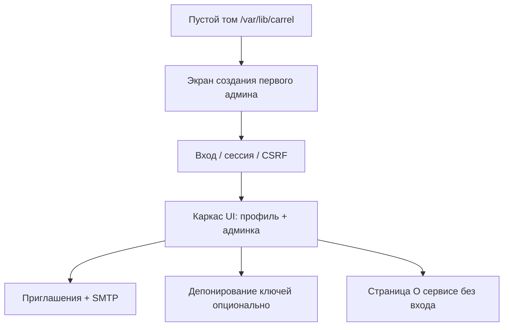

# Этап 1: Каркас Carrel

Источник требований: [carrel-spec.md](carrel-spec.md) — §3 (структура), §4 (крипто), §5 (пользователи/админ), §13 (интерфейс, базовые принципы), §18 (поставка), §19 этап 1, §21 (критерии приёмки), §22 (AGPL), §24.3–§24.6 (безопасность веб-уровня).

**Текущее состояние:** в репозитории только документация (`docs/`). Кода, `go.mod`, Docker-файлов нет.

**Граница этапа:** после входа пользователь видит каркас приложения (профиль, для админа — панель управления). Подключение DAV-аккаунтов, контакты и календарь — **этап 2+**. Счётчик DAV-аккаунтов в админке всегда `0`, но поле и API-место закладываются.

**CI:** только Dockerfile + compose.yaml, без GitHub Actions.

---

## Целевое состояние (Definition of Done)



- `docker run` с пустым томом → экран bootstrap администратора
- Полный цикл: приглашение → `/invite/<token>` → пароль → вход
- Админ-панель: пользователи, SMTP, глобальные настройки, журнал
- Депонирование: включение, мастер-пароль, восстановление, прозрачность в профиле
- Тесты криптослоя проходят; контейнер `read_only` + непривилегированный пользователь

---

## Рекомендации по модели (Cursor Agent)

| Задача | Модель | Почему |
|--------|--------|--------|
| `internal/crypto/`, constant-time, DEK/KEK, escrow | **Claude Opus (thinking-high)** или **Sonnet (thinking-high)** | Ошибка = потеря данных пользователя; нужен глубокий аудит |
| `internal/store/`, миграции формата, атомарная запись | **Sonnet (thinking-high)** | Сложная персистентность, мало шаблонов |
| `internal/session/`, CSRF, rate limit, security headers (§24.3–§24.5) | **Sonnet (thinking-high)** | Тонкие edge cases в middleware |
| `internal/admin/`, приглашения, журнал, бизнес-правила §5 | **Composer 2.5 Fast** или **Sonnet** | Много CRUD, но логика прямолинейна |
| `internal/mail/`, SMTP + async retry | **Composer 2.5 Fast** | Стандартный сетевой клиент |
| htmx-шаблоны, CSS по [carrel-brand-guide.html](carrel-brand-guide.html) | **Composer 2.5 Fast** | Шаблонная вёрстка, быстрые итерации |
| Dockerfile, compose.yaml, healthcheck | **Composer 2.5 Fast** | Конфигурация по §18 |
| Интеграционные тесты (bootstrap → invite → login) | **Sonnet** | Нужно связать несколько пакетов |

**Практика:** крипто и middleware — отдельные сессии с thinking-моделью; шаблоны и Docker — fast-модель. Перед merge крипто-кода — повторный проход Opus/Sonnet только по diff.

---

## Архитектура пакетов (§3, сокращённо под этап 1)

```
cmd/carrel/main.go          # serve, graceful shutdown (SIGTERM, 15s)
internal/config/            # env > file; port, data dir, trusted proxies
internal/crypto/            # Argon2id, AES-256-GCM, server key, escrow keys
internal/store/             # один файл state на томе, атомарная запись
internal/session/           # in-memory sessions, DEK keyring, CSRF store
internal/admin/             # users, invites, audit log, global settings
internal/mail/              # SMTP client, async queue, templates
internal/web/
  handler/                  # HTTP handlers + middleware chain
  template/                 # html/template layouts
  static/                   # css, vendored htmx (+ sse ext для этапа 5)
Dockerfile
compose.yaml
LICENSE
THIRD_PARTY.md
```

**Формат стора (решение этапа 1):** один JSON-файл `state.enc` на томе, зашифрованный AES-GCM серверным ключом (`server.key`, генерируется при первом запуске). Внутри — пользователи (auth hash, wrapped DEK, метаданные), приглашения (hash токена), SMTP-настройки, escrow config, audit log. Пользовательские секреты (будущие DAV-пароли) — в per-user blob, шифруются DEK (на этапе 1 blob пуст).

---

## Чек-лист реализации

| # | Блок | Модель |
|---|------|--------|
| 0 | Инициализация проекта | **Composer 2.5 Fast** |
| 1 | Конфигурация | **Composer 2.5 Fast** |
| 2 | Криптослой | **Opus / Sonnet (thinking-high)** |
| 3 | Персистентность | **Sonnet (thinking-high)** |
| 4 | Сессии и безопасность | **Sonnet (thinking-high)** |
| 5 | Bootstrap и аутентификация | **Sonnet** |
| 6 | Приглашения и регистрация | **Composer 2.5 Fast** |
| 7 | SMTP | **Composer 2.5 Fast** |
| 8 | Депонирование ключей | **Opus / Sonnet (thinking-high)** |
| 9 | Админ-панель (htmx) | **Composer 2.5 Fast** |
| 10 | Профиль пользователя | **Composer 2.5 Fast** |
| 11 | Каркас UI и статика | **Composer 2.5 Fast** |
| 12 | Страница «О сервисе» | **Composer 2.5 Fast** |
| 13 | Поставка | **Composer 2.5 Fast** |
| 14 | Тесты и приёмка | **Sonnet** (+ **Opus** для аудита crypto-тестов) |

### 0. Инициализация проекта · Composer 2.5 Fast

- [x] `go mod init`, модуль `cmd/carrel/main.go`, `-ldflags -X` для version/commit
- [x] Структура каталогов по §3; `go:embed` для templates/static
- [x] Вендоринг htmx + htmx-sse в `internal/web/static/`; `THIRD_PARTY.md` с лицензиями
- [x] `LICENSE` (AGPL-3.0-or-later), заголовки в исходниках

### 1. Конфигурация (`internal/config`) · Composer 2.5 Fast

- [x] Env-переменные с приоритетом над файлом: `CARREL_PORT`, `CARREL_DATA_DIR`, `CARREL_TRUSTED_PROXIES`, `CARREL_BASE_PATH`, log level
- [x] Defaults: порт `8080`, data dir `/var/lib/carrel`
- [x] Валидация при старте; понятные ошибки

### 2. Криптослой (`internal/crypto`) + unit-тесты · Opus / Sonnet (thinking-high)

- [x] Argon2id: отдельные параметры для auth, KEK, escrow master (усиленные для master)
- [x] `DeriveKEK(password, salt_kek)` / `VerifyAuth(password, salt_auth, hash)` — constant-time compare
- [x] Генерация DEK (32 байта), wrap/unwrap DEK через KEK (AES-256-GCM)
- [x] Server key: генерация, load/save на томе, шифрование служебных данных
- [x] Escrow: RSA/EC key pair; private key wrapped master password; DEK copy encrypted with public key
- [x] `Zero()` / explicit wipe для ключевого материала в памяти (§24.6)
- [x] Тесты: round-trip wrap/unwrap, смена пароля (re-wrap DEK only), wrong password fails

### 3. Персистентность (`internal/store`) · Sonnet (thinking-high)

- [ ] Обнаружение «пустой том» → режим bootstrap
- [ ] Атомарная запись: temp file + rename
- [ ] CRUD пользователей: create (invite / temp password), disable, delete (confirm login), role change
- [ ] Guard: нельзя удалить/понизить последнего админа
- [ ] Invites: token hash only, expiry, revoke, extend; constant-time token verify
- [ ] Global settings: user creation mode, SMTP, escrow flags, session timeout (defaults for later stages)
- [ ] Audit log append-only entries (no passwords/tokens)

### 4. Сессии и безопасность (`internal/session` + middleware) · Sonnet (thinking-high)

- [ ] In-memory session store: session ID rotation on login
- [ ] Cookie: `HttpOnly`, `SameSite=Lax`, `Secure` if trusted proxy sends `X-Forwarded-Proto: https`
- [ ] DEK только в session keyring; logout / disable user / SIGTERM → wipe
- [ ] CSRF token per session; проверка на всех mutating requests (forms + htmx headers)
- [ ] Rate limit login (by IP + username, progressive delay); rate limit `/invite/*`
- [ ] Security headers: CSP (htmx-safe), `X-Frame-Options`, `nosniff`, `Referrer-Policy`
- [ ] Public endpoints: `/healthz`, `/about`, `/invite/<token>` — без утечки версии на healthz

### 5. Bootstrap и аутентификация · Sonnet

- [ ] `GET/POST /setup` — первый администратор (login, password, email optional)
- [ ] `GET/POST /login`, `POST /logout`
- [ ] «Forgot password» отсутствует или ведёт на страницу «восстановление невозможно» (§5.3)
- [ ] Post-login redirect: профиль или админка (admins)
- [ ] Middleware: auth required для `/app/*`, admin required для `/admin/*`

### 6. Приглашения и регистрация · Composer 2.5 Fast

- [ ] Admin: создать приглашение (login + email) → показать ссылку + copy button + статус SMTP
- [ ] Режим «пароль от админа»: temp password, `must_change_password` flag, предупреждение в UI
- [ ] `GET/POST /invite/<token>`: set password, create salts + DEK; одноразовый token
- [ ] Resend / revoke / extend invite (admin actions)
- [ ] Invite works with SMTP completely unset (manual link only) — §21

### 7. SMTP (`internal/mail`) · Composer 2.5 Fast

- [ ] Admin settings: host, port, TLS mode (STARTTLS / implicit / none), login, password (encrypted server key), from name/address
- [ ] «Send test email» — показать полный ответ сервера (success or diagnostic)
- [ ] Async send with retries + backoff; failure logged, invite stays valid
- [ ] Templates: invite email, escrow recovery notification (plain + minimal HTML, no external resources)
- [ ] Profile email change with confirmation email (§5.3)

### 8. Депонирование ключей (`internal/crypto` + handlers) · Opus / Sonnet (thinking-high)

- [ ] Global toggle (admin): off by default; applies only to users created after enable
- [ ] Setup flow: generate key pair, set escrow master password (distinct from login password)
- [ ] On user create (when escrow on): store DEK copy encrypted with escrow public key
- [ ] Existing users: voluntary opt-in from profile; opt-out deletes copy (unless admin forbids)
- [ ] Recovery flow: admin + master password → re-wrap DEK under temp password → user login + change password
- [ ] Profile: escrow status, last recovery time; first-login notice if escrow active
- [ ] Every recovery → audit log + email to user (non-optional)
- [ ] Admin password reset blocked when escrow active → offer recovery instead (§5.5)

### 9. Админ-панель (htmx UI) · Composer 2.5 Fast

- [ ] User list: login, role, created, last login, DAV count (0), active sessions
- [ ] Actions: create, disable (kill sessions), delete (type login confirm), reset password (destructive dialog), kill sessions, change role
- [ ] Global settings page (creation mode, SMTP, escrow, session timeout defaults)
- [ ] Audit log viewer (filter by action type)
- [ ] English UI only (§13); strings inline in templates

### 10. Профиль пользователя · Composer 2.5 Fast

- [ ] Change password (current + new) — re-wrap DEK only
- [ ] Email display/edit with confirmation flow
- [ ] Escrow status + opt-in/out
- [ ] Change password after temp-password login (forced)

### 11. Каркас UI и статика · Composer 2.5 Fast

- [ ] Base layout: header nav (Profile, Admin if admin, Logout), footer link to About
- [ ] CSS from brand guide: `--ink`, `--card`, `--accent`, Georgia headings, system sans body
- [ ] Post-login placeholder: «No accounts connected yet» (stub for stage 2)
- [ ] PWA-ready: manifest + icons in embed; no service worker cache of user data (§13)
- [ ] Own nav controls (no reliance on browser back/refresh)

### 12. Страница «О сервисе» (§22) · Composer 2.5 Fast

- [ ] Public `/about`: name, version, commit (match ldflags), link to GitHub sources
- [ ] Footer on all authenticated pages

### 13. Поставка · Composer 2.5 Fast

- [ ] Multi-stage Dockerfile: `golang:alpine` build → `distroless/static`, `CGO_ENABLED=0`
- [ ] `compose.yaml`: `127.0.0.1:8080:8080`, volume for data, `read_only: true`, non-root user, cap drop
- [ ] `/healthz` liveness
- [ ] Graceful shutdown: stop accept → drain requests (15s) → wipe sessions/keys
- [ ] Structured stdout logs; never log passwords/tokens (even debug)

### 14. Тесты и ручная приёмка · Sonnet (+ Opus для аудита crypto-тестов)

- [ ] Unit: crypto round-trips, invite token hash, constant-time helpers
- [ ] Integration (optional httptest): bootstrap → admin login → create invite → accept → login
- [ ] Manual checklist по §21 (users/security/deployment/deposit sections applicable to stage 1)

---

## Порядок работ (рекомендуемый)

1. **Scaffold + config + crypto + store** (§0–3) — **Sonnet / Opus** — фундамент, без UI
2. **Session + middleware + bootstrap/login** (§4–5) — **Sonnet** — можно проверить curl/httptest
3. **Admin store ops + invites** (§6) — **Composer 2.5 Fast**
4. **Mail + invite emails** (§7) — **Composer 2.5 Fast**
5. **Escrow** (§8) — **Opus / Sonnet** — после базового user lifecycle стабилен
6. **htmx UI** (§9–12) — **Composer 2.5 Fast** — все экраны на готовых handlers
7. **Docker + manual QA** (§13–14) — **Composer 2.5 Fast** + **Sonnet** для интеграционных тестов

Не начинать UI до стабильного crypto/store — иначе переделки при смене формата данных.

---

## Вне scope этапа 1 (явно не делать)

- DAV transport, discovery, SSRF guard (§6, §24.2) — этап 2
- `internal/provider/*`, cache, fanout — этапы 3–5
- GitHub Actions / ghcr.io publish
- Self-registration UI (только флаг в global settings, без публичной формы регистрации, пока не включён админом — можно stub «disabled»)
- WebDAV files, duplicates, unified view

---

## Ключевые фрагменты ТЗ для реализации

Криптосхема (§4):

```go
// Два применения пароля — разные соли, не смешивать:
// auth: Argon2id(password, salt_auth) → hash (verify login)
// kek:  Argon2id(password, salt_kek)  → KEK → unwrap DEK
// DEK живёт только в session memory
```

Этап 1 из §19:

> **Каркас.** Конфиг, крипто, шифрованный стор, пользователи и роли, вход, сессии, CSRF, панель администратора, приглашения, SMTP, депонирование.

Критерии приёмки (выборка §21 для этапа 1):

- Админ не видит данных других пользователей (нет DEK → нет доступа)
- Invite link works without SMTP
- Disabled user → sessions killed immediately
- Escrow off by default → no recoverable DEK copies
- `docker run` empty volume → admin setup screen
