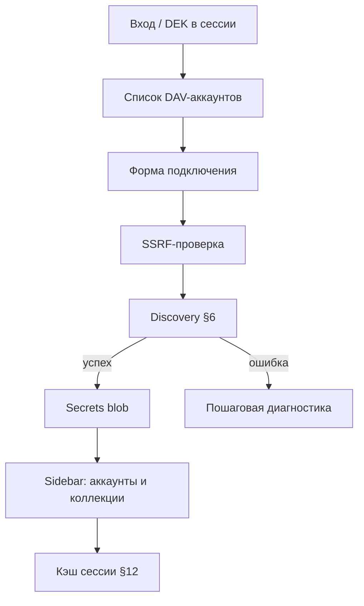

# Этап 2: Транспорт и discovery

**Статус:** **в работе** (после v0.1.0)  
**Целевая версия:** v0.2.0  
**Источник:** [carrel-spec.md](carrel-spec.md) — §6, §7, §12, §19 этап 2, §24.2  
**Предшествует:** [stage-1-plan.md](stage-1-plan.md) (готово)  
**Следующий:** [stage-3-plan.md](stage-3-plan.md)

**Граница этапа:** пользователь подключает DAV-аккаунт, видит реестр коллекций (CalDAV + CardDAV), учётки шифруются в `User.Secrets`, кэш сессии работает. CRUD контактов и календаря — **этап 3+**.

---

## Целевое состояние

- Подключение к Baikal по прямому URL (`/dav.php/`).
- `DAVCount` в админке — реальное число.
- Смена пароля пользователем сохраняет подключения; сброс админом уничтожает (store уже умеет — проверить e2e с аккаунтом).

---

## Рекомендации по модели (Cursor Agent)

| Задача | Модель | Почему |
|--------|--------|--------|
| SSRF guard (§24.2) | **Opus / Sonnet (thinking-high)** | Ошибка = сканирование внутренней сети; много edge cases (redirect, DNS rebinding) |
| DAV Transport + Multi-Status parser | **Sonnet (thinking-high)** | XML 207, основа всех последующих этапов |
| Discovery + DiscoveryTrace | **Sonnet (thinking-high)** | Цепочка шагов, диагностика — легко ошибиться в деталях |
| Account secrets blob + store API | **Sonnet (thinking-high)** | Шифрование credentials, миграции формата blob |
| Session cache (LRU, getctag, wipe) | **Sonnet** | Конкурентность и инвалидация; проще transport, но не trivial |
| Config: allowlist, таймауты, лимиты кэша | **Composer 2.5 Fast** | Прямолинейная конфигурация |
| UI: connect, sidebar, админ-валидатор | **Composer 2.5 Fast** | htmx-шаблоны, быстрые итерации |
| `go-webdav`, THIRD_PARTY, compose Baikal | **Composer 2.5 Fast** | Зависимости и compose |
| Unit + integration тесты | **Sonnet** | Связка пакетов, mock transport |

**Практика:** отдельная сессия thinking-high на SSRF + discovery до UI. UI не начинать, пока integration discovery green.

---

## Чек-лист реализации

| # | Блок | Пакеты / файлы | Модель |
|---|------|----------------|--------|
| 0 | Конфиг: SSRF allowlist, таймауты DAV, лимиты кэша | `internal/config` | **Composer 2.5 Fast** |
| 1 | DAV Transport + Multi-Status | `internal/dav/` | **Sonnet (thinking-high)** |
| 2 | SSRF guard (§24.2) | `internal/dav/ssrf.go` | **Opus / Sonnet (thinking-high)** |
| 3 | Discovery + DiscoveryTrace | `internal/dav/discovery/` | **Sonnet (thinking-high)** |
| 4 | Модель аккаунта, secrets blob, store API | `internal/account/` | **Sonnet (thinking-high)** |
| 5 | Кэш сессии: коллекции, ETag-карты, LRU, wipe | `internal/session/cache.go` | **Sonnet** |
| 6 | UI: подключение, список, sidebar, админ-валидатор | `handler/accounts.go`, templates | **Composer 2.5 Fast** |
| 7 | Зависимость `go-webdav`, THIRD_PARTY | `go.mod` | **Composer 2.5 Fast** |
| 8 | Compose: сервис Baikal для интеграции | `compose.test.yaml` | **Composer 2.5 Fast** |
| 9 | Тесты: unit + `integration` tag | `*_test.go` | **Sonnet** |

**Учётные данные Baikal** (`CARREL_TEST_DAV_*`) для `-tags=integration` и ручных прогонов: `dev/credentials/` — [dev-credentials.md](dev-credentials.md). Без переменных integration-тесты делают `t.Skip`.

### Детали

**SSRF (§24.2):** block private/loopback после каждого редиректа; dial к проверенному IP; allowlist пуст по умолчанию; лимит редиректов 3–5; таймауты и лимит размера ответа.

**Discovery (§6):** `.well-known` → fallback URL → `current-user-principal` → home-sets → `PROPFIND Depth:1`. Свойства: `displayname`, `resourcetype`, `calendar-color`, `supported-calendar-component-set`, `current-user-privilege-set`, `getctag`. Файловые коллекции — обнаружить и сохранить в реестре; UI «Файлы» и вложения — **этап 7**.

**Secrets blob:** JSON в `User.Secrets`: аккаунты (стабильный `account_id` UUID), credentials, principal, collections, флаги `enabled`. Шифрование через DEK сессии при записи.

**Кэш (§12):** метаданные коллекций, path→ETag, инвалидация по `getctag`/TTL 60 с, кнопка Refresh, wipe при logout/SIGTERM. Тела объектов — минимально (для тестов refresh); полный multiget — этап 3.

**UI (§13):** sidebar слева (аккаунты, коллекции, чекбоксы); справа — заглушка «Контакты — этап 3». Админ: «Test DAV server» (тот же discovery без сохранения).

---

## Порядок работ

0. Changelog — отметить начало этапа 2 в `[Unreleased]`; commit
1. Config + `go-webdav` + SSRF (блокирует всё исходящее)
2. Transport + multistatus parser
3. Discovery + trace
4. Account secrets + store API
5. Session cache
6. Handlers + templates
7. Интеграционный тест Baikal

Не начинать UI до стабильного discovery — иначе переделки при смене модели коллекций.

---

## Вне scope

- `internal/provider/*`, `internal/model` Object — этапы 3–4
- CRUD контактов/событий, фото, конфликты
- `internal/fanout`, единый вид, поиск, дубликаты
- WebDAV files + вложения §23.10 — этап 7
- davloom, device helper (§23)

---

## Шлюз к этапу 3

Без этого этап 3 (контакты) невозможен:

| Проверка | Как |
|----------|-----|
| Discovery находит addressbook-коллекции на Baikal | `go test -tags=integration` |
| Transport `PropFind` / `Get` работают с Basic Auth | unit + integration |
| Secrets round-trip: add → restart store → decrypt | unit |
| SSRF блокирует `127.0.0.1` | unit |

---

## Приёмка

Ручной чеклист — [manual-acceptance.md](manual-acceptance.md) §2 (после всего объёма v1). Между этапами — только таблица шлюза выше.

## Критерии §21 (этап 2)

- Подключение к Baikal по прямому URL; коллекции обоих типов обнаружены
- Смена пароля пользователем сохраняет подключения
- Сброс пароля админом делает подключения недоступными
- Выход освобождает память кэша
- Админ не видит чужих подключений (без escrow)

Остальное §21 — последующие этапы.
