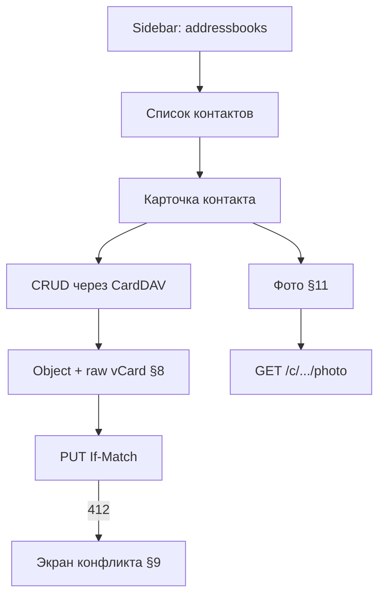

# Этап 3: Контакты

**Статус:** **готово** — фазы 0–12 (зависимость, model, provider, потери, конфликты 412, список, карточка, фото, кэш миниатюр, import/export `.vcf`, печать, тесты); шлюз к этапу 4  
**Целевая версия:** v0.3.0  
**Источник:** [carrel-spec.md](carrel-spec.md) — §8, §9, §10, §11, §13, §19 этап 3, §21, §23.6 (печать контактов), §23.7 (import/export `.vcf`)  
**Предшествует:** [stage-2-plan.md](stage-2-plan.md)  
**Следующий:** [stage-4-plan.md](stage-4-plan.md)

**Граница этапа:** полный CRUD контактов; фотографии; **import/export `.vcf`**; **печать** списка и карточки (§23.6). Календарь, заметки, единый вид — **этап 4+**.

---

## Целевое состояние

- `addressbook-multiget` батчами при прокрутке (§13); повторный заход — из кэша без лишних multiget (§21).
- Read-only коллекции: без кнопок редактирования/загрузки фото.

---

## Рекомендации по модели (Cursor Agent)

| Задача | Модель | Почему |
|--------|--------|--------|
| `internal/model` Object + Patch + raw §8 | **Opus / Sonnet (thinking-high)** | Ошибка = молчаливая потеря X-полей; аудит обязателен |
| Provider contacts (multiget, PUT) | **Sonnet** | CardDAV поверх готового transport |
| Контроль потерь свойств после PUT | **Sonnet (thinking-high)** | Сравнение объектов, агрегация по серверу |
| Конфликты 412 + diff UI | **Sonnet** | Переиспользуется на всех типах данных |
| Список + карточка (htmx) | **Composer 2.5 Fast** | Шаблонная вёрстка |
| Фото: pipeline, EXIF, crop (§11) | **Sonnet (thinking-high)** | Потоки, безопасность изображений, temp files |
| Import/export `.vcf` | **Sonnet** | Парсинг, UID policy, предпросмотр |
| Печать `@media print` | **Composer 2.5 Fast** | Только CSS, без серверной логики |
| Кэш: тела vCard, миниатюры | **Sonnet** | Инвалидация по ETag |
| Unit + integration тесты | **Sonnet** | Побайтовые фикстуры vCard |

**Практика:** сначала model + provider read path (thinking); UI и print — fast после green tests на X-fields.

---

## Чек-лист реализации

| # | Блок | Пакеты | Модель |
|---|------|--------|--------|
| 0 | Зависимость `go-vcard`, THIRD_PARTY | `go.mod` | **Composer 2.5 Fast** |
| 1 | `internal/model`: `Object`, `Patch`, неэкспортируемый `raw` | `internal/model/` | **Opus / Sonnet (thinking-high)** |
| 2 | `internal/provider/contacts`: list, get, put, delete, multiget | `internal/provider/contacts/` | **Sonnet** |
| 3 | Контроль потерь свойств после PUT (§8) | provider + UI | **Sonnet (thinking-high)** |
| 4 | Конфликты 412: diff, выбор версии (§9) | handler + template | **Sonnet** |
| 5 | Список контактов (htmx, scroll / paging) | `contacts.html` | **Composer 2.5 Fast** |
| 6 | Форма карточки через `Apply` | handler | **Composer 2.5 Fast** |
| 7 | Фото: endpoint, upload, crop, SVG placeholder | §11 | **Sonnet (thinking-high)** |
| 8 | Кэш: тела vCard, миниатюры | `session/cache` | **Sonnet** |
| 9 | Import `.vcf` | import handler | **Sonnet** |
| 10 | Export `.vcf` | handler | **Sonnet** |
| 11 | Печать §23.6 | `carrel.css` | **Composer 2.5 Fast** |
| 12 | Тесты | `*_test.go` | **Sonnet** |

**Сделано:** 0–12 (весь объём этапа 3). Потолок памяти на все сессии процесса (§12) и полноценный учёт байт тел объектов — усиление кэша; vCard bodies + миниатюры с LRU уже на месте.

Попутно в фазе 2 исправлена сериализация запрошенных свойств в `internal/dav`: `PROPFIND`/`REPORT` отправляли имена Go-полей вместо имён свойств, поэтому запрос не спрашивал у сервера ничего осмысленного. Без этого `addressbook-multiget` не работает.

### Import/export контактов (§23.7)

- **В объёме:** стандартные `.vcf` (vCard 3.0/4.0), один файл или несколько в архиве
- Import **всегда создаёт новые** объекты; совпавший UID → новый UID + запись в отчёте (как у заметок §23.9)
- Предпросмотр до записи: число файлов, ошибки разбора, целевая коллекция
- **Вне объёма:** разбор Google Takeout / iCloud-специфики (§23.7 «кандидат») — отдельно по фикстурам

### Печать контактов (§23.6)

- Печатается **текущий отбор** на экране (выбранные книги)
- Список: имя, телефоны, email; карточка — полная
- Скрыть nav/sidebar/кнопки; метки источника текстом + цветом
- Колонтитул: название, дата снятия
- Фото: опция «с фото / без» при печати

### Фото (§11) — ключевые решения

- Поток во временный файл (`tmpfs`), не в память
- `image.DecodeConfig` до декодирования; EXIF orientation → strip metadata → JPEG
- Размеры в конфиге (стартовые: max side 512, quality 85) — **не в критерии приёмки** до замеров
- `PHOTO` по URI: показ через прокси, редактирование недоступно
- Кадрирование: htmx-шаги, оригинал в буфере сессии до confirm

### Маршруты (пример)

- `GET /app/contacts`, `GET /app/contacts/{collection}`
- `GET/POST /app/contacts/{collection}/{uid}`
- `GET /c/{account}/{collection}/{uid}/photo?size=thumb|full`
- `POST` upload / delete photo

---

## Порядок работ

1. `internal/model` + unit-тесты marshal/apply (X-fields)
2. Provider contacts (read path: propfind map + multiget)
3. Список + карточка (read-only)
4. Create/update/delete + If-Match
5. Conflict UI
6. Photo pipeline + endpoint
7. Import/export vcf
8. Print stylesheet (contacts)
9. Property-loss notification + cache tests

---

## Вне scope

- Календарь, VEVENT, RRULE — этап 4
- Единый вид, поиск, fanout — этап 5
- Дубликаты — этап 6
- WebDAV files + вложения — этап 7
- Мобильная оптимизация карточки/кадрирования (§13: допустим упрощённый вид)

---

## Шлюз к этапу 4

| Проверка | Как |
|----------|-----|
| X-поля сохраняются после правки FN | unit: побайтовое сравнение |
| 412 → экран выбора, не silent overwrite | handler test |
| vCard 3.0 + замена PHOTO остаётся 3.0 | unit |
| `addressbook-multiget` + кэш: второй list без сети | unit с mock transport |
| CRUD на Baikal addressbook | integration |

---

## Критерии §21 (этап 3)

**Контакты и данные**

- Контакт с `X-`полями после правки имени сохраняет все исходные свойства
- Контакт vCard 3.0 после замены фото остаётся 3.0
- Правка из второго клиента → экран выбора

**Фотографии**

- EXIF orientation 6 → вертикально, без EXIF после save
- GPS stripped
- 4000×3000 → потолок в конфиге
- PHOTO по ссылке: показ, нередактируемо

**Кэш**

- Повторное открытие коллекции без изменений — без новых multiget
- Сторонняя правка видна после refresh

---

## Приёмка

Ручной чеклист — [manual-acceptance.md](manual-acceptance.md) §3 (после всего объёма v1).
