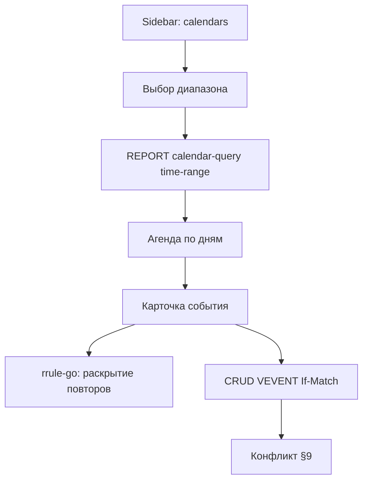

# Этап 4: Календарь

**Статус:** после этапа 3  
**Целевая версия:** v0.4.0  
**Источник:** [carrel-spec.md](carrel-spec.md) — §10, §13 (агенда), §19 этап 4, §21, §23.6 (печать агенды), §23.7 (import/export `.ics`)  
**Предшествует:** [stage-3-plan.md](stage-3-plan.md)  
**Следующий:** [stage-5-plan.md](stage-5-plan.md)

**Граница этапа:** агенда; CRUD VEVENT; RRULE серии целиком; **import/export `.ics`**; **печать повестки** (§23.6). VTODO, VJOURNAL, единый вид — **этап 5**.

---

## Целевое состояние

- Никакой сетки и drag&drop (§13 — принятое решение).
- `ATTENDEE` / `PARTSTAT` — только чтение.
- Часовой пояс: один глобальный TZ из настроек пользователя/инстанса.
- Вне v1: `RECURRENCE-ID`, `EXDATE`, `THISANDFUTURE`, отдельные экземпляры серии.

---

## Рекомендации по модели (Cursor Agent)

| Задача | Модель | Почему |
|--------|--------|--------|
| Provider calendar + `calendar-query` | **Sonnet** | iCal поверх готового transport |
| RRULE expansion (`rrule-go`) + кэш диапазона | **Sonnet (thinking-high)** | Часовые пояса и границы диапазона — частый источник багов |
| CRUD VEVENT + edit series | **Sonnet** | If-Match, переиспользование model §8 |
| RRULE editor (серия целиком) | **Sonnet** | Валидация правил, UX формы — средняя сложность |
| Агенда UI (список по дням) | **Composer 2.5 Fast** | htmx + шаблоны |
| Import/export `.ics` | **Sonnet** | Парсинг, UID policy |
| Печать агенды | **Composer 2.5 Fast** | CSS `@media print` |
| Зависимости go-ical, rrule-go | **Composer 2.5 Fast** | go.mod, THIRD_PARTY |
| Тесты RRULE + integration | **Sonnet** | Табличные кейсы повторов |

**Практика:** RRULE и provider — одна thinking-сессия; агенда UI — fast после read path green.

---

## Чек-лист реализации

| # | Блок | Пакеты | Модель |
|---|------|--------|--------|
| 0 | Зависимости `go-ical`, `rrule-go`, THIRD_PARTY | `go.mod` | **Composer 2.5 Fast** |
| 1 | Provider: VEVENT via `calendar-query` | `provider/calendar/` | **Sonnet** |
| 2 | RRULE expansion + кэш диапазона | provider + cache | **Sonnet (thinking-high)** |
| 3 | Агенда UI: группировка по дням | `agenda.html` | **Composer 2.5 Fast** |
| 4 | CRUD события, edit series, delete | handler | **Sonnet** |
| 5 | RRULE editor | form | **Sonnet** |
| 6 | Конфликты §9 | shared template | **Sonnet** |
| 7 | Кэш тел `.ics` | session/cache | **Sonnet** |
| 8 | Import `.ics` | import handler | **Sonnet** |
| 9 | Export `.ics` | handler | **Sonnet** |
| 10 | Печать §23.6 | `carrel.css` | **Composer 2.5 Fast** |
| 11 | Тесты | `*_test.go` | **Sonnet** |

### Import/export календаря (§23.7)

- Стандартные `.ics` / `.ical`; import создаёт новые UID при коллизии
- Export одного события, диапазона агенды или выбранных коллекций
- Takeout-специфика — вне объёма (как у контактов)

### Маршруты (пример)

- `GET /app/calendar`, `GET /app/calendar/{collection}`
- `GET/POST /app/calendar/{collection}/{uid}`
- Query params: `from`, `to` для диапазона агенды

---

## Порядок работ

1. Provider: `calendar-query` + parse VEVENT
2. RRULE expansion + cache keyed by range
3. Agenda list UI (read-only)
4. Create/edit/delete single events
5. Recurring series edit (whole series)
6. Import/export ics
7. Print stylesheet (agenda)
8. Integration Baikal calendar

---

## Вне scope

- VTODO, VJOURNAL — этап 5
- Единый вид нескольких календарей — этап 5
- Сквозной поиск, fanout/SSE — этап 5
- iTIP / приглашения / планирование встреч
- Дубликаты событий — этап 6

---

## Шлюз к этапу 5

| Проверка | Как |
|----------|-----|
| `calendar-query` возвращает события в диапазоне | integration |
| RRULE weekly → правильные даты в агенде | unit (rrule-go) |
| PUT с If-Match; 412 → conflict UI | handler test |
| Неизвестные iCal-свойства сохраняются | unit (model) |

---

## Критерии §21 (этап 4, частично)

- События в агенде за выбранный период отсортированы по времени
- Правка серии с RRULE не ломает неизвестные свойства
- Конфликт из второго клиента — экран выбора

Полные критерии «три календаря из двух аккаунтов» — этап 5 (единый вид).

---

## Приёмка

Ручной чеклист — [manual-acceptance.md](manual-acceptance.md) §4 (после всего объёма v1).
