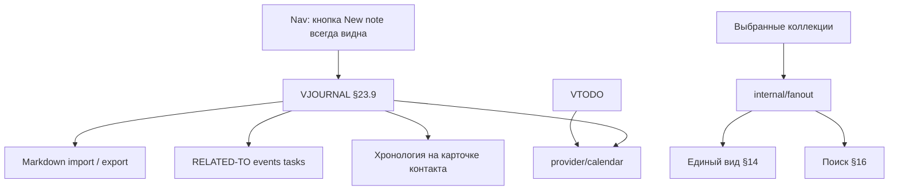

# Этап 5: Задачи, заметки, единый вид, поиск

**Статус:** **готово** — блоки A–G (VTODO, VJOURNAL по §23.9, Markdown import/export, единый вид, `internal/fanout` + SSE с fallback, сквозной поиск, хронология контакта, тесты); шлюз к этапу 6. Открыто: фикстуры jtx/Evolution с устройств (B0) и ручная приёмка P1/P2 — [manual-acceptance.md](manual-acceptance.md); `go test -race` на машине с gcc (в текущем окружении компилятор C отсутствует)  
**Целевая версия:** v0.5.0  
**Источник:** [carrel-spec.md](carrel-spec.md) — §10, §13, §14, §16, §17, §19 этап 5, **§23.9 (заметки — полный объём)**, §21  
**Предшествует:** [stage-4-plan.md](stage-4-plan.md)  
**Следующий:** [stage-6-plan.md](stage-6-plan.md)

**Граница этапа:** VTODO; **VJOURNAL (заметки) целиком по §23.9** включая Markdown import/export; единый вид; сквозной поиск; fanout/SSE. Вложения к заметкам (§23.10) — **этап 7** (после WebDAV). Дубликаты — этап 6.

Крупнейший этап: закрывает MVP по §25.6 (unified view + контакты + поиск; заметки — ключевая ценность §23.9).

---

## Целевое состояние

---

## Рекомендации по модели (Cursor Agent)

| Задача | Модель | Почему |
|--------|--------|--------|
| **`internal/fanout`** (горутины, cancel, SSE) | **Opus / Sonnet (thinking-high)** | Утечки горутин и гонки — критичный риск (§21) |
| Единый вид + сортировка при догрузке | **Sonnet (thinking-high)** | Сложная координация с fanout |
| Сквозной поиск | **Sonnet** | Переиспользует fanout |
| **VJOURNAL** core + jtx X-fields | **Sonnet (thinking-high)** | Совместимость с внешними клиентами — побайтовая точность |
| Сверка фикстур jtx/Evolution (B0) | **Sonnet** (анализ) + ручной сбор | Без фикстур код будет умозрительным |
| Markdown import/export | **Sonnet** | Потоковый zip, UID policy, front matter |
| `RELATED-TO`, хронология на карточке | **Sonnet** | Кросс-типовые связи |
| VTODO | **Composer 2.5 Fast** или **Sonnet** | Похож на VEVENT, меньше риска |
| Nav «New note», notes/tasks UI | **Composer 2.5 Fast** | Шаблоны |
| SSE + htmx-sse wiring, poll fallback | **Sonnet** | Тонкая интеграция с fanout |
| Интеграция multi-account | **Sonnet** | End-to-end |

**Практика:** fanout — отдельная thinking-сессия в начале этапа; VJOURNAL — вторая thinking-сессия после green fanout; UI блоками fast.

---

## Чек-лист реализации

### A. Задачи (VTODO)

| # | Блок | Модель |
|---|------|--------|
| A1 | Provider VTODO | **Sonnet** |
| A2 | Список задач, фильтр | **Composer 2.5 Fast** |
| A3 | CRUD + конфликты | **Sonnet** |
| A4 | UI `/app/tasks` | **Composer 2.5 Fast** |

### B. Заметки (VJOURNAL) — полный §23.9

| # | Блок | Модель |
|---|------|--------|
| B0 | Фикстуры jtx + Evolution | **Sonnet** + ручной сбор |
| B1 | Provider VJOURNAL | **Sonnet (thinking-high)** |
| B2 | Редактор + X-поля jtx | **Sonnet (thinking-high)** |
| B3 | Кнопка «New note» в nav | **Composer 2.5 Fast** |
| B4 | `RELATED-TO`, ссылка в агенде | **Sonnet** |
| B5 | Упоминания контакта (email) | **Sonnet** |
| B6 | Хронология на карточке контакта | **Sonnet** |
| B7 | UI `/app/notes` | **Composer 2.5 Fast** |
| B8 | Критерии jtx/Evolution | **Sonnet** (тесты на фикстурах) |

### C. Import/export заметок (§23.9)

| # | Блок | Модель |
|---|------|--------|
| C1–C4 | Export `.md` | **Sonnet** |
| C5–C8 | Import Markdown + отчёт | **Sonnet (thinking-high)** |
| C5 WebDAV-источник | stub → этап 7 | — |

### D. Единый вид (§14)

| # | Блок | Модель |
|---|------|--------|
| D1–D4 | Unified UI + persist | **Sonnet (thinking-high)** |

### E. Fanout и прогресс (§16, §17)

| # | Блок | Модель |
|---|------|--------|
| E1 | `internal/fanout` | **Opus / Sonnet (thinking-high)** |
| E2 | SSE + fallback poll | **Sonnet** |
| E3–E4 | Таймауты, retry, деградация | **Sonnet** |

### F. Поиск (§16)

| # | Блок | Модель |
|---|------|--------|
| F1 | calendar-query + addressbook-query | **Sonnet** |
| F2 | UI `/app/search` | **Composer 2.5 Fast** |

### G. Тесты

| Блок | Модель |
|------|--------|
| VJOURNAL, markdown, fanout race | **Sonnet**; fanout — **`-race`** обязателен |

---

## Порядок работ

1. Сверка с jtx/Evolution (B0) — параллельно с fanout
2. **fanout** + тесты отмены
3. Unified (events + contacts)
4. VJOURNAL core (B1–B7)
5. Markdown export/import (C1–C8); import WebDAV-источник — stub до этапа 7
6. Search
7. VTODO
8. Contact timeline + RELATED-TO wiring
9. SSE + fallback

---

## Вне scope

- **Вложения** `ATTACH` / clipboard paste — этап 7 (§23.10)
- Дубликаты — этап 6
- WebDAV file browser — этап 7
- davloom, backup §23.3, публичные ссылки
- Регулярная двусторонняя синхронизация Markdown ↔ VJOURNAL (§23.9 явно запрещает)

---

## Шлюз к этапу 6

| Проверка | Как |
|----------|-----|
| Unified: 2 аккаунта, 3 календаря, неделя | integration |
| VJOURNAL create + X-field preserve | unit + fixture |
| Markdown export round-trip content | unit |
| Import duplicate UID → new + report | unit |
| Fanout: no goroutine leak | race |
| Заметка из Carrel открывается в go-ical parse (proxy for jtx) | unit |

---

## Приёмка

Автоматические шлюзы — выше. Полная проверка jtx/Evolution на устройствах — **обязательная** ручная приёмка v1 (P1, P2 в [manual-acceptance.md](manual-acceptance.md)), не шлюз между этапами.

## Критерии §21 + §23.9

- Единый вид, опрос, кэш — как в прежнем плане этапа 5
- **§23.9:** заметка Carrel ↔ jtx/Evolution, побайтовое сохранение чужих свойств
- Import/export: отчёт, no silent overwrite by UID

Ручной чеклист — [manual-acceptance.md](manual-acceptance.md) §5 (после всего объёма v1).
