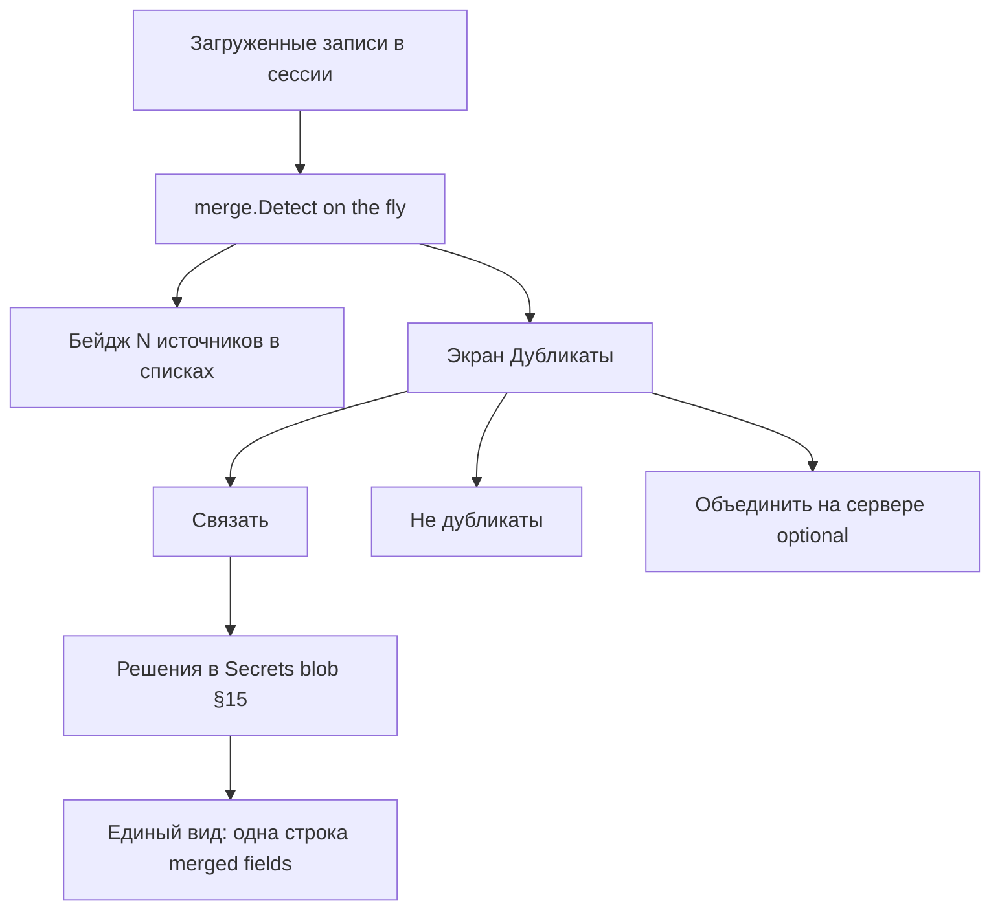

# Этап 6: Дубликаты

**Статус:** **готово** — блоки 0–10 включая **объединение на сервере** (`internal/merge`, порог в конфиге, решения в secrets blob, экран `/app/duplicates`, бейджи и свёрнутая строка в единый вид, разрушительный merge с подтверждением); шлюз к этапу 7. Открыто: ручная приёмка — [manual-acceptance.md](manual-acceptance.md); `go test -race` на машине с gcc  
**Целевая версия:** v0.6.0  
**Источник:** [carrel-spec.md](carrel-spec.md) — §15, §19 этап 6, §21 (дубликаты)  
**Предшествует:** [stage-5-plan.md](stage-5-plan.md)  
**Следующий:** [stage-7-plan.md](stage-7-plan.md) (опционально)

**Граница этапа:** обнаружение дубликатов на лету, связывание в UI, экран «Дубликаты», хранение решений в secrets blob. **Объединение на сервере** (разрушительное) — отдельная подзадача после обкатки связывания (§19); может войти в конец этапа 6 или v0.6.1.

---

## Целевое состояние

---

## Рекомендации по модели (Cursor Agent)

| Задача | Модель | Почему |
|--------|--------|--------|
| Scoring контактов/событий (§15) | **Sonnet (thinking-high)** | Пороги, нормализация email/телефона — много частных случаев |
| Хранение решений в encrypted blob | **Sonnet** | Переиспользование secrets из этапа 2 |
| Field merge при связывании | **Sonnet** | Union многозначных полей, предпочтения |
| Detection hook в list/unified | **Sonnet** | Интеграция без лишних запросов |
| Badge + экран «Дубликаты» | **Composer 2.5 Fast** | UI |
| **Server merge** (PUT + DELETE) | **Opus / Sonnet (thinking-high)** | Разрушительная операция, порядок DELETE критичен |
| Unit-тесты scoring | **Sonnet** | Table-driven, граничные случаи |

**Практика:** scoring + persist — thinking; UI — fast; server merge — отдельная сессия Opus после обкатки связывания.

---

## Чек-лист реализации

| # | Блок | Пакеты | Модель |
|---|------|--------|--------|
| 0 | Scoring contacts §15 | `internal/merge/` | **Sonnet (thinking-high)** |
| 1 | Scoring events | merge | **Sonnet (thinking-high)** |
| 2 | Порог в конфиге | config | **Composer 2.5 Fast** |
| 3 | Хранение решений в blob | account/secrets | **Sonnet** |
| 4 | Предпочтения полей | merge | **Sonnet** |
| 5 | UI badge в списках | templates | **Composer 2.5 Fast** |
| 6 | Экран `/app/duplicates` | handler | **Composer 2.5 Fast** |
| 7 | Связать / игнор / разорвать | handler | **Sonnet** |
| 8 | Слияние полей в unified row | merge + UI | **Sonnet** |
| 9 | Server merge §15 (опционально) | provider/contacts | **Opus / Sonnet (thinking-high)** |
| 10 | Тесты | `*_test.go` | **Sonnet** |

### Scoring контактов (§15)

- Email normalized (gmail dots) — strong
- Phone E.164 — strong
- UID match — strong (rare cross-server)
- FN Levenshtein — weak
- BDAY — weak booster

### Поведение при исчезновении участника

Пропавший UID удаляется из группы молча; группа из одного — распускается (§15).

---

## Порядок работ

1. Scoring + unit tests (table-driven)
2. Persist decisions in encrypted blob
3. Detection hook в list/unified providers
4. Badge + expand в списке
5. Экран «Дубликаты»
6. Field merge для unified row
7. (После стабилизации) server merge с подтверждением

---

## Вне scope

- WebDAV files + вложения — этап 7
- davloom, backup, public links — §23
- Автоматическое связывание без подтверждения пользователя
- ML / fuzzy beyond Levenshtein

---

## Шлюз к этапу 7

| Проверка | Как |
|----------|-----|
| Один человек в двух книгах → candidate | unit scoring |
| «Не дубликаты» persist после restart | integration |
| Связанные → одна строка в unified с объединёнными phones | handler test |
| Удаление участника сторонним клиентом — без ошибок UI | integration |

Server merge (если реализован):

| PUT fail → исходники не удалены | integration |

---

## Критерии §21 (этап 6)

- Кандидат в двух книгах разных аккаунтов
- После связывания — одна строка, объединённые телефоны
- «Не дубликаты» переживает restart
- Объединение на сервере не удаляет исходники при failed PUT
- Удаление связанной записи клиентом — без ошибок

---

## Приёмка

Ручной чеклист — [manual-acceptance.md](manual-acceptance.md) §6 (после всего объёма v1).

---

## Как реализовано

| Блок | Где |
|------|-----|
| Отпечаток записи, нормализация телефона/имени/BDAY | `internal/merge/fingerprint.go`, `normalize.go` |
| Веса, сигналы, порог по умолчанию (60) | `internal/merge/score.go` |
| Кластеризация (union-find по бакетам, без O(N²)) | `internal/merge/cluster.go` |
| Слияние полей для связанной группы, предпочтения | `internal/merge/fields.go` |
| Патч объединённой карточки (union многозначных, X- сохраняются) | `internal/merge/vcard.go` |
| Решения (linked / ignored, предпочтения полей) | `internal/account/duplicates.go`, `internal/store/duplicates.go` |
| Порог: файл + `CARREL_DUPLICATES_THRESHOLD` | `internal/config/config.go` |
| Экран, связать / не дубликаты / разорвать, prune пропавших | `internal/web/handler/duplicates.go` |
| Объединение на сервере: подтверждение, PUT, затем DELETE | `internal/web/handler/duplicates_merge.go` |
| Бейджи и свёрнутая строка | `find_rows.go`, `base.html`, `contacts.html`, `carrel.css` |

Порог — точки, а не вероятность: один сильный сигнал (адрес, телефон, UID) — 60 и достаточно; имя (30) плюс день рождения (20) — 50, то есть недобор, пока порог не понижен вручную. Ключ участника (аккаунт + коллекция + UID) нестабилен: участник, которого не вернула **ответившая** коллекция, удаляется из группы молча, группа из одного распускается; молчание упавшего источника (§17) не считается удалением.

Связывание не пишет ни на один сервер. Объединение пишет объединённую карточку первой и удаляет исходники только после подтверждённой записи; при отказе DELETE остальные удаления не выполняются, автоматического откат нет, а экран называет и удалённое, и оставшееся.
