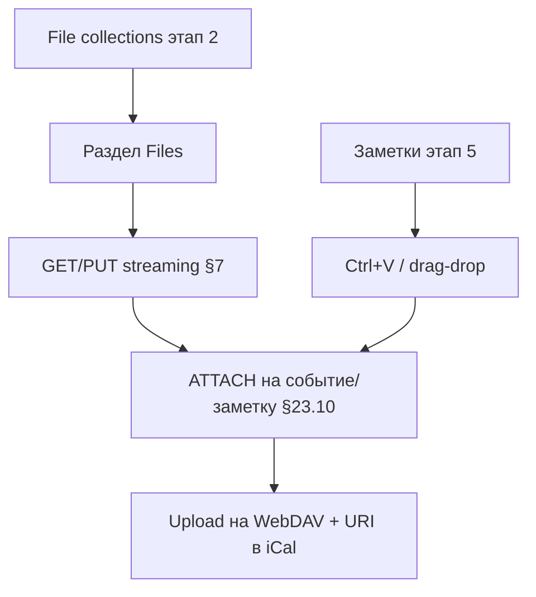

# Этап 7: WebDAV-файлы и вложения

**Статус:** после этапов 2 и 5 (CRUD событий/заметок)  
**Целевая версия:** v0.7.0  
**Источник:** [carrel-spec.md](carrel-spec.md) — §6, §7, §13, §19 этап 7, **§23.10 (вложения)**  
**Предшествует:** [stage-2-plan.md](stage-2-plan.md), [stage-5-plan.md](stage-5-plan.md)  
**Следующий:** — (завершение v1 по §19)

**Граница этапа:** раздел «Файлы» для обнаруженных file-коллекций; streaming GET/PUT; **вложения `ATTACH`** к событиям и заметкам через WebDAV. Входит в **основной объём v1** (см. [stages.md](stages.md)).

На этапе 2 file-коллекции уже **обнаруживаются**; здесь — UI и provider.

---

## Целевое состояние

**Роль файловой части (§23.10):** обслуживать вложения, не быть полноценным файловым менеджером. Превью PDF, права, sync — вне объёма.

---

## Рекомендации по модели (Cursor Agent)

| Задача | Модель | Почему |
|--------|--------|--------|
| Provider files (streaming GET/PUT, Range) | **Sonnet (thinking-high)** | OOM-риск, §7 требует `io.ReadCloser` |
| Path traversal, лимиты тела §24.4 | **Sonnet (thinking-high)** | Безопасность загрузок |
| UI file browser | **Composer 2.5 Fast** | htmx-навигация по папкам |
| **`ATTACH` на события/заметки** | **Sonnet (thinking-high)** | iCal property + WebDAV URI, не удалять файл при detach |
| Ctrl+V / drag-drop вложений | **Composer 2.5 Fast** | Клиентский UX + htmx |
| Настройки default attachment folder | **Composer 2.5 Fast** | CRUD настроек |
| Прокси открытия вложения | **Sonnet** | SSRF не хуже §24.2 |
| Import `.md` с WebDAV (B8) | **Sonnet** | Дозаполнение этапа 5 |
| Integration + memory tests | **Sonnet** | 10MB+ без OOM |

**Практика:** provider files + streaming — thinking до UI; вложения — вторая thinking-сессия после green file browser.

---

## Чек-лист реализации

### A. WebDAV browser

| # | Блок | Пакеты | Модель |
|---|------|--------|--------|
| A1 | Provider files | `provider/files/` | **Sonnet (thinking-high)** |
| A2 | Range / partial content | `internal/dav` | **Sonnet** |
| A3 | UI browser, breadcrumb | `files.html` | **Composer 2.5 Fast** |
| A4 | Upload/download streaming | handler | **Sonnet (thinking-high)** |
| A5 | Кэш listing only | session/cache | **Sonnet** |
| A6 | Тесты stream, range | `*_test.go` | **Sonnet** |

### B. Вложения (§23.10)

| # | Блок | Модель |
|---|------|--------|
| B1 | Default attachment folder | **Composer 2.5 Fast** |
| B2 | Upload → `ATTACH` URI | **Sonnet (thinking-high)** |
| B3 | Отображение + прокси | **Sonnet** |
| B4 | Чужие ATTACH read-only | **Sonnet** |
| B5 | Detach ≠ delete file (UI) | **Composer 2.5 Fast** |
| B6 | Деградация §17 | **Sonnet** |
| B7 | Paste / drag-drop в заметку | **Composer 2.5 Fast** |
| B8 | Import md с WebDAV | **Sonnet** |

### C. Интеграция

- Baikal CalDAV/CardDAV: `CARREL_TEST_DAV_*` из `dev/credentials/` ([dev-credentials.md](dev-credentials.md))
- WebDAV files + attachments: `CARREL_TEST_WEBDAV_*` (отдельный аккаунт, тот же каталог `dev/credentials/`)
- E2E: attach image to note → `ATTACH` in `.ics` on server

---

## Порядок работ

1. Provider files (list + download)
2. UI Files
3. Upload + settings default attachment folder
4. ATTACH на события
5. ATTACH на заметки + clipboard/drag-drop
6. WebDAV source для import `.md`
7. Integration tests

---

## Вне scope

- Полноценный файловый менеджер (превью, rename tree at scale)
- Backup на WebDAV §23.3
- davloom §23.2
- Удаление «осиротевших» файлов на WebDAV (§23.10: не задача Carrel)
- Resume upload / multipart

---

## Шлюз к релизу v0.7.0 / v1

| Проверка | Как |
|----------|-----|
| File collection visible + download 10MB no OOM | integration |
| ATTACH on note survives GET+parse | integration |
| Delete ATTACH property leaves WebDAV file | integration |
| Paste image → file on WebDAV + link in journal | handler test |

---

## Критерии приёмки

- Список, скачивание, загрузка в file collection
- Read-only: без мутаций
- Вложение к заметке: одно действие после настройки каталога
- Прокси открытия вложения, не redirect на чужой URL

---

## Приёмка

Ручной чеклист — [manual-acceptance.md](manual-acceptance.md) §7 (после всего объёма v1). Вставка скриншота в заметку — **обязательная** проверка P5.
