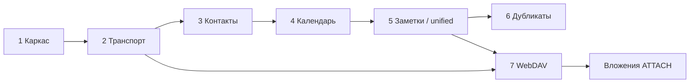

# Этапы реализации Carrel

Источник требований: [carrel-spec.md](carrel-spec.md) §19 (инженерный порядок), §20 (правила), §21 (критерии приёмки).

Рыночный порядок ценности (что показывать в README) — §25.6; инженерная нумерация этапов сохраняется.

| Этап | Название | План | Статус | Версия |
|------|----------|------|--------|--------|
| 1 | Каркас | [stage-1-plan.md](stage-1-plan.md) | **готово** (v0.1.0) | 0.1.0 |
| 2 | Транспорт и discovery | [stage-2-plan.md](stage-2-plan.md) | **готово** (шлюз к этапу 3 пройден) | 0.2.0 |
| 3 | Контакты + import/export + печать | [stage-3-plan.md](stage-3-plan.md) | **готово** (фазы 0–12) | 0.3.0 |
| 4 | Календарь + import/export + печать | [stage-4-plan.md](stage-4-plan.md) | **готово** (фазы 0–11) | 0.4.0 |
| 5 | Задачи, **заметки**, единый вид, поиск | [stage-5-plan.md](stage-5-plan.md) | **готово** (блоки A–G) | 0.5.0 |
| 6 | Дубликаты | [stage-6-plan.md](stage-6-plan.md) | **готово** (блоки 0–10, включая объединение на сервере) | 0.6.0 |
| 7 | **WebDAV-файлы** + вложения | [stage-7-plan.md](stage-7-plan.md) | **готово** (блоки A, B, C) | 0.7.0 |

**Основной объём v1 закрыт.** Остаётся ручная приёмка: [manual-acceptance.md](manual-acceptance.md).

Открытые пункты приёмки этапа 1 (промежуточный трекер): [stage-1-outstanding.md](stage-1-outstanding.md).  
**Финальная ручная приёмка v1** (после этапа 7): [manual-acceptance.md](manual-acceptance.md).

---

## Объём v1 (включено в планы этапов 3–7)

Следующее входит в **основной** объём реализации, а не в post-v1 / «по подтверждению заказчика»:

| Область | Спека | Этап(ы) |
|---------|-------|---------|
| **Заметки (VJOURNAL)** | §23.9: CRUD, jtx/Evolution, `RELATED-TO`, хронология на карточке, кнопка в nav | 5 |
| **Import/export заметок** | §23.9: Markdown export (одна / пачка), import с предпросмотром | 5 |
| **Import/export контактов и календаря** | §23.7: стандартные `.vcf` / `.ics` (не Takeout-разбор) | 3, 4 |
| **Печать** | §23.6: `@media print` — агенда, список контактов, карточка | 3, 4 |
| **WebDAV-файлы** | §6, §7, §19 этап 7: браузер файлов, streaming | 7 |
| **Вложения** | §23.10: `ATTACH` через WebDAV для событий и заметок | 7 |

**Вне основного объёма** (как в spec §23.7 «кандидаты»): разбор Google Takeout / iCloud-выгрузок; davloom; backup §23.3; публичные ссылки.

---

## Политика приёмки

**Между этапами** — только **автоматические шлюзы** в `stage-N-plan.md` (`go test`, integration с Baikal). Ручные проверки **не блокируют** переход к следующему этапу.

**Ручная приёмка** — **один чеклист** по завершении всего объёма v1 (этапы 1–7): [manual-acceptance.md](manual-acceptance.md). Не дублируется в конце каждого `stage-N-plan.md`.

**Принципиальные ручные проверки** (без полноценной автоматизации) выделены в manual-acceptance как **обязательные для v1** (P1–P5: jtx/Evolution, Docker bootstrap, логи, вставка вложения в заметку). Между этапами отдельных ручных шлюзов **нет** — подготовительный сбор фикстур jtx (этап 5, B0) это работа до кода, не приёмка.

**Каждый этап заканчивается** запускаемым состоянием (§20): `go test ./...` проходит, контейнер поднимается.

**Коммиты** — только по явному указанию в промпте (§20).

**Тестовые серверы:** `dev/credentials/` (не в git) — Baikal (CalDAV/CardDAV) и отдельный WebDAV для файлов/вложений. Соглашение: [dev-credentials.md](dev-credentials.md).

---

## Зависимости между этапами

Этап 7 опирается на транспорт (2) и на CRUD событий/заметок (4–5) для вложений §23.10.

---

## Общие зависимости (добавляются по этапам)

| Пакет | Этап |
|-------|------|
| `github.com/emersion/go-webdav` | 2 |
| `github.com/emersion/go-vcard` | 3 |
| `github.com/emersion/go-ical` | 4 |
| `github.com/teambition/rrule-go` | 4 |

Вне списка spec §2 — только по согласованию (§20).

---

## Рекомендации по модели (общие)

Согласовано с [stage-1-plan.md](stage-1-plan.md). Краткая шпаргалка:

| Класс задачи | Модель |
|--------------|--------|
| Безопасность (SSRF, секреты, constant-time) | **Opus / Sonnet (thinking-high)** |
| Протоколы DAV, multistatus, discovery, fanout | **Sonnet (thinking-high)** |
| Модель данных, сохранение raw, конфликты, merge | **Sonnet (thinking-high)**; Object §8 — **Opus** на аудит |
| Кэш, LRU, конкурентность | **Sonnet (thinking-high)** |
| Provider CRUD поверх готового transport | **Sonnet** |
| htmx-шаблоны, CSS, print `@media` | **Composer 2.5 Fast** |
| Compose, config flags, THIRD_PARTY | **Composer 2.5 Fast** |
| Интеграционные тесты Baikal | **Sonnet** |

**Практика:** thinking-модель на transport/security/fanout/merge; fast — на UI-итерации. Перед merge блоков безопасности и fanout — повторный проход Opus/Sonnet только по diff.

Детализация по фазам — в `stage-N-plan.md`, раздел «Рекомендации по модели».
